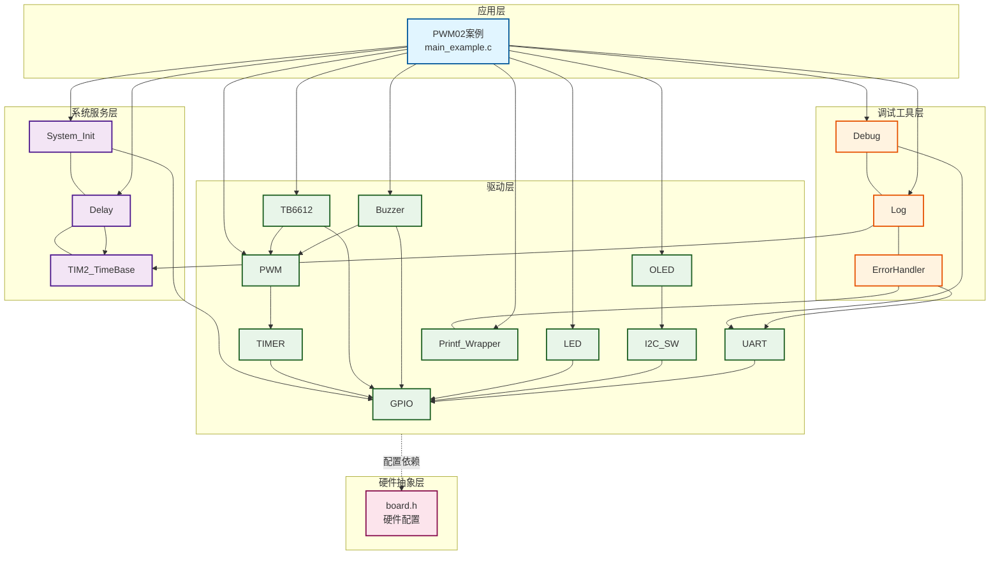
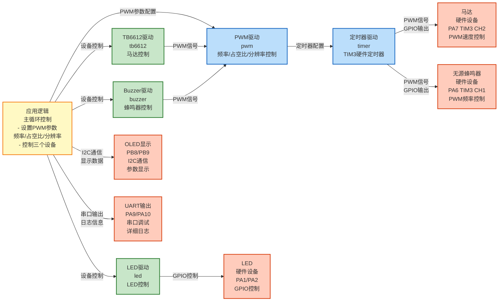
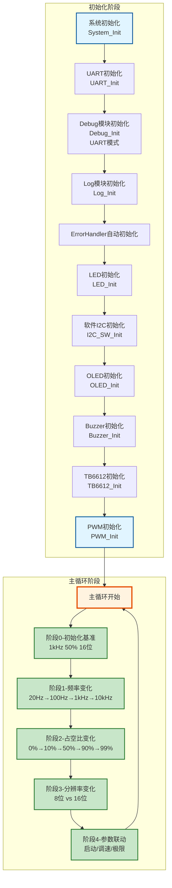

# PWM02 - PWM频率、占空比、分辨率三参数演示

## 📋 案例目的

- **核心目标**
  - 通过三设备联动（马达+LED+无源蜂鸣器）演示PWM的频率、占空比、分辨率三个核心参数的影响，帮助理解PWM工作原理

- **学习重点**：
  - 理解PWM频率对设备运行的影响（马达震动、LED闪烁、蜂鸣器音调）
  - 理解PWM占空比对设备功率的影响（马达转速、LED亮度、蜂鸣器音量）
  - 理解PWM分辨率对控制精度的影响（马达平滑度、LED渐变、蜂鸣器音质）
  - 掌握PWM_SetFrequency()、PWM_SetDutyCycle()、PWM_SetResolution()函数的使用
  - 学习TB6612电机驱动的使用方法
- **应用场景**：适用于需要理解PWM参数影响的场景，如电机控制、LED调光、音频输出等

---

## 功能说明

- **PWM三参数演示**：通过多阶段演示展示频率、占空比、分辨率三个核心参数对设备的影响
- **三设备联动**：马达（TB6612驱动）、LED（GPIO模拟PWM）、无源蜂鸣器（PWM控制）同步演示
- **OLED显示**：实时显示当前PWM参数（频率、占空比、分辨率）
- **串口日志**：输出详细演示过程和参数变化信息
- **多阶段演示**：
  - 阶段0：初始化基准（频率=1kHz，占空比=50%，分辨率=16位）
  - 阶段1：频率变化演示（20Hz → 100Hz → 1kHz → 10kHz）
  - 阶段2：占空比变化演示（0% → 10% → 50% → 90% → 99%）
  - 阶段3：分辨率变化演示（8位 vs 16位）
  - 阶段4：参数联动综合演示（启动过程、精密调速、极限挑战）

---

## 🔧 硬件要求

### 必需硬件

- **STM32F103C8T6开发板**
- **无源蜂鸣器**：连接到`PA6`（TIM3 CH1），通过PWM控制频率和音量
- **LED1和LED2**：
  - LED1：`PA1`（低电平点亮）
  - LED2：`PA2`（低电平点亮）
  - 本案例使用GPIO模拟PWM效果（实际应用中应使用独立PWM通道）
- **马达（通过TB6612驱动）**：
  - **控制信号**：
    - **PWMA**：连接到`PA7`（TIM3 CH2，PWM速度控制）
    - **AIN1**：连接到`PB3`（方向控制）
    - **AIN2**：连接到`PB4`（方向控制）
    - **STBY**：连接到`PB5`（待机控制，高电平使能）
  - **电源连接**：
    - **VCC**：连接到`3.3V`或`5V`（逻辑电源，与STM32共电源）
    - **VM**：连接到外部电源`5V-12V`（马达驱动电源，根据马达规格选择）
    - **GND**：连接到`GND`（公共地，必须与STM32共地）
  - **马达连接**：
    - **AO1**：连接到马达线1
    - **AO2**：连接到马达线2
    - 注意：马达只有两根线，不区分正负极，方向由AIN1/AIN2控制
- **USART1**（串口调试）：
  - TX：`PA9`
  - RX：`PA10`
  - 波特率：`115200`
- **OLED显示屏（SSD1306，I2C接口）**：
  - SCL连接到`PB8`
  - SDA连接到`PB9`
  - 用于显示当前PWM参数

### 硬件连接

| STM32引脚 | 外设/模块 | 说明 |
|----------|----------|------|
| **控制信号** | | |
| PA7 | TB6612 PWMA | TIM3 CH2，PWM速度控制 |
| PB3 | TB6612 AIN1 | 方向控制（正转/反转） |
| PB4 | TB6612 AIN2 | 方向控制（正转/反转） |
| PB5 | TB6612 STBY | 待机控制（高电平使能） |
| **其他外设** | | |
| PA6 | 无源蜂鸣器正极 | TIM3 CH1，PWM输出 |
| PA1 | LED1 | 低电平点亮 |
| PA2 | LED2 | 低电平点亮 |
| PA9 | USB转串口模块 TX | UART发送引脚 |
| PA10 | USB转串口模块 RX | UART接收引脚 |
| PB8 | OLED SCL | I2C时钟线 |
| PB9 | OLED SDA | I2C数据线 |
| **电源连接** | | |
| 3.3V | 无源蜂鸣器 VCC | 电源（如果蜂鸣器需要） |
| 3.3V | OLED VCC | 电源 |
| 3.3V | TB6612 VCC | 逻辑电源（3.3V或5V，与STM32共电源） |
| 外部5V-12V | TB6612 VM | 马达驱动电源（独立供电，根据马达规格选择） |
| GND | 所有模块 GND | 公共地线（必须共地） |
| **马达连接** | | |
| - | TB6612 AO1 | 连接到马达线1 |
| - | TB6612 AO2 | 连接到马达线2 |

### TB6612接线说明

#### TB6612引脚排列（左右两排引脚）

**左侧引脚（从上到下）**：
- PWMA：PWM速度控制（A通道）
- AIN2：方向控制2（A通道）
- AIN1：方向控制1（A通道）
- STBY：待机控制
- BIN1：方向控制1（B通道，本案例未使用）
- BIN2：方向控制2（B通道，本案例未使用）
- PWMB：PWM速度控制（B通道，本案例未使用）
- GND：公共地

**右侧引脚（从上到下）**：
- VM：马达驱动电源（5V-12V，外部电源正极）
- VCC：逻辑电源（3.3V或5V）
- GND：公共地
- AO1：马达输出1（A通道）
- AO2：马达输出2（A通道）
- BO2：马达输出2（B通道，本案例未使用）
- BO1：马达输出1（B通道，本案例未使用）
- GND：公共地

#### 完整接线图

**左侧连接（控制信号）**：
```
STM32F103C8T6          TB6612（左侧）
─────────────────      ─────────────
PA7 (TIM3 CH2) ──────> PWMA (PWM速度控制)
PB3 ─────────────────> AIN1 (方向控制)
PB4 ─────────────────> AIN2 (方向控制)
PB5 ─────────────────> STBY (待机控制，高电平使能)
                      (BIN1 - 未使用)
                      (BIN2 - 未使用)
                      (PWMB - 未使用)
GND ─────────────────> GND (公共地)

**STBY引脚重要说明**：
- STBY引脚**必须**连接到STM32的GPIO（PB5），**不能**直接接VCC
- STBY = 高电平（3.3V）：TB6612使能，正常工作
- STBY = 低电平（0V）：TB6612待机，所有输出禁用
- 代码通过`TB6612_Enable()`函数将PB5设置为高电平来使能TB6612
- 如果直接接VCC，将无法通过软件控制待机/使能状态
```

**右侧连接（电源和马达）**：
```
STM32F103C8T6          TB6612（右侧）        外部电源        马达
─────────────────      ─────────────        ──────────      ──────
外部电源 + (5V-12V) ──> VM
3.3V ────────────────> VCC
GND ─────────────────> GND ────────────────> GND (公共地)
外部电源 - (负极) ─────> GND (公共地)
                       AO1 ────────────────────────────────> 马达线1
                       AO2 ────────────────────────────────> 马达线2
                       (BO2 - 未使用)
                       (BO1 - 未使用)
                       GND ────────────────────────────────> GND (公共地)
```

**重要提示**：
- **电源选择**：
  - **超小马达**：可以从单片机引入电源，只接VCC（3.3V或5V），VM可以不接或与VCC短接
  - **普通马达**：建议使用外部电源，VM接5V-12V（根据马达规格选择），**必须与STM32共地**
- TB6612的VCC（逻辑电源）可以接3.3V或5V
- 确保所有模块共地（GND连接在一起）
- 马达只有两根线，不区分正负极，方向由AIN1/AIN2控制
- 本案例只使用A通道（PWMA、AIN1、AIN2、AO1、AO2），B通道未使用

### 硬件配置

**重要说明**：案例是独立工程，硬件配置在案例目录下的 `board.h` 中。
如果硬件引脚不同，直接修改 `Examples/PWM/PWM02_ThreeDevicesDemo/board.h` 中的配置即可。

**PWM配置**（已包含在board.h中）：
```c
/* PWM统一配置表 - TIM3，PA6用于蜂鸣器，PA7用于马达 */
#define PWM_CONFIGS { \
    {TIM3, {{GPIOA, GPIO_Pin_6, 1}, {GPIOA, GPIO_Pin_7, 1}, ...}, 1}, \
}
```

**TB6612配置**（已包含在board.h中）：
```c
/* TB6612统一配置表 */
#define TB6612_CONFIGS { \
    {GPIOB, GPIO_Pin_3, GPIOB, GPIO_Pin_4, GPIOB, GPIO_Pin_5, 1, 1, 1}, \
}
```

**Buzzer配置**（已包含在board.h中）：
```c
/* Buzzer统一配置表 - PWM模式，TIM3 CH1，PA6 */
#define BUZZER_CONFIGS { \
    {BUZZER_MODE_PWM, NULL, 0, 1, 0, Bit_RESET, 1}, \
}
```

**UART配置**（已包含在board.h中，新项目必须）：
```c
/* UART统一配置表 - 标准配置：USART1，PA9/PA10，115200，8N1 */
#define UART_CONFIGS { \
    {USART1, GPIOA, GPIO_Pin_9, GPIOA, GPIO_Pin_10, 115200, USART_WordLength_8b, USART_StopBits_1, USART_Parity_No, 1}, \
}
```

---

## 📦 模块依赖

### 模块依赖关系图

展示本案例使用的模块及其依赖关系：



### 模块列表

本案例使用以下模块：

- `timer_pwm`：PWM驱动模块（核心功能，频率、占空比、分辨率控制）
- `tb6612`：TB6612电机驱动模块（马达控制）
- `buzzer`：蜂鸣器驱动模块（无源蜂鸣器控制）
- `led`：LED驱动模块（LED控制）
- `uart`：UART驱动模块（串口调试，新项目必须）
- `oled_ssd1306`：OLED显示驱动模块（参数显示）
- `i2c_sw`：软件I2C驱动模块（OLED使用）
- `printf_wrapper`：printf封装模块（OLED格式化输出）
- `debug`：Debug模块（printf重定向，新项目必须）
- `log`：日志模块（分级日志系统，新项目必须）
- `error_handler`：错误处理模块（统一错误处理，新项目必须）
- `gpio`：GPIO驱动模块（所有模块依赖）
- `delay`：延时模块（演示延时）
- `system_init`：系统初始化模块（系统初始化）

---

## 🚀 使用方法

### 快速开始

1. **打开案例工程**：双击 `Examples/PWM/PWM02_ThreeDevicesDemo/Examples.uvprojx` 打开Keil工程
2. **检查硬件配置**：确认案例目录下的 `board.h` 中硬件配置正确
3. **编译下载**：在Keil中编译（F7）并下载到开发板（F8）
4. **观察效果**：
   - OLED显示当前PWM参数（频率、占空比、分辨率）
   - 串口输出详细演示过程和参数变化信息
   - 观察马达、LED、蜂鸣器的联动效果
   - 演示按照阶段0→1→2→3→4的顺序进行，完成后自动循环

### 详细操作流程

**通用操作步骤请参考**：[Examples/README.md](../README.md#-通用操作流程)

**注意**：本案例是独立工程，无需复制文件，直接打开工程文件即可编译运行。

---

## 🔄 实现流程

### 整体逻辑

本案例通过多阶段演示，逐步展示PWM的三个核心参数（频率、占空比、分辨率）对三个设备（马达、LED、无源蜂鸣器）的影响：

1. **阶段0：初始化基准**
   - 设置统一基准参数：频率=1kHz，占空比=50%，分辨率=16位
   - 让观众建立"正常状态"的基准感知

2. **阶段1：频率变化演示**
   - 固定占空比=50%，分辨率=16位
   - 频率变化：20Hz → 100Hz → 1kHz → 10kHz
   - 观察：马达震动变化、LED闪烁变化、蜂鸣器音调变化

3. **阶段2：占空比变化演示**
   - 固定频率=1kHz，分辨率=16位
   - 占空比变化：0% → 10% → 50% → 90% → 99%
   - **注意**：占空比10%时，马达可能不转或转得很慢，这是正常现象
     - 原因：10%占空比提供的功率较小，可能不足以克服马达的启动扭矩和负载
     - 这是PWM占空比对马达影响的正常演示：占空比越小，输出功率越小
     - 通常需要20-30%以上的占空比才能启动马达
   - 观察：马达转速变化、LED亮度变化、蜂鸣器音量变化

4. **阶段3：分辨率变化演示**
   - 固定频率=500Hz，占空比=5%（低占空比区域）
   - 分辨率变化：8位 vs 16位
   - 观察：马达平滑度差异、LED渐变差异、蜂鸣器音质差异

5. **阶段4：参数联动综合演示**
   - 场景A：启动过程模拟（频率+占空比+分辨率联动）
   - 场景B：精密调速对比（8位 vs 16位分辨率）
   - 场景C：极限挑战（高频+低占空比+高分辨率）

### 关键方法

1. **标准初始化流程**：按照System_Init → UART → Debug → Log → ErrorHandler → 其他模块的顺序初始化
2. **错误处理集成**：通过ErrorHandler模块统一处理错误，并输出错误日志
3. **分级日志输出**：通过Log模块实现不同级别的日志输出，便于调试和监控
4. **串口与OLED输出分工**：串口输出详细日志（中文），OLED输出简要状态（英文）

### 数据流向图

展示本案例的数据流向：应用逻辑 → PWM控制 → 三个设备输出



**数据流说明**：

1. **应用逻辑**：
   - 主循环中设置PWM参数（频率、占空比、分辨率）
   - 控制三个设备（TB6612马达、Buzzer蜂鸣器、LED）

2. **PWM驱动**：
   - **PWM驱动模块**：配置定时器产生PWM信号
   - 设置频率、占空比、分辨率等参数

3. **定时器驱动**：
   - **定时器驱动**：TIM3硬件定时器，产生PWM波形
   - 通过GPIO输出PWM信号到不同设备

4. **设备驱动**：
   - **TB6612驱动**：控制马达速度和方向
   - **Buzzer驱动**：控制蜂鸣器频率
   - **LED驱动**：控制LED亮度

5. **输出设备**：
   - **马达**：接收PWM信号，控制转速
   - **无源蜂鸣器**：接收PWM信号，产生音调
   - **LED**：通过GPIO控制亮度
   - **OLED**：显示当前PWM参数和设备状态
   - **UART**：输出详细日志信息（支持中文）

### 工作流程示意



---

## 代码说明

### 关键代码

```c
// 系统初始化
System_Init();

// UART初始化
UART_Init(UART_INSTANCE_1);

// Debug模块初始化
Debug_Init(DEBUG_MODE_UART, 115200);

// Log模块初始化
Log_Init(&log_config);

// ErrorHandler模块自动初始化（无需显式调用）

// LED初始化
LED_Init();

// 软件I2C初始化
I2C_SW_Init();

// OLED初始化
OLED_Init();

// Buzzer初始化
Buzzer_Init();

// TB6612初始化
TB6612_Init();
TB6612_Enable(TB6612_INSTANCE_1);
TB6612_SetDirection(TB6612_INSTANCE_1, TB6612_DIR_FORWARD);

// PWM初始化
PWM_Init();
PWM_SetFrequency(PWM_INSTANCE_1, 1000);  // 设置1kHz
PWM_SetDutyCycle(PWM_INSTANCE_1, PWM_CHANNEL_1, 50.0f);  // 设置占空比50%
PWM_SetResolution(PWM_INSTANCE_1, PWM_RESOLUTION_16BIT);  // 设置16位分辨率
PWM_EnableChannel(PWM_INSTANCE_1, PWM_CHANNEL_1);  // 使能蜂鸣器通道
PWM_EnableChannel(PWM_INSTANCE_1, PWM_CHANNEL_2);  // 使能马达通道
```

### 完整流程

1. **系统初始化**：`System_Init()` 初始化SysTick和延时模块
2. **UART初始化**：`UART_Init()` 初始化串口通信
3. **Debug模块初始化**：`Debug_Init()` 初始化printf重定向
4. **Log模块初始化**：`Log_Init()` 初始化日志系统
5. **ErrorHandler自动初始化**：无需显式调用，编译时自动初始化
6. **LED初始化**：`LED_Init()` 初始化LED驱动
7. **OLED初始化**：`OLED_Init()` 初始化OLED显示
8. **Buzzer初始化**：`Buzzer_Init()` 初始化无源蜂鸣器（PWM模式）
9. **TB6612初始化**：`TB6612_Init()` 初始化TB6612驱动，然后使能和设置方向
10. **PWM初始化**：`PWM_Init()` 初始化PWM定时器，设置频率、占空比、分辨率
11. **演示循环**：按照阶段0→1→2→3→4的顺序进行演示

---

## 📚 关键函数说明

### PWM相关函数

- **`PWM_Init()`**：初始化PWM定时器外设和GPIO
  - 在本案例中用于初始化TIM3，配置PA6和PA7为PWM输出
  - 初始化后需要单独设置频率、占空比和分辨率
  - 返回PWM_Status_t错误码，需要检查返回值

- **`PWM_SetFrequency()`**：设置PWM频率
  - 在本案例中用于演示频率变化对设备的影响
  - 设置频率后，所有通道的频率都会改变
  - 频率范围：1Hz ~ 72MHz（取决于系统时钟）
  - 返回PWM_Status_t错误码，需要检查返回值

- **`PWM_SetDutyCycle()`**：设置PWM占空比
  - 在本案例中用于演示占空比变化对设备的影响
  - 占空比范围：0.0 ~ 100.0（单位：百分比）
  - 每个通道可以独立设置占空比
  - **注意**：对于无源蜂鸣器，100%占空比会导致PWM信号恒为高电平，没有电平变化，因此无法振动发声。本案例使用99%占空比来演示接近最大功率的效果
  - 返回PWM_Status_t错误码，需要检查返回值

- **`PWM_SetResolution()`**：设置PWM分辨率
  - 在本案例中用于演示分辨率变化对控制精度的影响
  - 支持8位分辨率（ARR=256）和16位分辨率（ARR=65536）
  - 设置分辨率时保持当前频率不变（重新计算PSC）
  - 返回PWM_Status_t错误码，需要检查返回值

- **`PWM_GetFrequency()`**：获取PWM频率
  - 在本案例中用于验证频率设置是否成功

- **`PWM_GetResolution()`**：获取PWM分辨率
  - 在本案例中用于验证分辨率设置是否成功

- **`PWM_EnableChannel()`**：使能PWM通道输出
  - 在本案例中用于使能蜂鸣器和马达的PWM输出
  - 返回PWM_Status_t错误码，需要检查返回值

**详细函数实现和调用示例请参考**：`main_example.c` 中的代码

### TB6612相关函数

- **`TB6612_Init()`**：初始化TB6612驱动模块
  - 在本案例中用于初始化TB6612，配置方向控制引脚和PWM
  - 初始化后需要调用`TB6612_Enable()`使能模块
  - 返回TB6612_Status_t错误码，需要检查返回值

- **`TB6612_SetDirection()`**：设置电机方向
  - 在本案例中用于控制马达正反转
  - 支持：停止、正转、反转、制动
  - 返回TB6612_Status_t错误码，需要检查返回值

- **`TB6612_SetSpeed()`**：设置电机速度（PWM占空比）
  - 在本案例中用于控制马达转速
  - 速度范围：0.0 ~ 100.0（单位：百分比）
  - 返回TB6612_Status_t错误码，需要检查返回值

- **`TB6612_Enable()`**：使能TB6612（退出待机模式）
  - 在本案例中用于使能马达驱动
  - 返回TB6612_Status_t错误码，需要检查返回值

- **`TB6612_Disable()`**：禁用TB6612（进入待机模式）
  - 在本案例中用于禁用马达驱动
  - 返回TB6612_Status_t错误码，需要检查返回值

**详细函数实现和调用示例请参考**：`main_example.c` 中的代码

### Buzzer相关函数

- **`Buzzer_Init()`**：初始化Buzzer驱动模块
  - 在本案例中用于初始化无源蜂鸣器（PWM模式）
  - 返回Buzzer_Status_t错误码，需要检查返回值

- **`Buzzer_SetFrequency()`**：设置Buzzer频率
  - 在本案例中通过PWM_SetFrequency()间接控制
  - 频率范围：1Hz ~ 72MHz（取决于系统时钟）
  - 返回Buzzer_Status_t错误码，需要检查返回值

- **`Buzzer_On()`**：开启Buzzer
  - 在本案例中用于使能蜂鸣器PWM输出

- **`Buzzer_Off()`**：关闭Buzzer
  - 在本案例中用于禁用蜂鸣器PWM输出

**详细函数实现和调用示例请参考**：`main_example.c` 中的代码

### LED相关函数

- **`LED_Init()`**：初始化LED驱动模块
  - 在本案例中用于初始化LED1和LED2
  - 返回LED_Status_t错误码，需要检查返回值

- **`LED_On()`**：点亮LED
  - 在本案例中用于控制LED亮度（通过GPIO模拟PWM效果）

- **`LED_Off()`**：熄灭LED
  - 在本案例中用于控制LED亮度

**详细函数实现和调用示例请参考**：`main_example.c` 中的代码

### UART相关函数

- **`UART_Init()`**：初始化UART外设
  - 在本案例中用于初始化USART1，配置为115200波特率、8N1格式
  - 参数：UART实例索引（UART_INSTANCE_1）
  - 返回UART_Status_t错误码，初始化失败必须停止程序

### Debug模块相关函数

- **`Debug_Init()`**：初始化Debug模块（UART模式）
  - 在本案例中用于初始化Debug模块，配置为UART输出模式
  - 参数：输出模式（DEBUG_MODE_UART）、波特率
  - 返回int类型，0表示成功，非0表示失败，初始化失败必须停止程序

### Log模块相关函数

- **`Log_Init()`**：初始化日志系统
  - 在本案例中用于初始化日志系统，配置日志级别和功能开关
  - 参数：日志配置结构体指针
  - 返回Log_Status_t错误码，初始化失败可以继续运行

- **`LOG_DEBUG()`** / **`LOG_INFO()`** / **`LOG_WARN()`** / **`LOG_ERROR()`**：分级日志宏
  - 在本案例中用于输出不同级别的日志
  - 参数：模块名称、格式字符串、参数列表
  - 串口输出详细日志（支持中文）

### 错误处理相关函数

- **`ErrorHandler_Handle()`**：处理错误
  - 在本案例中用于处理各种错误，并输出错误日志
  - 参数：错误码、模块名称
  - ErrorHandler模块在编译时自动初始化，无需显式调用

### OLED相关函数

- **`OLED_Init()`**：初始化OLED显示模块
  - 在本案例中用于初始化OLED显示
  - 返回OLED_Status_t错误码，需要检查返回值

- **`OLED_Clear()`**：清屏
  - 在本案例中用于清除OLED显示内容

- **`OLED_ShowString()`**：显示字符串
  - 在本案例中用于显示操作状态和提示信息
  - 参数：行号、列号、字符串（全英文，ASCII字符）

**详细函数实现和调用示例请参考**：`main_example.c` 中的代码

---

## 🎯 预期效果

- **OLED显示**：实时显示当前PWM参数（频率、占空比、分辨率）
- **串口输出**：详细演示过程和参数变化信息
- **阶段0**：初始化基准（频率=1kHz，占空比=50%，分辨率=16位）
- **阶段1**：频率变化演示（20Hz → 100Hz → 1kHz → 10kHz）
  - 观察：马达震动变化、LED闪烁变化、蜂鸣器音调变化
- **阶段2**：占空比变化演示（0% → 10% → 50% → 90% → 99%）
  - 观察：马达转速变化、LED亮度变化、蜂鸣器音量变化
- **阶段3**：分辨率变化演示（8位 vs 16位）
  - 观察：马达平滑度差异、LED渐变差异、蜂鸣器音质差异
- **阶段4**：参数联动综合演示（启动过程、精密调速、极限挑战）
- 程序循环执行上述操作

---

## ⚠️ 注意事项与重点

### 重要提示

1. **标准初始化流程**：
   - 必须严格按照 System_Init → UART → Debug → Log → ErrorHandler → 其他模块 的顺序初始化
   - UART/Debug初始化失败：必须停止程序（进入死循环）
   - Log初始化失败：可以继续运行（使用UART直接输出）
   - 其他模块初始化失败：根据模块重要性决定是否继续运行

2. **TB6612电源要求**：
   - TB6612需要外部电源（VM引脚）驱动马达，建议5V-12V，根据马达规格选择
   - TB6612的VCC（逻辑电源）可以接3.3V或5V
   - 确保所有模块共地（GND连接在一起）

3. **PWM通道分配**：
   - TIM3 CH1（PA6）：用于无源蜂鸣器
   - TIM3 CH2（PA7）：用于TB6612的PWMA（马达速度控制）
   - LED1和LED2使用GPIO模拟PWM效果（实际应用中应使用独立PWM通道）

4. **硬件配置**：
   - 案例是独立工程，硬件配置在案例目录下的 `board.h` 中
   - 如果硬件引脚不同，直接修改 `Examples/PWM/PWM02_ThreeDevicesDemo/board.h` 中的配置即可

5. **演示顺序**：
   - 演示按照阶段0→1→2→3→4的顺序进行
   - 每个阶段停留一定时间，便于观察效果
   - 演示完成后自动循环

6. **参数联动**：
   - 设置分辨率时，PWM模块会自动重新计算PSC以保持频率不变
   - 设置频率时，占空比和分辨率保持不变
   - 设置占空比时，频率和分辨率保持不变

7. **UART配置**：新项目必须包含UART_CONFIGS配置（用于串口调试和日志输出）

8. **错误处理**：所有模块初始化函数必须检查返回值，使用ErrorHandler统一处理错误

### 关键点

1. **频率的影响**：
   - 频率过低（<100Hz）：马达剧烈抖动，LED明显闪烁，蜂鸣器发出低沉"咔咔"声
   - 频率适中（100Hz-1kHz）：马达平稳转动，LED肉眼无闪烁，蜂鸣器发出清晰音调
   - 频率过高（>10kHz）：马达高速平稳，LED完全恒亮，蜂鸣器发出尖锐高音调

2. **占空比的影响**：
   - 占空比=0%：设备完全停止/熄灭/静音
   - 占空比=50%：设备正常工作状态
   - 占空比=99%：设备接近全功率运行（注意：100%占空比时无源蜂鸣器不振动）
   - **无源蜂鸣器100%占空比不振动的原因**：
     - 无源蜂鸣器需要PWM信号的电平变化来驱动压电片振动
     - 100%占空比时，PWM信号恒为高电平（或恒为低电平），没有电平变化
     - 没有电平变化 = 压电片不振动 = 无声音
     - 因此，本案例使用99%占空比来演示接近最大功率的效果，确保蜂鸣器能正常发声

3. **分辨率的影响**：
   - 8位分辨率（256级）：控制粗糙，低占空比区域有明显跳变
   - 16位分辨率（65536级）：控制精细，低占空比区域平滑连续
   - 分辨率越高，控制精度越高，但计算开销也越大

4. **参数联动**：
   - 频率和分辨率共同决定控制精度
   - 低频率+低分辨率：最差组合（抖动+跳变）
   - 高频率+高分辨率：最佳组合（平滑+精确）

5. **输出分工规范**：
   - **串口（UART）**：详细日志、调试信息、错误详情（支持中文，GB2312编码）
   - **OLED**：关键状态、实时数据、简要提示（全英文，ASCII字符）
   - **双边输出**：系统启动信息、关键错误、重要状态变化

6. **日志输出**：
   - 开发阶段使用LOG_LEVEL_DEBUG（显示所有日志）
   - 发布时改为LOG_LEVEL_INFO或LOG_LEVEL_WARN
   - 日志调用必须包含模块名字符串

### 观察重点（根据实际测试总结）

**阶段1：频率变化演示**
- **主要观察**：马达（抖动/平稳对比最明显）、无源蜂鸣器（音调变化明显：20Hz低沉→10kHz尖锐）
- **次要观察**：LED（低频率闪烁可见，高频率恒亮）

**阶段2：占空比变化演示**
- **主要观察**：LED（亮度变化最直观：0%熄灭→99%几乎最亮）
- **次要观察**：马达（转速变化）、无源蜂鸣器（音量变化）

**阶段3：分辨率变化演示**
- **主要观察**：无源蜂鸣器（音质差异明显：8位有"跳音"感，16位连续变化）、马达（平滑度差异明显：8位转速跳变，16位平滑）
- **次要观察**：LED（8位有亮度阶梯，16位平滑渐变）

**说明**：
- **频率变化时**：马达的抖动/平稳对比最直观，无源蜂鸣器的音调变化也很明显（20Hz低沉"咔咔"声→10kHz尖锐高音）
- **占空比变化时**：LED的亮度变化最直观，最容易观察到（0%完全熄灭→99%几乎最亮）
- **分辨率变化时**：无源蜂鸣器的音质差异最明显（8位有"跳音"感，16位连续平滑），马达的平滑度差异也很明显（8位转速有明显跳变，16位转速平滑）

### 调试技巧

1. **串口输出**：
   - 通过串口助手（115200波特率）查看详细日志
   - 日志包含每个阶段的参数设置和预期效果描述

2. **OLED显示**：
   - OLED实时显示当前PWM参数（频率、占空比、分辨率）
   - 便于观察参数变化

3. **观察要点**（按阶段分类）：
   - **阶段1（频率）**：主要观察马达抖动/平稳、无源蜂鸣器音调；次要观察LED闪烁
   - **阶段2（占空比）**：主要观察LED亮度；次要观察马达转速、无源蜂鸣器音量
   - **阶段3（分辨率）**：主要观察无源蜂鸣器音质、马达平滑度；次要观察LED渐变
   - **阶段4（综合）**：综合观察三个参数联动效果

4. **故障排查**：
   - **马达不转**：见下方"常见问题"章节的详细排查步骤
   - 如果蜂鸣器不响：检查PWM频率是否在可听范围（20Hz-20kHz）
   - 如果LED不亮：检查GPIO配置、有效电平设置

---

## 功能限制说明

### 空函数说明

本案例中使用了以下空函数（占位函数），这些函数目前未实现完整功能，但保留了接口以便将来扩展：

1. **`SetLED1Duty(float duty)`**：
   - **功能**：设置LED1目标占空比（用于统一接口）
   - **当前状态**：空函数，保留接口以便将来扩展
   - **说明**：这个函数目前只用于统一接口，实际占空比在`ControlLED1ByDuty()`中使用
   - **影响**：不影响演示功能，LED1的亮度控制通过`ControlLED1ByDuty()`函数实现（GPIO模拟PWM效果）
   - **未来扩展**：可以在此函数中实现LED1的持续状态更新（如主循环中持续更新LED状态）

**注意**：这些空函数不影响案例的核心演示功能，案例可以正常运行。

---

## 🔍 常见问题排查

### 马达不动

**排查步骤（按顺序检查）**：

1. **检查串口日志**：
   - 查看是否有"TB6612初始化失败"的错误信息
   - 查看是否有"马达初始化失败"的错误信息
   - 如果看到错误码，根据错误码判断问题

2. **检查电源连接**：
   - **VCC（右侧第2个引脚）**：必须连接到3.3V或5V
   - **VM（右侧第1个引脚）**：如果使用外部电源，必须连接到5V-12V
   - **GND**：所有GND必须连接在一起（共地）
   - 用万用表测量VCC和VM是否有电压

3. **检查STBY引脚（PB5）**：
   - **STBY必须为高电平才能使能TB6612**（这是TB6612芯片的要求）
   - STBY引脚**必须连接到STM32的PB5**，**不能直接接VCC**
   - 用万用表测量PB5引脚，应该为3.3V（高电平）
   - 如果为0V，说明`TB6612_Enable()`没有调用或失败
   - 检查代码中是否调用了`TB6612_Enable(TB6612_INSTANCE_1)`
   - **常见错误**：将STBY直接接VCC，这样虽然能工作，但无法通过软件控制待机/使能

4. **检查方向控制引脚**：
   - **AIN1（PB3）**：正转时应为**高电平（3.3V）**，反转时应为低电平（0V）
   - **AIN2（PB4）**：正转时应为**低电平（0V）**，反转时应为高电平（3.3V）
   - **用万用表测量PB3和PB4的电平**：
     - 如果代码设置为正转（`TB6612_DIR_FORWARD`），PB3应该为3.3V，PB4应该为0V
     - 如果PB3和PB4都是0V或都是3.3V，马达不会转
   - 检查代码中是否调用了`TB6612_SetDirection(TB6612_INSTANCE_1, TB6612_DIR_FORWARD)`
   - **常见错误**：方向控制引脚接反或没有正确设置

5. **检查PWM输出（PA7）**：
   - **用示波器测量PA7引脚**（推荐）：
     - 应该有PWM波形输出（占空比>0时）
     - 频率应该与设置值一致（默认1kHz）
     - 占空比应该与设置值一致（默认50%）
   - **用万用表测量PA7引脚**（只能测平均电压）：
     - 如果占空比为50%，平均电压应该约为1.65V（3.3V × 50%）
     - 如果占空比为0，平均电压为0V，马达不会转
     - 如果占空比为100%，平均电压为3.3V
   - **如果PA7没有PWM输出**：
     - 检查PWM初始化是否成功
     - 检查是否调用了`TB6612_SetSpeed(TB6612_INSTANCE_1, speed)`，且speed > 0
     - 检查PWM通道是否被使能（`PWM_EnableChannel`）
   - **常见错误**：PWM没有输出或占空比为0

6. **检查马达电源（VM）**：
   - **VM引脚（右侧第1个引脚）必须连接电源**
   - 如果使用外部电源：VM接5V-12V（根据马达规格）
   - 如果使用MCU电源（超小马达）：VM可以不接或与VCC短接
   - **用万用表测量VM引脚**，应该有电压（5V-12V或3.3V）
   - **如果VM没有电压，马达不会转**
   - **常见错误**：忘记连接VM电源
   - **测试方法**：
     - 断开马达，用万用表测量VM和GND之间的电压
     - 如果电压为0V，说明VM电源没有连接
     - 如果电压正常，但马达不转，检查马达连接

7. **检查马达连接**：
   - 确认马达的两根线正确连接到TB6612的AO1和AO2
   - 马达只有两根线，不区分正负极（方向由AIN1/AIN2控制）
   - 尝试手动转动马达，确认马达本身没有卡死
   - 如果马达有负载，确认负载没有过大
   - **测试方法**：断开马达，用万用表测量AO1和AO2之间的电压，应该有PWM波形

8. **检查代码流程**：
   - 查看串口日志，确认是否有错误信息
   - 确认`TB6612_Init()`返回成功（检查串口日志）
   - 确认`TB6612_Enable()`被调用并返回成功
   - 确认`TB6612_SetDirection()`被调用并返回成功
   - 确认`TB6612_SetSpeed()`被调用，且速度值>0（默认50%）

**快速测试方法（按顺序检查）**：
1. **PB5（STBY）**：用万用表测量，应该为3.3V（高电平）
2. **PB3（AIN1）**：用万用表测量，正转时应为3.3V（高电平）
3. **PB4（AIN2）**：用万用表测量，正转时应为0V（低电平）
4. **PA7（PWMA）**：用示波器测量，应该有PWM波形（频率1kHz，占空比50%）
   - 如果没有示波器，用万用表测量平均电压，应该约为1.65V（3.3V × 50%）
5. **VM引脚**：用万用表测量，应该有电压（5V-12V或3.3V）
6. **AO1和AO2**：断开马达，用示波器测量AO1和AO2之间的电压，应该有PWM波形
7. 如果以上都正常，检查马达连接和马达本身

**常见原因**：
- STBY引脚没有使能（最常见）
- 速度设置为0
- PWM没有输出
- 电源没有连接或电压不足
- 马达本身故障

### 蜂鸣器不响

- **检查蜂鸣器类型**：必须使用**无源蜂鸣器**，有源蜂鸣器无法通过PWM控制频率
- 检查案例目录下的 `board.h` 中的Buzzer配置是否正确
- 检查PWM实例和通道配置（`pwm_instance`、`pwm_channel`）
- 检查PWM配置（`PWM_CONFIGS`）中的引脚是否正确（PA6）
- 检查Buzzer的 `enabled` 标志是否为1
- 检查定时器模块是否已启用（`CONFIG_MODULE_TIMER_ENABLED = 1`）
- 检查PWM频率是否在可听范围（20Hz-20kHz）

### LED不亮

- 检查LED连接是否正确（PA1、PA2）
- 检查GPIO配置是否正确
- 检查有效电平设置（低电平点亮）
- 检查LED模块是否已启用（`CONFIG_MODULE_LED_ENABLED = 1`）

### OLED不显示

- 检查OLED连接是否正确（SCL: PB8, SDA: PB9）
- 检查软件I2C模块是否已启用（`CONFIG_MODULE_SOFT_I2C_ENABLED = 1`）
- 检查OLED模块是否已启用（`CONFIG_MODULE_OLED_ENABLED = 1`）

### 编译错误

- 确保已包含必要的头文件
- 确保所有模块初始化函数已正确调用
- 确保所有模块已启用（在`config.h`中检查）
- 检查Keil工程的包含路径（Include Paths）

---

## 💡 扩展练习

1. **频率范围探索**：
   - 尝试更低的频率（如1Hz、5Hz）观察马达和LED的表现
   - 尝试更高的频率（如50kHz、100kHz）观察设备极限

2. **占空比渐变**：
   - 实现占空比从0%到100%的平滑渐变（每秒增加1%）
   - 观察马达转速、LED亮度、蜂鸣器音量的连续变化

3. **分辨率对比**：
   - 在低占空比区域（1%-5%）对比8位和16位分辨率的差异
   - 观察马达能否在1%占空比下平稳转动

4. **参数优化**：
   - 尝试找到马达启动的最佳参数组合（频率+占空比+分辨率）
   - 尝试找到LED无闪烁的最低频率

5. **多设备协调**：
   - 实现三设备同步控制（同时改变频率、占空比、分辨率）
   - 观察三设备的联动效果

6. **极限挑战**：
   - 尝试频率=10kHz，占空比=0.1%，分辨率=16位的极限组合
   - 观察设备是否仍能正常工作

---

## 📖 相关文档

- **模块文档**：
  - **PWM模块**：`Drivers/timer/timer_pwm.c/h`
  - **TB6612模块**：`Drivers/motor/tb6612.c/h`
  - **Buzzer模块**：`Drivers/basic/buzzer.c/h`
  - **LED模块**：`Drivers/basic/led.c/h`
  - **UART模块**：`Drivers/uart/uart.c/h`
  - **OLED模块**：`Drivers/display/oled_ssd1306.c/h`
  - **软件I2C模块**：`Drivers/i2c/i2c_sw.c/h`
  - **printf封装模块**：`Debug/printf_wrapper.c/h`
  - **Debug模块**：`Debug/debug.c/h`
  - **Log模块**：`Debug/log.c/h`
  - **ErrorHandler模块**：`Common/error_handler.c/h`
  - **GPIO驱动**：`Drivers/basic/gpio.c/h`
  - **延时功能**：`System/delay.c/h`
  - **系统初始化**：`System/system_init.c/h`

- **业务文档**：
  - **主程序代码**：`Examples/PWM/PWM02_ThreeDevicesDemo/main_example.c`
  - **硬件配置**：`Examples/PWM/PWM02_ThreeDevicesDemo/board.h`
- **模块配置**：`Examples/PWM/PWM02_ThreeDevicesDemo/config.h`
- **PWM模块文档**：`Drivers/timer/README.md`
- **TB6612模块文档**：`Drivers/motor/README.md`
- **Buzzer模块文档**：`Drivers/basic/README.md`
- **LED模块文档**：`Drivers/basic/README.md`
- **UART驱动模块文档**：`Drivers/uart/README.md`
- **Log模块文档**：`Debug/log.c/h`
- **ErrorHandler模块文档**：`Common/error_handler.c/h`
- **OLED驱动模块文档**：`Drivers/display/README.md`
- **项目规范文档**：`PROJECT_KEYWORDS.md`
- **案例参考**：`Examples/README.md`

---

**最后更新**：2024-12-19
