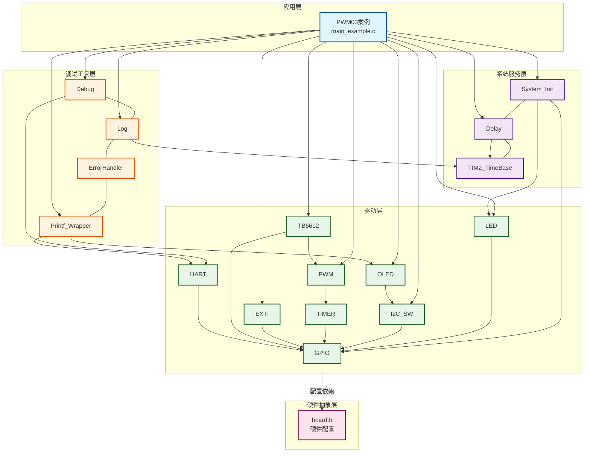
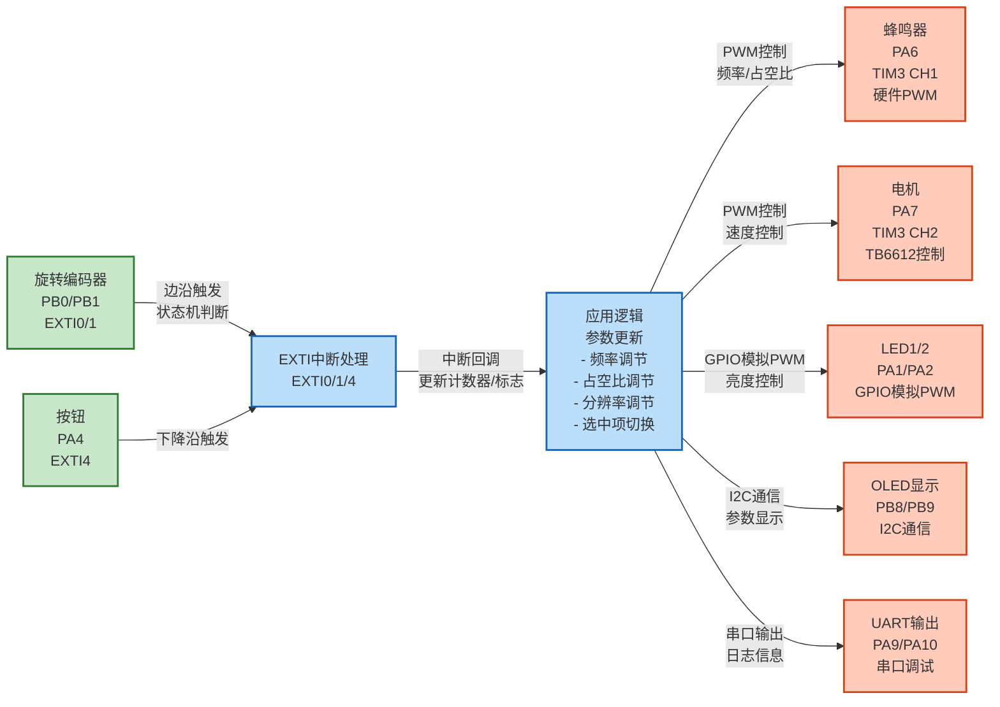
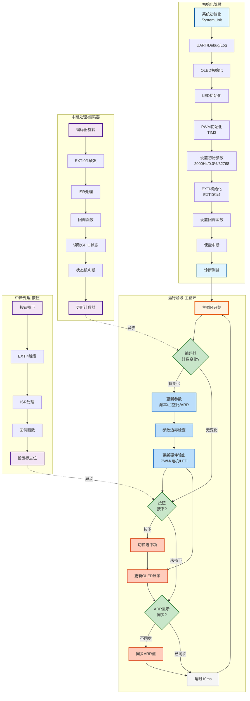

# PWM03 - 控制频率、占空比、分辨率（ARR）

## 📋 案例目的

- **核心目标**
  - 通过旋转编码器手动调节PWM的频率、占空比和ARR（分辨率），OLED显示三个参数值，按钮切换选中项，实时控制电机和蜂鸣器

- **核心功能**：
- 通过旋转编码器调节PWM参数（频率、占空比、分辨率）
- 通过按钮切换选中项
- OLED显示当前参数值和选中项
- 实时控制蜂鸣器、电机和LED

- **学习重点**：
  - 理解PWM频率、占空比和ARR（自动重装载值）的手动调节方法
  - 掌握旋转编码器的使用方法（EXTI中断方式，带防抖）
  - 掌握按钮切换选中项的实现方法
  - 学习OLED显示参数值和选中项的方法（箭头指示）
  - 理解PWM参数的安全范围限制和自动修正机制
  - 学习TB6612电机驱动的使用方法
- **应用场景**：适用于需要手动调节PWM参数的场景，如电机调速、LED调光、音频输出等

---

## 🔧 硬件要求

### 必需外设

- **旋转编码器模块**：
  - 通道A：`PB0`（EXTI Line 0，双边沿触发）
  - 通道B：`PB1`（EXTI Line 1，双边沿触发）
  - 按钮：`PA4`（EXTI Line 4，下降沿触发）
  - VCC：独立供电（不依赖STM32）
  - GND：GND
  - **注意**：
    - 旋转编码器输出正交信号，两个通道相位差90度
    - 本案例使用**双边沿触发**（`EXTI_TRIGGER_RISING_FALLING`）
    - 使用状态机方法：在中断中读取两个通道的当前状态，根据状态变化模式判断方向
    - 正转：状态变化 `00 -> 01` → 计数器+1
    - 反转：状态变化 `00 -> 10` → 计数器-1
    - 每个步进只计数一次（避免重复计数）

- **PWM输出**：
  - `PA6`（TIM3 CH1），用于无源蜂鸣器控制
  - `PA7`（TIM3 CH2），用于TB6612电机速度控制

- **TB6612电机驱动**：
  - **PWMA**：`PA7`（TIM3 CH2，PWM速度控制）
  - **AIN1**：`PB3`（方向控制）
  - **AIN2**：`PB4`（方向控制）
  - **STBY**：`PB5`（待机控制，高电平使能）
  - **VM**：外部电源5V-12V（马达驱动电源）
  - **VCC**：3.3V或5V（逻辑电源）
  - **GND**：GND（公共地）

- **LED1**：`PA1`（GPIO模拟PWM控制亮度，与占空比参数同步）
- **LED2**：`PA2`（GPIO模拟PWM控制亮度，与占空比参数同步）

### 传感器/模块

- **OLED显示屏**（SSD1306，软件I2C接口）：
  - SCL：`PB8`
  - SDA：`PB9`
  - VCC：3.3V
  - GND：GND
  - 用于显示当前PWM参数值和选中项

- **USART1**（串口调试）：
  - TX：`PA9`
  - RX：`PA10`
  - 波特率：`115200`

### 硬件连接

| STM32F103C8T6 | 外设 | 说明 |
|--------------|------|------|
| PB0 | 编码器通道A | EXTI Line 0，双边沿触发 |
| PB1 | 编码器通道B | EXTI Line 1，双边沿触发 |
| PA4 | 按钮 | EXTI Line 4，下降沿触发 |
| PA6 | 蜂鸣器（PWM） | TIM3 CH1，PWM输出 |
| PA7 | 电机PWMA | TIM3 CH2，PWM速度控制 |
| PB3 | 电机AIN1 | 方向控制 |
| PB4 | 电机AIN2 | 方向控制 |
| PB5 | 电机STBY | 待机控制（高电平使能） |
| PA1 | LED1 | GPIO模拟PWM，亮度与占空比同步 |
| PA2 | LED2 | GPIO模拟PWM，亮度与占空比同步 |
| 3.3V | VCC | 电源（编码器独立供电，此引脚可选） |
| GND | GND | 地线 |

**重要提示**：

- PB0和PB1配置为**上拉输入**（`GPIO_MODE_INPUT_PULLUP`），适用于开漏输出的编码器
- 如果编码器内部已有上拉，可以改为浮空输入（`GPIO_MODE_INPUT_FLOATING`）
- 编码器电源独立供电，不依赖STM32
- **电机电磁干扰防护**：
  - 电机运行时可能对裸露的GPIO线路造成电磁干扰，导致信号异常
  - 建议措施：
    - 使用屏蔽线或双绞线连接电机控制信号（PWMA、AIN1、AIN2、STBY）
    - 电机电源线（VM）与信号线分开走线，避免平行布线
    - 在电机电源端添加去耦电容（如100uF电解电容+0.1uF陶瓷电容）
    - 如果可能，使用光耦隔离电机控制信号
    - 保持电机驱动电路与STM32控制电路的地线连接良好
- LED使用PWM控制亮度，与占空比参数同步变化
- 案例是独立工程，硬件配置在案例目录下的 `board.h` 中
- 如果硬件引脚不同，直接修改 `Examples/PWM/PWM03_TB6612_FreqDutyResControl/board.h` 中的配置即可

---

## 📦 模块依赖

### 模块依赖关系图

展示本案例使用的模块及其依赖关系：

### 模块列表

本案例使用以下模块：

- `timer_pwm`：PWM驱动模块（核心功能，频率、占空比控制）
- `tb6612`：TB6612电机驱动模块（电机控制）
- `buzzer`：蜂鸣器驱动模块（蜂鸣器控制）
- `exti`：外部中断模块（旋转编码器和按钮）
- `gpio`：GPIO驱动模块（EXTI依赖）
- `led`：LED驱动模块（状态指示，可选）
- `oled_ssd1306`：OLED显示驱动模块（参数显示）
- `i2c_sw`：软件I2C驱动模块（OLED使用）
- `printf_wrapper`：printf封装模块（OLED格式化输出）
- `uart`：UART驱动模块（串口调试，新项目必须）
- `debug`：Debug模块（printf重定向，新项目必须）
- `log`：日志模块（分级日志系统，新项目必须）
- `error_handler`：错误处理模块（统一错误处理，新项目必须）
- `delay`：延时模块（演示延时）
- `system_init`：系统初始化模块（系统初始化）

### 模块使用说明

| 模块分类 | 模块名称 | 用途 | 依赖关系 |
|---------|---------|------|----------|
| **系统服务** | System_Init | 系统初始化 | 依赖GPIO、LED、Delay |
| **系统服务** | Delay | 延时功能 | 依赖TIM2_TimeBase |
| **系统服务** | TIM2_TimeBase | 时间基准 | 无依赖 |
| **基础驱动** | GPIO | GPIO操作 | 依赖BSP配置 |
| **基础驱动** | LED | LED控制 | 依赖GPIO |
| **通信驱动** | UART | 串口调试 | 依赖GPIO |
| **通信驱动** | I2C_SW | 软件I2C | 依赖GPIO |
| **显示驱动** | OLED_SSD1306 | OLED显示 | 依赖I2C_SW |
| **定时器驱动** | TIMER | 定时器基础 | 依赖GPIO |
| **定时器驱动** | PWM | PWM输出 | 依赖TIMER |
| **外设驱动** | EXTI | 外部中断 | 依赖GPIO |
| **电机驱动** | TB6612 | 电机控制 | 依赖PWM、GPIO |
| **调试工具** | Debug | 调试输出 | 依赖UART |
| **调试工具** | Log | 日志系统 | 依赖ErrorHandler、TIM2_TimeBase |
| **调试工具** | ErrorHandler | 错误处理 | 无依赖 |
| **调试工具** | Printf_Wrapper | 格式化输出 | 依赖OLED、UART |

---

## 🔄 实现流程

### 整体逻辑

1. **系统初始化阶段**：
   - 调用 `System_Init()` 初始化系统基础功能
   - 初始化UART、Debug、Log、ErrorHandler（新项目标准初始化流程）
   - 初始化OLED显示
   - 初始化LED（PA1和PA2，使用GPIO模拟PWM）
   - 初始化PWM（TIM3用于蜂鸣器和电机）
   - 设置PWM初始参数（频率=2000Hz，占空比=0.0%，ARR=32768）
   - LED亮度与占空比参数同步（GPIO模拟PWM，周期约5Hz）
   - 初始化EXTI0（PB0，编码器通道A，双边沿触发）
   - 初始化EXTI1（PB1，编码器通道B，双边沿触发）
   - 初始化EXTI4（PA4，按钮，下降沿触发）
   - 设置EXTI中断回调函数
   - 使能EXTI中断
   - 执行启动诊断测试（电机30%占空比运行2秒）

2. **主循环阶段**：
   - 检查按钮标志，切换选中项（频率 → 占空比 → ARR）
   - 检查编码器计数变化，更新对应参数（带防抖：频率/占空比50ms，ARR 150ms）
   - 检查ARR显示值与实际值是否一致，自动同步并刷新OLED
   - 更新OLED显示（显示三个参数值，当前选中项显示箭头`<-`）
   - 延时降低CPU占用率

3. **中断处理阶段**（自动触发）：
   - 旋转编码器旋转，产生边沿变化
   - 触发EXTI0或EXTI1中断
   - Core层的 `EXTI0_IRQHandler()` 或 `EXTI1_IRQHandler()` 自动调用 `EXTI_IRQHandler()`
   - EXTI模块调用用户回调函数（`EncoderA_Callback()` 或 `EncoderB_Callback()`）
   - 回调函数中：
     - 读取两个通道的当前GPIO状态
     - 使用状态机方法判断状态变化
     - 根据状态变化模式判断方向并更新计数器
   - 按钮按下，触发EXTI4中断
   - 回调函数中设置按钮按下标志

### 数据流向图

展示本案例的数据流向：输入设备 → 中断处理 → 应用逻辑 → 输出设备

**数据流说明**：

1. **输入设备**：
   - **旋转编码器**（PB0/PB1）：通过EXTI0/1中断检测旋转方向和步数
   - **按钮**（PA4）：通过EXTI4中断检测按下事件

2. **中断处理**：
   - EXTI中断触发后，调用用户回调函数
   - 编码器：使用状态机判断旋转方向，更新计数器
   - 按钮：设置按下标志

3. **应用逻辑**：
   - 主循环检测编码器计数变化，更新对应参数（频率/占空比/分辨率）
   - 主循环检测按钮标志，切换选中项
   - 参数更新后，同步更新所有输出设备

4. **输出设备**：
   - **蜂鸣器**：硬件PWM控制，频率和占空比可调
   - **电机**：通过TB6612控制，PWM速度控制
   - **LED**：GPIO模拟PWM，亮度与占空比同步
   - **OLED**：显示当前参数值和选中项
   - **UART**：输出详细日志信息

### 关键方法

1. **EXTI初始化**：使用 `EXTI_HW_Init()` 初始化EXTI线
   - 参数：EXTI线号、触发模式（上升沿/下降沿/双边沿）、模式（中断/事件）
   - 本案例使用双边沿触发（编码器）和下降沿触发（按钮）

2. **EXTI回调设置**：使用 `EXTI_SetCallback()` 设置中断回调函数
   - 回调函数在中断中调用，应尽可能简短
   - 只做简单操作（如记录状态、更新计数），复杂操作在主循环处理

3. **参数更新**：根据编码器旋转方向和当前选中项更新对应参数
   - **频率**：范围1000Hz ~ 20000Hz，步进1000Hz，默认2000Hz
   - **占空比**：范围0.0% ~ 99.9%，步进5%，默认0.0%，显示格式`00.0%`
   - **ARR（分辨率）**：范围256 ~ 65536，步进256，默认32768，显示格式`ARR: 32768`
   - 频率和占空比更新时，同时更新蜂鸣器、电机和LED的PWM参数
     - 蜂鸣器：TIM3 CH1（PA6），硬件PWM
     - 电机：TIM3 CH2（PA7，通过TB6612控制），硬件PWM
     - LED1：PA1，GPIO模拟PWM（在主循环中更新）
     - LED2：PA2，GPIO模拟PWM（在主循环中更新）
   - ARR更新时，直接操作TIM3寄存器（ARR、PSC、CCR），保持频率和占空比百分比不变
   - ARR自动修正：如果ARR值不适合（导致PSC溢出），自动修正为合适的值（保持256的倍数）
   - ARR边界保护：如果无法继续增大ARR（受PSC限制），禁止继续增大

4. **OLED显示**：使用 `Printf_OLED2()`、`Printf_OLED3()`、`Printf_OLED4()` 显示参数值
   - 第1行：`PWM03 Control`
   - 第2行：`Freq: 02000Hz <-`（选中时显示箭头`<-`，5位数字，不足补0）
   - 第3行：`Duty: 00.0% <-`（选中时显示箭头`<-`，格式`00.0%`）
   - 第4行：`ARR: 32768 <-`（选中时显示箭头`<-`，5位数字）
   - 切换选中项时，自动清除上一个位置的箭头

### 工作流程示意

---

## 📚 关键函数说明

### PWM相关函数

- **`PWM_Init()`**：初始化PWM定时器外设和GPIO
  - 在本案例中用于初始化TIM3，配置PA6为PWM输出
  - 初始化后需要单独设置频率、占空比和分辨率
  - 返回PWM_Status_t错误码，需要检查返回值

- **`PWM_SetFrequency()`**：设置PWM频率
  - 在本案例中用于根据编码器旋转更新频率
  - 频率范围：1Hz ~ 20000Hz（安全范围）
  - 返回PWM_Status_t错误码，需要检查返回值

- **`PWM_SetDutyCycle()`**：设置PWM占空比
  - 在本案例中用于根据编码器旋转更新占空比
  - 占空比范围：0.0% ~ 99.9%（安全范围，防止100%占空比）
  - 同时更新蜂鸣器（TIM3 CH1）和电机（TIM3 CH2）的占空比
  - LED使用GPIO模拟PWM，在主循环中根据占空比参数自动更新
  - 返回PWM_Status_t错误码，需要检查返回值

- **`PWM_SetResolution()`**：设置PWM分辨率（本案例未使用）
  - 注意：本案例直接操作TIM3寄存器（ARR、PSC、CCR）来控制分辨率，不使用此函数
  - ARR值直接控制分辨率：ARR=256为8位，ARR=65536为16位

- **`PWM_EnableChannel()`**：使能PWM通道输出
  - 在本案例中用于使能PWM输出
  - 返回PWM_Status_t错误码，需要检查返回值

### EXTI相关函数

- **`EXTI_HW_Init()`**：初始化外部中断
  - 参数：EXTI线号、触发模式、模式（中断/事件）
  - 返回值：`EXTI_OK`表示成功
  - 在本案例中用于初始化EXTI0、EXTI1、EXTI4

- **`EXTI_SetCallback()`**：设置EXTI中断回调函数
  - 参数：EXTI线号、回调函数指针、用户数据指针
  - 回调函数在中断中调用，应尽可能简短
  - 在本案例中用于设置EncoderA_Callback、EncoderB_Callback、Button_Callback

- **`EXTI_Enable()`**：使能EXTI中断
  - 使能后，EXTI中断才会触发

### TB6612相关函数

- **`TB6612_Init()`**：初始化TB6612电机驱动
  - 在本案例中用于初始化电机驱动（PB3/PB4/PB5方向/待机，PA7 PWM速度）
  - 返回TB6612_Status_t错误码，需要检查返回值

- **`TB6612_Enable()`**：使能电机驱动
  - 在本案例中用于使能电机输出

- **`TB6612_SetDirection()`**：设置电机方向
  - 在本案例中用于设置电机正转/反转

- **`TB6612_SetSpeed()`**：设置电机速度（PWM占空比）
  - 在本案例中用于根据占空比参数控制电机速度
  - 参数：速度百分比（0-100），对应PWM占空比

### OLED相关函数

- **`OLED_Init()`**：初始化OLED显示模块
  - 在本案例中用于初始化OLED显示
  - 返回OLED_Status_t错误码，需要检查返回值

- **`OLED_ShowString()`**：显示字符串
  - 在本案例中用于显示标题

- **`Printf_OLED2()`** / **`Printf_OLED3()`** / **`Printf_OLED4()`**：格式化输出到OLED第2/3/4行
  - 在本案例中用于显示频率、占空比和ARR（支持格式化字符串）
  - 使用标准printf格式化语法，如：`Printf_OLED2("Freq:%05dHz <-", freq)`

**详细函数实现和调用示例请参考**：`main_example.c` 中的代码

---

## ⚠️ 注意事项与重点

### 重要提示

1. **标准初始化流程**：
   - 必须严格按照 System_Init → UART → Debug → Log → ErrorHandler → 其他模块 的顺序初始化
   - UART/Debug初始化失败：必须停止程序（进入死循环）
   - Log初始化失败：可以继续运行（使用UART直接输出）
   - 其他模块初始化失败：根据模块重要性决定是否继续运行

2. **参数安全范围**：
   - **频率**：1000Hz ~ 20000Hz，步进1000Hz，默认2000Hz（防止过低频率导致PWM失效）
   - **占空比**：0.0% ~ 99.9%，步进5%，默认0.0%（防止100%占空比，无源蜂鸣器等设备无法工作）
   - **ARR（分辨率）**：256 ~ 65536，步进256，默认32768（8位到16位可调）

3. **编码器步进设置**：
   - **频率步进**：固定1000Hz（正转+1000Hz，反转-1000Hz）
   - **占空比步进**：固定5%（正转+5%，反转-5%）
   - **ARR步进**：固定256（正转+256，反转-256）

4. **编码器防抖设置**：
   - **频率/占空比**：防抖时间50ms（快速响应）
   - **ARR**：防抖时间150ms（防止误操作，ARR变化影响较大）

5. **ARR自动修正机制**：
   - 如果设置的ARR值导致PSC溢出，自动修正ARR为合适的值（保持256的倍数）
   - 如果无法继续增大ARR（受PSC限制），禁止继续增大，保持当前值
   - 如果显示的ARR值大于实际ARR值，自动同步并刷新OLED

6. **硬件配置**：
   - 案例是独立工程，硬件配置在案例目录下的 `board.h` 中
   - 如果硬件引脚不同，直接修改 `Examples/PWM/PWM03_TB6612_FreqDutyResControl/board.h` 中的配置即可

7. **中断回调函数应简短**：
   - 在中断回调中只做简单操作（记录状态、更新计数、设置标志位）
   - 不要执行复杂操作（OLED显示、延时等）
   - 复杂操作在主循环处理

### 关键点

1. **状态机方法判断方向**：
   - 在中断中读取两个通道的当前GPIO状态
   - 根据状态变化模式判断方向：
     - 正转：状态变化 `00 -> 01` → 计数器+1
     - 反转：状态变化 `00 -> 10` → 计数器-1
   - 每个步进只计数一次，确保计数准确

2. **参数更新逻辑**：
   - 根据编码器旋转方向和当前选中项更新对应参数
   - 频率和占空比都有边界检查，防止超出安全范围
   - 更新参数后立即调用PWM函数更新硬件

3. **显示更新优化**：
   - 只在参数变化或选中项变化时更新显示
   - 使用标志位避免频繁刷新
   - 选中项在值后面显示箭头`<-`
   - 切换选中项时，重新渲染所有行以清除上一个位置的箭头
   - ARR显示值与实际值不一致时，自动同步并刷新OLED

4. **输出分工规范**：
   - **串口（UART）**：详细日志、调试信息、错误详情（支持中文，GB2312编码）
   - **OLED**：关键状态、实时数据、简要提示（全英文，ASCII字符）
   - **双边输出**：系统启动信息、关键错误、重要状态变化

---

## 📊 安全范围评估

### 频率范围

- **理论范围**：1Hz ~ 72MHz（取决于系统时钟）
- **安全范围**：**1000Hz ~ 20000Hz**（推荐）
  - 理由：低于1000Hz可能导致PWM失效，超过20kHz对大多数应用无意义，且可能影响定时器精度
  - 步进：固定1000Hz（正转+1000Hz，反转-1000Hz）
  - 默认值：2000Hz
  - 边界检查：代码中限制频率范围为1000Hz ~ 20000Hz
  - 显示格式：5位数字，不足补0（如：`02000Hz`）

### 占空比范围

- **理论范围**：0.0% ~ 100.0%
- **安全范围**：**0.0% ~ 99.9%**（推荐）
  - 理由：100%占空比时PWM信号恒为高电平，无源蜂鸣器等设备无法工作
  - 步进：固定5%（正转+5%，反转-5%）
  - 默认值：0.0%
  - 边界检查：代码中限制占空比范围为0.0% ~ 99.9%
  - 显示格式：`00.0%`（两位整数，一位小数）

### ARR（分辨率）范围

- **理论范围**：1 ~ 65536（16位定时器）
- **安全范围**：**256 ~ 65536**（推荐）
  - 理由：ARR值直接影响PWM分辨率，256对应8位分辨率，65536对应16位分辨率
  - 步进：固定256（正转+256，反转-256）
  - 默认值：32768（65536的一半，16位分辨率）
  - 边界检查：代码中限制ARR范围为256 ~ 65536，且必须为256的倍数
  - 自动修正：如果ARR值导致PSC溢出，自动修正为合适的值（保持256的倍数）
  - 边界保护：如果无法继续增大ARR（受PSC限制），禁止继续增大
  - 显示格式：5位数字（如：`32768`）

### 安全措施

1. **参数范围限制**：
   - 频率：1000Hz ~ 20000Hz（防止过低频率导致PWM失效）
   - 占空比：0.0% ~ 99.9%（防止100%占空比）
   - ARR：256 ~ 65536，步进256（8位到16位可调）

2. **错误处理**：
   - 所有PWM函数调用检查返回值
   - 使用ErrorHandler统一处理错误
   - 串口输出错误日志
   - 参数更新失败时恢复原值

3. **中断安全**：
   - 中断中只设置标志位，不执行复杂操作
   - 主循环中处理参数更新和显示

4. **ARR自动修正**：
   - 如果ARR值导致PSC溢出，自动修正ARR为合适的值（保持256的倍数）
   - 如果无法继续增大ARR（受PSC限制），禁止继续增大，保持当前值
   - 如果显示的ARR值大于实际ARR值，自动同步并刷新OLED

---

## 🔍 常见问题排查

### 问题1：编码器旋转无反应

**可能原因**：
- EXTI初始化失败
- 编码器未正确连接
- GPIO配置问题（需要上拉输入）

**解决方法**：
1. 检查 `board.h` 中的EXTI配置是否正确（应使用 `EXTI_TRIGGER_RISING_FALLING`）
2. 检查PB0和PB1连接是否正确
3. 确认PB0和PB1配置为上拉输入（`GPIO_MODE_INPUT_PULLUP`）
4. 使用万用表测量PB0和PB1引脚电平，确认编码器输出有变化
5. 检查编码器电源和地线连接

### 问题2：按钮无反应

**可能原因**：
- EXTI4初始化失败
- 按钮未正确连接
- GPIO配置问题（需要上拉输入）

**解决方法**：
1. 检查 `board.h` 中的EXTI配置是否正确（应使用 `EXTI_TRIGGER_FALLING`）
2. 检查PA4连接是否正确
3. 确认PA4配置为上拉输入（`GPIO_MODE_INPUT_PULLUP`）
4. 使用万用表测量PA4引脚电平，确认按钮按下时有变化

### 问题3：参数更新不准确

**可能原因**：
- 编码器计数不准确
- 参数边界检查过于严格

**解决方法**：
1. 检查编码器状态机判断逻辑是否正确
2. 检查参数边界检查是否合理
3. 查看串口日志，确认参数更新是否成功

### 问题4：OLED显示不正确

**可能原因**：
- OLED初始化失败
- I2C通信问题
- 显示格式问题

**解决方法**：
1. 检查OLED连接是否正确（SCL: PB8, SDA: PB9）
2. 检查软件I2C模块是否已启用（`CONFIG_MODULE_SOFT_I2C_ENABLED = 1`）
3. 检查OLED模块是否已启用（`CONFIG_MODULE_OLED_ENABLED = 1`）
4. 检查显示格式是否正确（选中项显示箭头`<-`）

---

## 💡 扩展练习

### 循序渐进理解本案例

1. **简化功能测试**：
   - 先只实现频率调节功能，去掉占空比和ARR调节，专注于理解编码器中断和参数更新流程

2. **添加参数预设**：
   - 实现多个参数预设（如：低频、中频、高频），通过按钮长按切换预设，理解状态机设计

3. **优化显示格式**：
   - 实现参数值的单位显示（如：1kHz显示为"1.0kHz"），添加参数变化趋势显示（如：上升/下降箭头）

### 实际场景中的常见坑点

4. **参数联动问题**：
   - 实现参数联动（如：频率改变时自动调整占空比），注意避免参数更新死循环和显示闪烁问题

5. **边界条件处理**：
   - 测试极端情况：快速旋转编码器、同时按下按钮、参数达到边界值时的行为，发现并修复潜在的竞态条件

6. **ARR自动修正的边界情况**：
   - 当ARR值接近PSC溢出边界时，测试自动修正算法是否在所有情况下都能正确工作，特别是ARR值在边界附近频繁变化时

---

## 📖 相关文档

- **模块文档**：
  - **PWM模块**：`Drivers/timer/timer_pwm.c/h`
  - **TB6612模块**：`Drivers/motor/tb6612.c/h`
  - **蜂鸣器模块**：`Drivers/buzzer/buzzer.c/h`
  - **EXTI模块**：`Drivers/peripheral/exti.c/h`
  - **GPIO模块**：`Drivers/basic/gpio.c/h`
  - **LED模块**：`Drivers/basic/led.c/h`
  - **UART模块**：`Drivers/uart/uart.c/h`
  - **OLED模块**：`Drivers/display/oled_ssd1306.c/h`
  - **软件I2C模块**：`Drivers/i2c/i2c_sw.c/h`
  - **printf封装模块**：`Debug/printf_wrapper.c/h`
  - **Debug模块**：`Debug/debug.c/h`
  - **Log模块**：`Debug/log.c/h`
  - **ErrorHandler模块**：`Common/error_handler.c/h`
  - **延时功能**：`System/delay.c/h`
  - **系统初始化**：`System/system_init.c/h`

- **业务文档**：
  - **主程序代码**：`Examples/PWM/PWM03_TB6612_FreqDutyResControl/main_example.c`
  - **硬件配置**：`Examples/PWM/PWM03_TB6612_FreqDutyResControl/board.h`
  - **模块配置**：`Examples/PWM/PWM03_TB6612_FreqDutyResControl/config.h`
  - **项目规范文档**：`PROJECT_KEYWORDS.md`
  - **案例参考**：`Examples/README.md`
  - **PWM02案例**：`Examples/PWM/PWM02_TB6612_ThreeDevicesDemo/` - PWM参数控制参考
  - **EXTI02案例**：`Examples/EXTI/EXTI02_RotaryEncoder_Counter/` - 旋转编码器处理参考

---

**最后更新**：2024-01-XX

## 📝 更新日志

- **2024-01-XX**：
  - 频率范围从200Hz-5000Hz改为1000Hz-20000Hz，步进从200Hz改为1000Hz
  - OLED显示格式从4位改为5位，支持20kHz显示
  - 分辨率改为ARR直接控制（256-65536，步进256）
  - 集成TB6612电机驱动和LED2配置
  - 添加ARR自动修正和边界保护机制
  - 添加ARR显示值与实际值同步机制
  - 优化编码器防抖（频率/占空比50ms，ARR 150ms）
  - 按钮引脚从PA5改为PA4
  - 箭头显示从`->`改为`<-`
  - LED改为使用GPIO模拟PWM（PA1和PA2），与占空比参数同步变化
  - 添加电机电磁干扰防护说明

