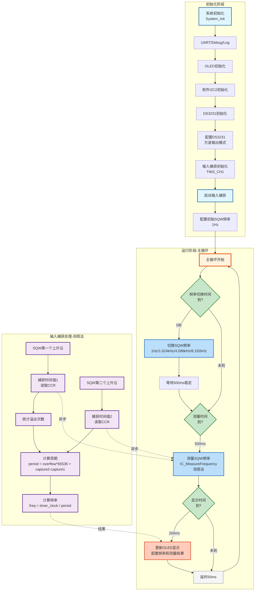

# PWM04 - DS3231 SQW输入捕获测量示例

## 📋 案例目的

- **核心目标**
  - 演示使用输入捕获功能测量DS3231的SQW（方波）输出频率，展示输入捕获模块的使用方法
  - 循环测试不同频率（1Hz、1.024kHz、4.096kHz、8.192kHz）并对比测量结果

- **核心功能**：
  - 使用DS3231的SQW引脚输出不同频率的方波（1Hz、1.024kHz、4.096kHz、8.192kHz）
  - 使用TIM3_CH1（PA6）输入捕获测量SQW频率
  - 每5秒自动切换SQW频率
  - 每500ms测量一次频率
  - OLED显示当前配置频率和测量结果
  - UART输出详细日志

- **学习重点**：
  - 理解输入捕获的工作原理和应用场景
  - 掌握输入捕获模块的配置流程（按照规范格式）
  - 掌握频率测量方法（IC_MeasureFrequency，测周法）
  - 理解测周法的原理和适用场景
  - 学习DS3231的SQW输出配置方法
  - 理解输入捕获与PWM输出的区别（输入捕获用于测量，PWM用于输出）

- **应用场景**：适用于需要测量外部信号频率、周期等参数的场景，如频率计、信号分析、传感器信号测量等

---

## 🔧 硬件要求

### 必需外设

- **DS3231实时时钟模块**（I2C接口）：
  - SCL连接到PB10（软件I2C2）
  - SDA连接到PB11（软件I2C2）
  - **SQW/INT引脚连接到PA6（TIM3_CH1，输入捕获）**
  - VCC连接到3.3V
  - GND连接到GND
  - **⚠️ 重要提示**：I2C总线需要上拉电阻（4.7kΩ-10kΩ）连接到SCL和SDA
  - **⚠️ 重要提示**：SQW引脚是推挽输出，不需要上拉电阻

### 传感器/模块

- **OLED显示屏**（SSD1306，I2C接口）：
  - SCL连接到PB8（软件I2C1）
  - SDA连接到PB9（软件I2C1）
  - VCC连接到3.3V
  - GND连接到GND
  - 用于显示测量结果
  - **⚠️ 重要提示**：OLED需要外部上拉电阻（通常4.7kΩ-10kΩ）连接到SCL和SDA

- **USART1串口**（用于UART日志输出）：
  - TX连接到PA9
  - RX连接到PA10
  - 波特率：115200，8N1格式
  - **⚠️ 重要提示**：串口助手需要配置为GB2312编码以正确显示中文

### 硬件连接

| STM32F103C8T6 | 外设/模块 | 说明 |
|--------------|----------|------|
| **DS3231连接** | | |
| PB10 | DS3231 SCL | 软件I2C2时钟线 |
| PB11 | DS3231 SDA | 软件I2C2数据线 |
| PA6 | DS3231 SQW | TIM3_CH1，输入捕获 |
| 3.3V | DS3231 VCC | 电源 |
| GND | DS3231 GND | 地线 |
| **OLED连接** | | |
| PB8 | OLED SCL | 软件I2C1时钟线 |
| PB9 | OLED SDA | 软件I2C1数据线 |
| 3.3V | OLED VCC | 电源 |
| GND | OLED GND | 地线 |
| **UART连接** | | |
| PA9 | USB转串口模块 RX | UART发送引脚 |
| PA10 | USB转串口模块 TX | UART接收引脚 |
| GND | GND | 地线 |

**重要提示**：

- I2C总线（SCL和SDA）必须添加上拉电阻（4.7kΩ-10kΩ）到3.3V
- SQW引脚是推挽输出，不需要上拉电阻
- 案例是独立工程，硬件配置在案例目录下的 `board.h` 中
- 如果硬件引脚不同，直接修改 `Examples/PWM/PWM04_InputCapture_DS3231_FreqSQW/board.h` 中的配置即可

---

## 📦 模块依赖

### 模块列表

本案例使用以下模块：

- `timer_input_capture`：输入捕获驱动模块（核心功能，频率测量）
- `ds3231`：DS3231实时时钟模块（SQW输出）
- `gpio`：GPIO驱动模块（所有外设依赖）
- `uart`：UART驱动模块（串口调试）
- `i2c_sw`：软件I2C驱动模块（OLED和DS3231使用）
- `oled_ssd1306`：OLED显示驱动模块（测量结果显示）
- `printf_wrapper`：printf封装模块（OLED格式化输出）
- `debug`：Debug模块（printf重定向）
- `log`：日志模块（分级日志系统）
- `error_handler`：错误处理模块（统一错误处理）
- `delay`：延时模块（演示延时）
- `system_init`：系统初始化模块（系统初始化）

---

## 🔄 实现流程

### 整体逻辑

1. **系统初始化阶段**：
   - 调用 `System_Init()` 初始化系统基础功能
   - 初始化UART、Debug、Log、ErrorHandler（新项目标准初始化流程）
   - 初始化OLED显示
   - 初始化软件I2C2（用于DS3231）
   - 初始化DS3231模块
   - 检查并清除OSF标志
   - 启动DS3231振荡器
   - 配置DS3231中断模式为方波输出
   - 初始化输入捕获（TIM3_CH1用于SQW）
   - 启动输入捕获
   - 配置初始SQW频率（1Hz）
   - 等待DS3231输出稳定

2. **主循环阶段**：
   - 每5秒切换一次SQW频率（循环：1Hz → 1.024kHz → 4.096kHz → 8.192kHz → 1Hz...）
   - 每500ms测量一次SQW频率（使用IC_MeasureFrequency，测周法）
   - 每200ms更新一次OLED显示（显示测量结果）
   - 延时降低CPU占用率

3. **测量原理**：
   - **测周法**：捕获两个连续上升沿，计算时间差得到周期，进而计算频率
   - 公式：`frequency = timer_clock / period_count`
   - 对于低频信号（如1Hz），需要等待较长时间才能捕获两个上升沿
   - 对于高频信号（如8.192kHz），周期很短，测量很快

### 输入捕获配置流程（按照规范）

本案例严格按照输入捕获配置规范实现：

#### 1. 初始化

- **RCC时钟使能**
  - 使能GPIO时钟（根据GPIO端口：GPIOA/B/C/D）
  - 使能AFIO时钟（用于GPIO复用功能）
  - 使能定时器时钟（TIM3在APB1）

- **GPIO配置成浮空输入模式**
  - 配置PA6为浮空输入模式（`GPIO_Mode_IN_FLOATING`）
  - 速度：`GPIO_Speed_50MHz`
  - 引脚映射：TIM3_CH1对应PA6

#### 2. 配置时基单元：让CNT计数器在内部时钟的驱动下自增运行

- `TIM_Period = 0xFFFF`（16位最大值，65535）
- `TIM_Prescaler = 0`（不分频，使用定时器时钟频率）
- `TIM_ClockDivision = TIM_CKD_DIV1`（时钟不分频）
- `TIM_CounterMode = TIM_CounterMode_Up`（向上计数）
- 调用 `TIM_TimeBaseInit()` 初始化时基

#### 3. 配置输入捕获单元

- **极性**：`TIM_ICPolarity_Rising`（上升沿捕获）
- **直连通道/交叉通道**：`TIM_ICSelection_DirectTI`（直连通道）
- **分频器参数**：`TIM_ICPSC_DIV1`（每个边沿都捕获）
- **滤波器**：`TIM_ICFilter = 0x0`（无滤波）
- 调用 `TIM_ICInit()` 初始化输入捕获

#### 4. 使能输入捕获通道

- 调用 `TIM_CCxCmd(tim_periph, tim_channel, TIM_CCx_Enable)` 使能通道

#### 5. 调用TIM_Cmd：开启定时器

- 调用 `TIM_Cmd(tim_periph, ENABLE)` 启动定时器
- 在 `IC_Start()` 函数中执行

#### 6. 需要读取频率时，直接读取CCR寄存器，按照FC/N，计算一下即可

- **当前实现**：使用测周法，需要等待两个上升沿并统计溢出次数
  - 等待第一个上升沿，读取CCR值（capture1）
  - 等待第二个上升沿，读取CCR值（capture2）
  - 统计溢出次数（overflow_count）
  - 计算周期：`period_count = overflow_count * 0x10000 + (capture2 - capture1)`
  - 计算频率：`frequency = timer_clock / period_count`

- **注意**：如果使用从模式（Slave Mode）+ Reset，则可以直接读取CCR，按照FC/N计算（当前实现未使用从模式）

### 工作流程示意

---

## 📚 关键函数说明

### 输入捕获相关函数

- **`IC_Init()`**：初始化输入捕获通道
  - 在本案例中用于初始化TIM3_CH1（SQW）
  - 参数：实例（IC_INSTANCE_TIM3）、通道（IC_CHANNEL_1）、极性（IC_POLARITY_RISING）
  - 按照规范流程配置：RCC → GPIO → 时基 → 输入捕获 → 使能通道
  - 返回IC_Status_t错误码，需要检查返回值

- **`IC_Start()`**：启动输入捕获
  - 在本案例中用于启动TIM3_CH1的输入捕获
  - 使能定时器计数器和输入捕获通道
  - 返回IC_Status_t错误码，需要检查返回值

- **`IC_MeasureFrequency()`**：测量信号频率（测周法）
  - 在本案例中用于测量SQW频率（1Hz、1.024kHz、4.096kHz、8.192kHz）
  - 捕获两个连续上升沿，计算时间差得到周期，进而计算频率
  - 自动统计溢出次数，支持低频信号测量
  - 超时时间根据信号频率动态调整：
    - 1Hz：2500ms（等待两个上升沿，每个最多1秒）
    - 1.024kHz：100ms（周期约1ms）
    - 4.096kHz、8.192kHz：50ms（周期很短）
  - 返回IC_Status_t错误码，需要检查返回值

### DS3231相关函数

- **`DS3231_Init()`**：初始化DS3231模块
  - 在本案例中用于初始化DS3231，准备配置SQW输出
  - 使用软件I2C接口（SoftI2C2，PB10/11）
  - 返回DS3231_Status_t错误码，需要检查返回值

- **`DS3231_SetSquareWave()`**：设置DS3231方波输出频率和使能
  - 在本案例中用于配置SQW输出为不同频率
  - 参数：频率枚举（DS3231_SQW_1HZ、DS3231_SQW_1024HZ、DS3231_SQW_4096HZ、DS3231_SQW_8192HZ），使能标志（1）
  - SQW引脚输出对应频率的方波信号
  - 返回DS3231_Status_t错误码，需要检查返回值

- **`DS3231_SetInterruptMode()`**：设置DS3231中断模式
  - 在本案例中用于设置中断模式为方波输出模式（INTCN=0）
  - 参数：`DS3231_INT_MODE_SQUARE_WAVE`（方波输出模式）
  - 返回DS3231_Status_t错误码，需要检查返回值

**详细函数实现和调用示例请参考**：`main_example.c` 中的代码

---

## ⚠️ 注意事项与重点

### 重要提示

1. **标准初始化流程**：
   - 必须严格按照 System_Init → UART → Debug → Log → ErrorHandler → 其他模块 的顺序初始化
   - UART/Debug初始化失败：必须停止程序（进入死循环）
   - Log初始化失败：可以继续运行（使用UART直接输出）
   - 其他模块初始化失败：根据模块重要性决定是否继续运行

2. **输入捕获配置**：
   - **严格按照规范流程配置**：RCC → GPIO → 时基 → 输入捕获 → 使能通道 → 启动定时器
   - **SQW测量**：使用TIM3_CH1（PA6），上升沿捕获（IC_POLARITY_RISING）
   - 必须先初始化输入捕获通道，再启动测量

3. **测量超时设置**：
   - **1Hz信号**：超时时间2500ms（等待两个上升沿，每个最多1秒，总共最多2秒，加上余量）
   - **1.024kHz信号**：超时时间100ms（周期约1ms，等待两个上升沿，加上余量）
   - **4.096kHz、8.192kHz信号**：超时时间50ms（周期很短，50ms足够等待两个上升沿）
   - 如果超时，测量函数返回错误码，需要检查返回值

4. **测周法原理**：
   - 测周法：测量一个完整周期的时间，精度高但测量时间长
   - 适用于低频信号（< 2kHz），也适用于高频信号（只要定时器时钟足够快）
   - 需要等待两个连续上升沿，统计溢出次数
   - 公式：`frequency = timer_clock / period_count`
   - 对于1Hz信号，需要等待约2秒才能完成测量

5. **硬件配置**：
   - 案例是独立工程，硬件配置在案例目录下的 `board.h` 中
   - 如果硬件引脚不同，直接修改 `Examples/PWM/PWM04_InputCapture_DS3231_FreqSQW/board.h` 中的配置即可

6. **I2C上拉电阻**：
   - I2C总线（SCL和SDA）必须添加上拉电阻（4.7kΩ-10kΩ）到3.3V
   - SQW引脚是推挽输出，不需要上拉电阻

### 关键点

1. **输入捕获与PWM输出的区别**：
   - **输入捕获**：用于测量外部信号的频率、周期、占空比等参数（本案例）
   - **PWM输出**：用于输出PWM信号控制外部设备（如电机、LED等）
   - 两者使用不同的定时器通道，不能同时使用同一个通道

2. **频率测量原理（测周法）**：
   - 捕获两个连续上升沿的时间戳（CCR寄存器值）
   - 统计溢出次数（CNT从65535跳回0的次数）
   - 计算时间差得到周期：`period_count = overflow_count * 0x10000 + (capture2 - capture1)`
   - 根据定时器时钟频率计算频率：`frequency = timer_clock / period_count`
   - 对于1Hz信号，需要等待2秒才能捕获两个上升沿

3. **频率切换逻辑**：
   - 每5秒自动切换一次SQW频率
   - 切换顺序：1Hz → 1.024kHz → 4.096kHz → 8.192kHz → 1Hz（循环）
   - 切换后等待500ms让信号稳定
   - 使用非阻塞延时（Delay_GetElapsed）避免阻塞主循环

4. **显示更新优化**：
   - 测量频率：每500ms测量一次（避免频繁测量）
   - 显示更新：每200ms更新一次（保持显示流畅）
   - 使用非阻塞延时（Delay_GetElapsed）避免阻塞主循环

5. **输出分工规范**：
   - **串口（UART）**：详细日志、调试信息、错误详情（支持中文，GB2312编码）
   - **OLED**：关键状态、实时数据、简要提示（全英文，ASCII字符）
   - **双边输出**：系统启动信息、关键错误、重要状态变化

---

## 🔍 常见问题排查

### 问题1：SQW频率测量失败或返回0

**可能原因**：
- DS3231 SQW输出未配置或未使能
- 输入捕获初始化失败
- 信号未正确连接到PA6
- 超时时间设置过短（1Hz信号需要2秒）

**解决方法**：
1. 检查DS3231初始化是否成功（查看串口日志）
2. 检查DS3231_SetSquareWave是否成功配置频率
3. 检查输入捕获初始化是否成功（IC_Init返回值）
4. 检查PA6连接是否正确（使用万用表测量信号）
5. 检查超时时间是否足够（1Hz信号需要至少2500ms）

### 问题2：测量结果不准确

**可能原因**：
- 定时器时钟频率计算错误
- 溢出次数统计不准确
- 信号不稳定

**解决方法**：
1. 检查定时器时钟频率是否正确（查看IC_GetTimerClock函数）
2. 检查溢出统计逻辑（查看IC_MeasureFrequency函数）
3. 检查信号质量（使用示波器观察信号波形）
4. 对于低频信号（1Hz），测量时间较长，需要耐心等待

### 问题3：OLED显示不正确

**可能原因**：
- OLED初始化失败
- I2C通信问题
- 显示格式问题

**解决方法**：
1. 检查OLED连接是否正确（SCL: PB8, SDA: PB9）
2. 检查软件I2C模块是否已启用（`CONFIG_MODULE_SOFT_I2C_ENABLED = 1`）
3. 检查OLED模块是否已启用（`CONFIG_MODULE_OLED_ENABLED = 1`）
4. 检查显示格式是否正确（snprintf格式化字符串）

### 问题4：串口无输出或乱码

**可能原因**：
- UART初始化失败
- 波特率配置错误
- 串口助手编码设置错误

**解决方法**：
1. 检查UART初始化是否成功（UART_Init返回值）
2. 检查波特率配置是否正确（115200，8N1）
3. 检查串口助手编码设置（应设置为GB2312编码）
4. 检查PA9和PA10连接是否正确

### 问题5：输入捕获初始化失败

**可能原因**：
- 定时器资源冲突（TIM3已被其他模块占用）
- GPIO配置错误
- 定时器时钟未使能

**解决方法**：
1. 检查TIM3是否被其他模块占用（如PWM模块）
2. 检查GPIO配置是否正确（PA6应配置为输入模式）
3. 检查定时器时钟是否已使能（RCC_APB1Periph_TIM3）
4. 查看串口日志中的错误信息

---

## 💡 扩展练习

### 循序渐进理解本案例

1. **简化功能测试**：
   - 先只实现1Hz频率测量，去掉其他频率，专注于理解输入捕获的基本使用方法

2. **添加周期显示**：
   - 在OLED上同时显示频率和周期，理解频率和周期的关系（f = 1 / T）

3. **优化测量精度**：
   - 使用更高精度的定时器时钟，提高测量精度，理解定时器时钟对测量精度的影响

### 实际场景中的常见坑点

4. **多通道测量冲突**：
   - 尝试同时测量多个信号，发现定时器通道冲突问题，学习如何合理分配定时器资源

5. **高频信号测量限制**：
   - 尝试测量更高频率的信号（如100kHz），发现测量精度下降或失败，理解定时器时钟频率对测量范围的限制

6. **信号稳定性问题**：
   - 测试信号不稳定时的测量结果，发现测量值波动，学习如何添加滤波和平滑处理

---

## 📖 相关文档

- **模块文档**：
  - **输入捕获模块**：`Drivers/timer/timer_input_capture.c/h`
  - **DS3231模块**：`Drivers/sensors/ds3231.c/h`
  - **GPIO模块**：`Drivers/basic/gpio.c/h`
  - **UART模块**：`Drivers/uart/uart.c/h`
  - **OLED模块**：`Drivers/display/oled_ssd1306.c/h`
  - **软件I2C模块**：`Drivers/i2c/i2c_sw.c/h`
  - **printf封装模块**：`Debug/printf_wrapper.c/h`
  - **Debug模块**：`Debug/debug.c/h`
  - **Log模块**：`Debug/log.c/h`
  - **ErrorHandler模块**：`Common/error_handler.c/h`
  - **延时功能**：`System/delay.c/h`
  - **系统初始化**：`System/system_init.c/h`

- **业务文档**：
  - **主程序代码**：`Examples/PWM/PWM04_InputCapture_DS3231_FreqSQW/main_example.c`
  - **硬件配置**：`Examples/PWM/PWM04_InputCapture_DS3231_FreqSQW/board.h`
  - **模块配置**：`Examples/PWM/PWM04_InputCapture_DS3231_FreqSQW/config.h`
  - **项目规范文档**：`../../AI/README.md`（AI规则体系）
  - **案例参考**：`Examples/README.md`
  - **Timer03案例**：`Examples/Timer/Timer03_DS3231ExternalSquareWave/` - DS3231 SQW输出参考

---

**最后更新**：2024-01-01
