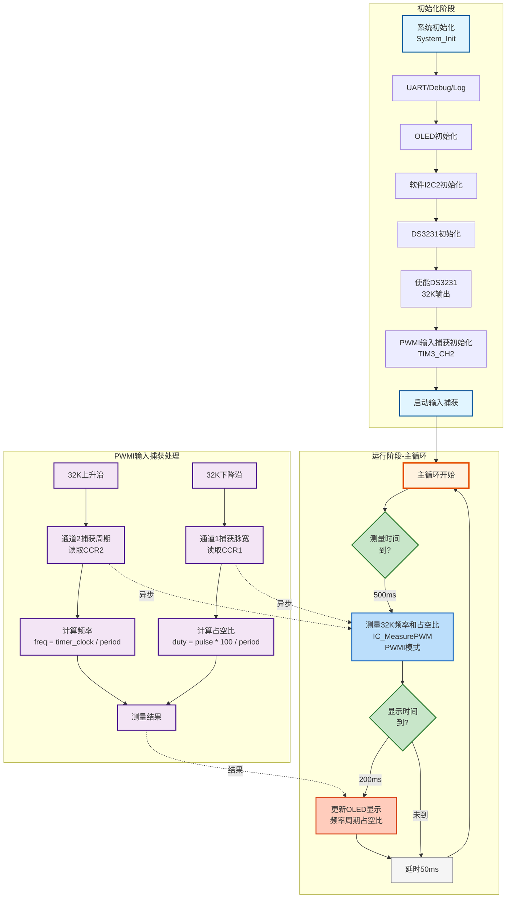
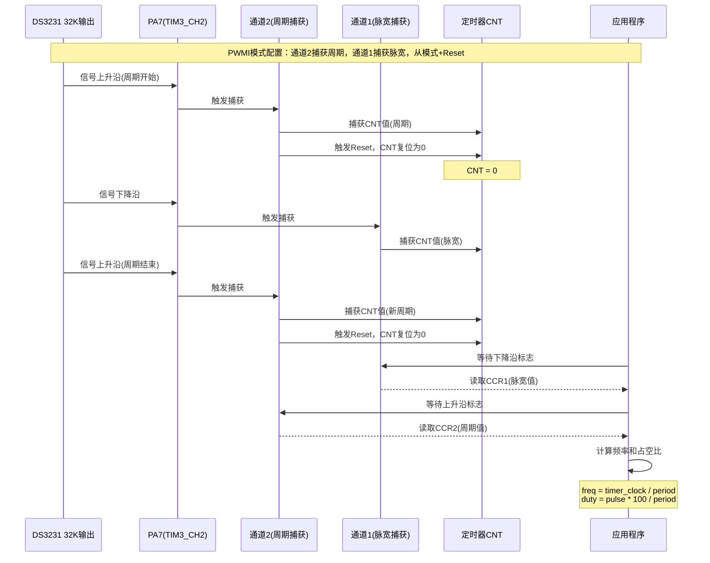

# PWM05 - DS3231 32K PWMI输入捕获测量示例

## 📋 案例目的

- **核心目标**
  - 演示使用PWMI（PWM输入模式）测量DS3231的32K输出频率（32kHz），展示PWMI模式的使用方法
  - 使用双边沿捕获同时测量频率、周期、占空比等参数

- **核心功能**：
  - 使用DS3231的32K引脚输出32kHz方波
  - 使用TIM3_CH2（PA7）PWMI输入捕获测量32K频率
  - 每500ms测量一次频率、周期、占空比
  - OLED显示测量结果（频率、周期、占空比）
  - UART输出详细日志

- **学习重点**：
  - 理解PWMI（PWM输入模式）的工作原理和应用场景
  - 掌握PWMI模式的配置流程（IC_POLARITY_BOTH）
  - 掌握PWMI模式测量频率和占空比的方法（IC_MeasurePWM）
  - 理解PWMI模式与普通输入捕获模式的区别
  - 学习DS3231的32K输出配置方法
  - 理解PWMI模式中通道1和通道2的作用（周期和脉宽）

- **应用场景**：适用于需要同时测量PWM信号频率和占空比的场景，如PWM信号分析、电机控制、传感器信号测量等

---

## 🔧 硬件要求

### 必需外设

- **DS3231实时时钟模块**（I2C接口）：
  - SCL连接到PB10（软件I2C2）
  - SDA连接到PB11（软件I2C2）
  - **32K引脚连接到PA7（TIM3_CH2，PWMI输入捕获）**
  - VCC连接到3.3V
  - GND连接到GND
  - **⚠️ 重要提示**：I2C总线需要上拉电阻（4.7kΩ-10kΩ）连接到SCL和SDA
  - **⚠️ 重要提示**：32K引脚是推挽输出，不需要上拉电阻

### 传感器/模块

- **OLED显示屏**（SSD1306，I2C接口）：
  - SCL连接到PB8（软件I2C1）
  - SDA连接到PB9（软件I2C1）
  - VCC连接到3.3V
  - GND连接到GND
  - 用于显示测量结果
  - **⚠️ 重要提示**：OLED需要外部上拉电阻（通常4.7kΩ-10kΩ）连接到SCL和SDA

- **USART1串口**（用于UART日志输出）：
  - TX连接到PA9
  - RX连接到PA10
  - 波特率：115200，8N1格式
  - **⚠️ 重要提示**：串口助手需要配置为GB2312编码以正确显示中文

### 硬件连接

| STM32F103C8T6 | 外设/模块 | 说明 |
|--------------|----------|------|
| **DS3231连接** | | |
| PB10 | DS3231 SCL | 软件I2C2时钟线 |
| PB11 | DS3231 SDA | 软件I2C2数据线 |
| PA7 | DS3231 32K | TIM3_CH2，PWMI输入捕获 |
| 3.3V | DS3231 VCC | 电源 |
| GND | DS3231 GND | 地线 |
| **OLED连接** | | |
| PB8 | OLED SCL | 软件I2C1时钟线 |
| PB9 | OLED SDA | 软件I2C1数据线 |
| 3.3V | OLED VCC | 电源 |
| GND | OLED GND | 地线 |
| **UART连接** | | |
| PA9 | USB转串口模块 RX | UART发送引脚 |
| PA10 | USB转串口模块 TX | UART接收引脚 |
| GND | GND | 地线 |

**重要提示**：

- I2C总线（SCL和SDA）必须添加上拉电阻（4.7kΩ-10kΩ）到3.3V
- 32K引脚是推挽输出，不需要上拉电阻
- 案例是独立工程，硬件配置在案例目录下的 `board.h` 中
- 如果硬件引脚不同，直接修改 `Examples/PWM/PWM05_InputCapture_DS3231_Freq32K/board.h` 中的配置即可

---

## 📦 模块依赖

### 模块列表

本案例使用以下模块：

- `timer_input_capture`：输入捕获驱动模块（核心功能，PWMI模式测量）
- `ds3231`：DS3231实时时钟模块（32K输出）
- `gpio`：GPIO驱动模块（所有外设依赖）
- `uart`：UART驱动模块（串口调试）
- `i2c_sw`：软件I2C驱动模块（OLED和DS3231使用）
- `oled_ssd1306`：OLED显示驱动模块（测量结果显示）
- `printf_wrapper`：printf封装模块（OLED格式化输出）
- `debug`：Debug模块（printf重定向）
- `log`：日志模块（分级日志系统）
- `error_handler`：错误处理模块（统一错误处理）
- `delay`：延时模块（演示延时）
- `system_init`：系统初始化模块（系统初始化）

---

## 🔄 实现流程

### 整体逻辑

1. **系统初始化阶段**：
   - 调用 `System_Init()` 初始化系统基础功能
   - 初始化UART、Debug、Log、ErrorHandler（新项目标准初始化流程）
   - 初始化OLED显示
   - 初始化软件I2C2（用于DS3231）
   - 初始化DS3231模块
   - 检查并清除OSF标志
   - 启动DS3231振荡器
   - 使能DS3231 32K输出
   - 初始化PWMI输入捕获（TIM3_CH2用于32K）
   - 启动输入捕获
   - 等待DS3231输出稳定

2. **主循环阶段**：
   - 每500ms测量一次32K频率和占空比（使用IC_MeasurePWM，PWMI模式）
   - 每200ms更新一次OLED显示（显示测量结果）
   - 延时降低CPU占用率

3. **测量原理**：
   - **PWMI模式**：使用双边沿捕获，同时测量周期和脉宽
   - 对于通道2配置：通道2捕获周期（上升沿），通道1捕获脉宽（下降沿）
   - 使用从模式+Reset：每次上升沿时CNT自动复位为0，简化测量
   - 公式：`frequency = timer_clock / period_count`
   - 公式：`duty_cycle = pulse_width_count * 100 / period_count`
   - 32kHz信号的周期约31.25us，测量很快
   - **注意**：DS3231的32K输出占空比可能不是50%，应以实际测量为准

### PWMI输入捕获配置流程（按照规范）

本案例严格按照PWMI输入捕获配置规范实现：

#### 1. 初始化

- **RCC时钟使能**
  - 使能GPIO时钟（根据GPIO端口：GPIOA/B/C/D）
  - 使能AFIO时钟（用于GPIO复用功能）
  - 使能定时器时钟（TIM3在APB1）

- **GPIO配置成浮空输入模式**
  - 配置PA7为浮空输入模式（`GPIO_Mode_IN_FLOATING`）- 通道2（周期捕获）
  - **重要**：PWMI模式需要同时配置通道1（PA6）和通道2（PA7）的GPIO
  - 通道1（PA6）配置为浮空输入模式 - 通道1（脉宽捕获）
  - 速度：`GPIO_Speed_50MHz`
  - 引脚映射：TIM3_CH1对应PA6，TIM3_CH2对应PA7

#### 2. 配置时基单元：让CNT计数器在内部时钟的驱动下自增运行

- `TIM_Period = 0xFFFF`（16位最大值，65535）
- `TIM_Prescaler = 0`（不分频，使用定时器时钟频率）
- `TIM_ClockDivision = TIM_CKD_DIV1`（时钟不分频）
- `TIM_CounterMode = TIM_CounterMode_Up`（向上计数）
- 调用 `TIM_TimeBaseInit()` 初始化时基

#### 3. 配置PWMI输入捕获单元

- **极性**：`TIM_ICPolarity_BothEdge`（双边沿捕获，PWMI模式）
- **直连通道/交叉通道**：`TIM_ICSelection_DirectTI`（直连通道）
- **分频器参数**：`TIM_ICPSC_DIV1`（每个边沿都捕获）
- **滤波器**：`TIM_ICFilter = 0x0`（无滤波）
- 调用 `TIM_PWMIConfig()` 初始化PWMI（注意：不是TIM_ICInit）
- **重要**：PWMI模式会自动配置通道1和通道2，需要同时配置两个通道的GPIO

#### 4. 配置从模式（Slave Mode）

- **触发源**：通道1使用 `TIM_TS_TI1FP1`，通道2使用 `TIM_TS_TI2FP2`
- **从模式**：`TIM_SlaveMode_Reset`（每次上升沿时CNT自动复位为0）
- 调用 `TIM_SelectInputTrigger()` 和 `TIM_SelectSlaveMode()` 配置从模式
- **作用**：简化测量，直接读取CCR值得到周期，无需处理溢出

#### 5. 使能输入捕获通道

- PWMI模式需要同时使能通道1和通道2
- 调用 `TIM_CCxCmd()` 使能两个通道

#### 6. 调用TIM_Cmd：开启定时器

- 调用 `TIM_Cmd(tim_periph, ENABLE)` 启动定时器
- 在 `IC_Start()` 函数中执行

#### 7. PWMI模式测量

- **PWMI模式工作原理**：
  - 通道1和通道2同时捕获信号
  - 对于通道2配置：通道2捕获周期（上升沿，触发CNT复位），通道1捕获脉宽（下降沿）
  - 使用从模式+Reset：每次上升沿时CNT自动复位为0，简化测量
  - 使用 `IC_MeasurePWM()` 函数读取周期和脉宽，计算频率和占空比

### 工作流程示意

#### 1. 程序工作流程图

#### 2. PWMI模式工作原理时序图

---

## 📚 关键函数说明

### 输入捕获相关函数

- **`IC_Init()`**：初始化输入捕获通道（PWMI模式）
  - 在本案例中用于初始化TIM3_CH2（32K）
  - 参数：实例（IC_INSTANCE_TIM3）、通道（IC_CHANNEL_2）、极性（IC_POLARITY_BOTH）
  - **注意**：PWMI模式必须使用 `IC_POLARITY_BOTH`（双边沿捕获）
  - 按照规范流程配置：RCC → GPIO → 时基 → PWMI输入捕获 → 使能通道
  - 返回IC_Status_t错误码，需要检查返回值

- **`IC_Start()`**：启动输入捕获
  - 在本案例中用于启动TIM3_CH2的PWMI输入捕获
  - 使能定时器计数器和输入捕获通道
  - 返回IC_Status_t错误码，需要检查返回值

- **`IC_MeasurePWM()`**：测量PWM信号（频率、占空比）
  - 在本案例中用于测量32K频率和占空比（32kHz）
  - **PWMI模式专用**：需要先使用 `IC_POLARITY_BOTH` 初始化
  - 自动读取通道1和通道2的捕获值，计算周期和脉宽
  - 对于通道2配置：通道2捕获周期，通道1捕获脉宽
  - 读取顺序：先等待脉宽捕获（通道1下降沿），再等待周期捕获（通道2上升沿），确保读取同一周期的数据
  - 超时时间：100ms（32kHz信号周期约31.25us，100ms足够）
  - 返回IC_Status_t错误码，需要检查返回值
  - **注意**：占空比以实际测量为准，DS3231的32K输出占空比可能不是50%

### DS3231相关函数

- **`DS3231_Init()`**：初始化DS3231模块
  - 在本案例中用于初始化DS3231，准备配置32K输出
  - 使用软件I2C接口（SoftI2C2，PB10/11）
  - 返回DS3231_Status_t错误码，需要检查返回值

- **`DS3231_Enable32kHz()`**：使能DS3231 32K输出
  - 在本案例中用于使能32K输出（32kHz方波）
  - 32K引脚输出32kHz方波信号（50%占空比）
  - 返回DS3231_Status_t错误码，需要检查返回值

- **`DS3231_Start()`**：启动DS3231振荡器
  - 在本案例中用于启动DS3231振荡器（必须启动才能输出32K）
  - 返回DS3231_Status_t错误码，需要检查返回值

**详细函数实现和调用示例请参考**：`main_example.c` 中的代码

---

## ⚠️ 注意事项与重点

### 重要提示

1. **标准初始化流程**：
   - 必须严格按照 System_Init → UART → Debug → Log → ErrorHandler → 其他模块 的顺序初始化
   - UART/Debug初始化失败：必须停止程序（进入死循环）
   - Log初始化失败：可以继续运行（使用UART直接输出）
   - 其他模块初始化失败：根据模块重要性决定是否继续运行

2. **PWMI输入捕获配置**：
   - **严格按照规范流程配置**：RCC → GPIO → 时基 → PWMI输入捕获 → 使能通道 → 启动定时器
   - **32K测量**：使用TIM3_CH2（PA7），PWMI模式（IC_POLARITY_BOTH）
   - **关键点**：PWMI模式必须使用 `IC_POLARITY_BOTH`，会调用 `TIM_PWMIConfig()` 而不是 `TIM_ICInit()`
   - 必须先初始化PWMI输入捕获通道，再启动测量

3. **PWMI模式工作原理**：
   - **通道1和通道2同时工作**：通道1捕获脉宽，通道2捕获周期（对于通道2配置）
   - **对于通道2配置**：通道2捕获周期（上升沿，触发CNT复位），通道1捕获脉宽（下降沿）
   - **从模式+Reset**：每次上升沿时CNT自动复位为0，简化测量，直接读取CCR值得到周期
   - **GPIO配置**：PWMI模式需要同时配置通道1（PA6）和通道2（PA7）的GPIO为浮空输入模式
   - **测量函数**：使用 `IC_MeasurePWM()` 读取周期和脉宽，自动计算频率和占空比
   - **读取顺序**：先等待脉宽捕获（通道1下降沿），再等待周期捕获（通道2上升沿），确保读取同一周期的数据
   - **超时设置**：32kHz信号周期约31.25us，100ms超时时间足够

4. **PWMI模式与普通输入捕获模式的区别**：
   - **普通输入捕获模式**：只能捕获单边沿（上升沿或下降沿），需要手动测量周期
   - **PWMI模式**：自动捕获双边沿，同时测量周期和脉宽，适合PWM信号测量
   - **配置区别**：PWMI模式使用 `IC_POLARITY_BOTH`，普通模式使用 `IC_POLARITY_RISING` 或 `IC_POLARITY_FALLING`

5. **硬件配置**：
   - 案例是独立工程，硬件配置在案例目录下的 `board.h` 中
   - 如果硬件引脚不同，直接修改 `Examples/PWM/PWM05_InputCapture_DS3231_Freq32K/board.h` 中的配置即可

6. **I2C上拉电阻**：
   - I2C总线（SCL和SDA）必须添加上拉电阻（4.7kΩ-10kΩ）到3.3V
   - 32K引脚是推挽输出，不需要上拉电阻

### 关键点

1. **PWMI模式的优势**：
   - 自动捕获双边沿，同时测量周期和脉宽
   - 适合PWM信号测量，无需手动计算占空比
   - 测量精度高，适合高频信号（如32kHz）

2. **32K信号特点**：
   - DS3231的32K输出是32kHz方波信号
   - 周期约31.25us，频率稳定
   - **占空比**：以实际测量为准，不同芯片可能不同（通常不是50%）
   - 适合作为外部时钟源或频率参考

3. **测量超时设置**：
   - 32kHz信号周期很短（约31.25us），100ms超时时间足够
   - 如果测量失败，检查信号连接和初始化是否正确

4. **输出分工规范**：
   - **串口（UART）**：详细日志、调试信息、错误详情（支持中文，GB2312编码）
   - **OLED**：关键状态、实时数据、简要提示（全英文，ASCII字符）
   - **双边输出**：系统启动信息、关键错误、重要状态变化

---

## 🔍 常见问题排查

### 问题1：32K频率测量失败或返回0

**可能原因**：
- DS3231 32K输出未使能
- PWMI输入捕获初始化失败（未使用IC_POLARITY_BOTH）
- 信号未正确连接到PA7
- 超时时间设置过短

**解决方法**：
1. 检查DS3231初始化是否成功（查看串口日志）
2. 检查DS3231_Enable32kHz是否成功使能32K输出
3. 检查PWMI输入捕获初始化是否成功（IC_Init返回值，必须使用IC_POLARITY_BOTH）
4. 检查PA7连接是否正确（使用万用表测量信号）
5. 检查超时时间是否足够（32kHz信号100ms足够）

### 问题2：测量结果不准确

**可能原因**：
- 定时器时钟频率计算错误
- PWMI模式配置错误（通道1和通道2的作用）
- 信号不稳定

**解决方法**：
1. 检查定时器时钟频率是否正确（查看IC_GetTimerClock函数）
2. 检查PWMI模式配置（通道2捕获周期，通道1捕获脉宽）
3. 检查信号质量（使用示波器观察信号波形）
4. 检查通道1（PA6）和通道2（PA7）的GPIO是否都正确配置
5. 检查从模式配置是否正确（触发源和Reset模式）
6. 32kHz信号应该稳定在32kHz，占空比以实际测量为准（可能不是50%）

### 问题3：PWMI模式初始化失败

**可能原因**：
- 未使用IC_POLARITY_BOTH
- 定时器资源冲突（TIM3已被其他模块占用）
- GPIO配置错误

**解决方法**：
1. 检查是否使用IC_POLARITY_BOTH（PWMI模式必须使用双边沿捕获）
2. 检查TIM3是否被其他模块占用（如PWM模块）
3. 检查GPIO配置是否正确（PA7应配置为输入模式）
4. 查看串口日志中的错误信息

### 问题4：OLED显示不正确

**可能原因**：
- OLED初始化失败
- I2C通信问题
- 显示格式问题

**解决方法**：
1. 检查OLED连接是否正确（SCL: PB8, SDA: PB9）
2. 检查软件I2C模块是否已启用（`CONFIG_MODULE_SOFT_I2C_ENABLED = 1`）
3. 检查OLED模块是否已启用（`CONFIG_MODULE_OLED_ENABLED = 1`）
4. 检查显示格式是否正确（snprintf格式化字符串）

### 问题5：串口无输出或乱码

**可能原因**：
- UART初始化失败
- 波特率配置错误
- 串口助手编码设置错误

**解决方法**：
1. 检查UART初始化是否成功（UART_Init返回值）
2. 检查波特率配置是否正确（115200，8N1）
3. 检查串口助手编码设置（应设置为GB2312编码）
4. 检查PA9和PA10连接是否正确

---

## 💡 扩展练习

### 循序渐进理解本案例

1. **简化功能测试**：
   - 先只实现频率测量，去掉占空比显示，专注于理解PWMI模式的基本使用方法

2. **添加误差分析**：
   - 在OLED上显示期望频率（32kHz）和测量频率的误差，理解测量精度

3. **优化测量精度**：
   - 使用更高精度的定时器时钟，提高测量精度，理解定时器时钟对测量精度的影响

### 实际场景中的常见坑点

4. **PWMI模式通道选择**：
   - 尝试使用通道1进行PWMI测量，发现通道1和通道2的作用不同，学习PWMI模式的工作原理

5. **高频信号测量限制**：
   - 尝试测量更高频率的信号（如100kHz），发现测量精度下降或失败，理解定时器时钟频率对测量范围的限制

6. **信号稳定性问题**：
   - 测试信号不稳定时的测量结果，发现测量值波动，学习如何添加滤波和平滑处理

---

## 📖 相关文档

- **模块文档**：
  - **输入捕获模块**：`Drivers/timer/timer_input_capture.c/h`
  - **DS3231模块**：`Drivers/sensors/ds3231.c/h`
  - **GPIO模块**：`Drivers/basic/gpio.c/h`
  - **UART模块**：`Drivers/uart/uart.c/h`
  - **OLED模块**：`Drivers/display/oled_ssd1306.c/h`
  - **软件I2C模块**：`Drivers/i2c/i2c_sw.c/h`
  - **printf封装模块**：`Debug/printf_wrapper.c/h`
  - **Debug模块**：`Debug/debug.c/h`
  - **Log模块**：`Debug/log.c/h`
  - **ErrorHandler模块**：`Common/error_handler.c/h`
  - **延时功能**：`System/delay.c/h`
  - **系统初始化**：`System/system_init.c/h`

- **业务文档**：
  - **主程序代码**：`Examples/PWM/PWM05_InputCapture_DS3231_Freq32K/main_example.c`
  - **硬件配置**：`Examples/PWM/PWM05_InputCapture_DS3231_Freq32K/board.h`
  - **模块配置**：`Examples/PWM/PWM05_InputCapture_DS3231_Freq32K/config.h`
  - **项目规范文档**：`PROJECT_KEYWORDS.md`
  - **案例参考**：`Examples/README.md`
  - **PWM04案例**：`Examples/PWM/PWM04_InputCapture_DS3231_FreqSQW/` - 普通输入捕获参考
  - **Timer04案例**：`Examples/Timer/Timer04_DS3231ExternalClock32kHz/` - DS3231 32K输出参考

---

**最后更新**：2024-12-19

**更新说明**：
- 添加了PWMI模式从模式（Slave Mode）+ Reset配置说明
- 添加了通道1（PA6）和通道2（PA7）GPIO配置说明
- 修正了占空比说明：DS3231的32K输出占空比以实际测量为准，可能不是50%
- 优化了PWMI模式读取逻辑说明

