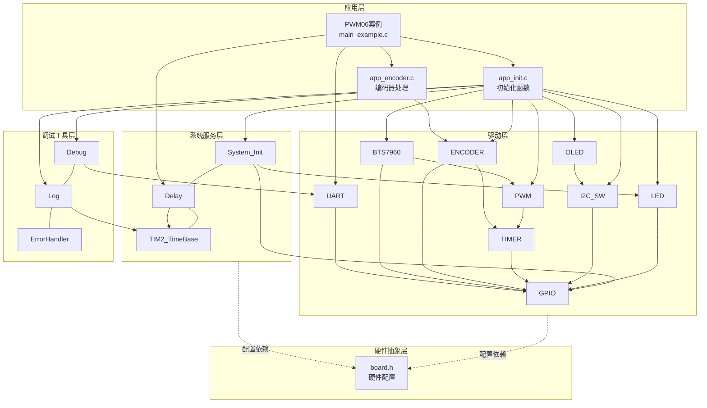
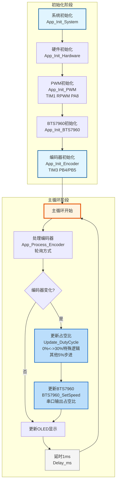

# PWM06 - BTS7960电机参数手动控制

## 📋 案例目的

- **核心目标**：通过旋转编码器手动调节BTS7960电机的PWM占空比，OLED实时显示参数值，串口输出占空比变化

- **核心功能**：
  - 通过旋转编码器调节PWM占空比（0%停止 或 30.0% ~ 100.0%）
  - OLED实时显示当前状态、占空比、频率、分辨率、IS状态
  - 串口输出详细日志信息和占空比变化值
  - 占空比特殊逻辑：0%往上调直接跳到30%，30%往下调直接跳到0%

- **学习重点**：
  - 理解BTS7960的引脚功能和使用方法（只使用正转方向，精简引脚配置）
  - 掌握BTS7960的初始化、使能、方向控制、速度控制
  - 掌握旋转编码器的使用方法（编码器接口模式，TIM3，轮询方式）
  - 学习OLED显示参数值的方法
  - 掌握代码模块化设计（初始化函数抽离到app_init.c，编码器处理抽离到app_encoder.c）
  - 掌握BTS7960_SetDirection()、BTS7960_SetSpeed()等函数的使用

- **应用场景**：适用于需要手动调节电机参数的场景，如电机调试、参数测试、教学演示等

---

## 🔧 硬件要求

### 必需外设

- **BTS7960电机驱动模块**（只使用正转方向）：
  - **R组（正转）**：
    - R_EN：`PA5`（STM32控制，代码设置为高电平）
    - L_EN：**硬件直接连接到VCC（5V）**，不能悬空！BTS7960要求R_EN和L_EN必须同时为高电平才能工作
    - RPWM：`PA8`（TIM1 CH1，正转PWM）
    - R_IS：未使用（board.h中配置为NULL, 0）
  - **L组（不使用）**：
    - LPWM：不需要（硬件不连接）
    - L_IS：不需要（硬件不连接）
  - VCC：5V逻辑电源（不能接3.3V）
  - GND：公共地（必须与STM32共地）
  - 工作电源：6V~27V（典型12V/24V），外部电源
  - **重要提示**：如果L_EN引脚悬空，BTS7960不会工作！必须将L_EN硬件连接到VCC（5V）

- **旋转编码器**：
  - 通道A：`PB4`（TIM3 CH1，部分重映射）
  - 通道B：`PB5`（TIM3 CH2，部分重映射）
  - 使用编码器接口模式（4倍频）
  - VCC：独立供电（不依赖STM32）
  - GND：GND

- **LED1**：`PA1`（低电平点亮，状态指示）

### 传感器/模块

- **OLED显示屏**（SSD1306，软件I2C接口）：
  - SCL：`PB8`
  - SDA：`PB9`
  - VCC：3.3V
  - GND：GND
  - 用于显示当前参数值和状态

- **USART1**（串口调试）：
  - TX：`PA9`
  - RX：`PA10`
  - 波特率：`115200`，8N1
  - 标准配置（不使用重映射）

### 硬件连接

| STM32引脚 | BTS7960引脚 | 说明 |
|----------|------------|------|
| **R组（正转）** | | |
| PA5 | R_EN (引脚3) | 正转使能（STM32控制，代码设置为高电平） |
| VCC (5V) | L_EN (引脚4) | **硬件直接连接到VCC（5V），不能悬空！** |
| PA8 | RPWM (引脚1) | TIM1 CH1，正转PWM速度控制 |
| **L组（不使用）** | | |
| - | LPWM (引脚2) | 硬件不连接 |
| - | L_IS (引脚6) | 硬件不连接 |
| **其他外设** | | |
| PA1 | LED1 | 低电平点亮 |
| PA9 | USB转串口模块 TX | UART发送引脚 |
| PA10 | USB转串口模块 RX | UART接收引脚 |
| PB4 | 编码器通道A | TIM3 CH1，部分重映射 |
| PB5 | 编码器通道B | TIM3 CH2，部分重映射 |
| PB8 | OLED SCL | I2C时钟线 |
| PB9 | OLED SDA | I2C数据线 |
| **电源连接** | | |
| 5V | BTS7960 VCC (引脚7) | 逻辑电源（必须5V，不能接3.3V） |
| 外部6V-27V | BTS7960 工作电源+ | 电机驱动电源（典型12V/24V） |
| GND | BTS7960 GND (引脚8) | 公共地（必须与STM32共地） |
| GND | 外部电源 GND | 公共地（必须与STM32共地） |
| 3.3V | OLED VCC | 电源 |
| GND | 所有模块 GND | 公共地线（必须共地） |
| **电机连接** | | |
| - | BTS7960 输出端+ | 连接到电机线1 |
| - | BTS7960 输出端- | 连接到电机线2 |

### 硬件配置

**重要说明**：案例是独立工程，硬件配置在案例目录下的 `board.h` 中。
如果硬件引脚不同，直接修改 `Examples/PWM/PWM06_BTS7960_CarAirPumpMotor/board.h` 中的配置即可。

**BTS7960配置**（已包含在board.h中）：
```c
/* BTS7960统一配置表 - 只使用正转方向，L_EN硬件接VCC */
/* R_EN=PA5（STM32控制），L_EN=NULL（硬件直接接VCC 5V），RPWM=TIM1 CH1 (PA8), R_IS=NULL（未使用） */
#define BTS7960_CONFIGS { \
    {GPIOA, GPIO_Pin_5, NULL, 0, 0, 0, 0, 0, NULL, 0, NULL, 0, 1}, \
}
```

**PWM配置**（已包含在board.h中）：
```c
/* PWM统一配置表 - 只使用正转方向 */
/* TIM1 CH1(PA8)用于RPWM */
/* TIM3只用于编码器接口（CH1/CH2用于编码器，PB4/PB5），不用于PWM */
#define PWM_CONFIGS { \
    {TIM1, {{GPIOA, GPIO_Pin_8, 1}, {NULL, 0, 0}, {NULL, 0, 0}, {NULL, 0, 0}}, 1}, \
    {TIM3, {{NULL, 0, 0}, {NULL, 0, 0}, {NULL, 0, 0}, {NULL, 0, 0}}, 0}, \
}
```

**UART配置**（已包含在board.h中，标准配置）：
```c
/* UART统一配置表 - 标准配置：USART1，PA9/PA10，115200，8N1 */
#define UART_CONFIGS { \
    {USART1, GPIOA, GPIO_Pin_9, GPIOA, GPIO_Pin_10, 115200, USART_WordLength_8b, USART_StopBits_1, USART_Parity_No, 1}, \
}
```

---

## 📦 模块依赖

### 模块依赖关系图



### 模块列表

本案例使用以下模块：

- `bts7960`：BTS7960电机驱动模块（核心功能，大功率电机控制）
- `timer_pwm`：PWM驱动模块（RPWM控制，TIM1）
- `timer_encoder`：编码器接口模块（旋转编码器读取，TIM3）
- `led`：LED驱动模块（状态指示）
- `uart`：UART驱动模块（串口调试）
- `oled_ssd1306`：OLED显示驱动模块（参数显示）
- `i2c_sw`：软件I2C驱动模块（OLED使用）
- `debug`：Debug模块（printf重定向）
- `log`：日志模块（分级日志系统）
- `error_handler`：错误处理模块（统一错误处理）
- `gpio`：GPIO驱动模块（所有模块依赖）
- `delay`：延时模块（演示延时）
- `system_init`：系统初始化模块（系统初始化）

---

## 🚀 使用方法

### 快速开始

1. **打开案例工程**：双击 `Examples/PWM/PWM06_BTS7960_CarAirPumpMotor/Examples.uvprojx` 打开Keil工程
2. **检查硬件配置**：确认案例目录下的 `board.h` 中硬件配置正确
3. **连接硬件**：按照硬件连接表连接BTS7960、旋转编码器、LED、OLED等外设
4. **注意电源**：确保BTS7960的VCC接5V（不能接3.3V），工作电源接6V~27V
5. **编译下载**：在Keil中编译（F7）并下载到开发板（F8）
6. **观察效果**：
   - OLED显示当前状态、占空比、频率、分辨率、IS状态
   - 串口输出详细日志信息和占空比变化值
   - 旋转编码器调节占空比

### 详细操作流程

**通用操作步骤请参考**：[Examples/README.md](../README.md#-通用操作流程)

**注意**：本案例是独立工程，无需复制文件，直接打开工程文件即可编译运行。

### 操作说明

- **旋转编码器**：调节PWM占空比
  - 顺时针旋转：增加占空比（步进：5%）
  - 逆时针旋转：减少占空比（步进：5%）
  - 特殊逻辑：
    - 0%往上调：直接跳到30%（安全最低值）
    - 30%往下调：直接跳到0%（停止）
    - 其他情况：按5%步进调整（30% ~ 100%）
- **OLED显示**：
  - 第1行：当前状态（Stop/Forward）
  - 第2行：当前占空比（0.0% ~ 100.0%）
  - 第3行：固定参数（频率20kHz，分辨率10位）
  - 第4行：IS状态（IS: Disabled，R_IS未使用）
- **串口输出**：
  - 系统初始化信息
  - 编码器变化时输出占空比值（格式：`[INFO][MAIN] 占空比: XX.X%`）

---

## 🔄 实现流程

### 整体逻辑

本案例通过旋转编码器手动调节BTS7960电机的PWM占空比：

1. **初始化阶段**（代码抽离到`app_init.c`）：
   - 系统初始化（GPIO、LED、delay、TIM2_TimeBase）
   - UART初始化（串口调试）
   - Debug和Log模块初始化
   - OLED初始化（显示模块）
   - PWM初始化（TIM1用于RPWM，只使用正转方向）
   - BTS7960初始化（只使用正转方向，L_EN硬件接VCC）
   - 编码器接口初始化（TIM3，PB4/PB5，部分重映射）

2. **主循环阶段**（编码器处理抽离到`app_encoder.c`）：
   - 读取编码器计数值（编码器接口模式，硬件自动计数，轮询方式）
   - 计算编码器变化量，更新PWM占空比（累积到4个计数才更新，1个物理步进=5%占空比）
   - 更新OLED显示（状态、占空比等）
   - 串口输出占空比变化值

### 代码结构

本案例采用模块化设计，代码结构清晰：

```
Examples/PWM/PWM06_BTS7960_CarAirPumpMotor/
├── main_example.c      # 主逻辑（238行，简洁清晰）
├── app_init.h          # 初始化函数声明
├── app_init.c          # 初始化函数实现
├── app_encoder.h       # 编码器处理函数声明
├── app_encoder.c       # 编码器处理函数实现
├── board.h            # 硬件配置
└── config.h            # 模块开关配置
```

**代码特点**：
- **模块化设计**：初始化函数抽离到`app_init.c`，编码器处理抽离到`app_encoder.c`
- **main函数简洁**：只有约30行，逻辑清晰
- **职责分离**：每个文件职责明确，易于维护

### 关键方法

1. **标准初始化流程**：按照System_Init → UART → Debug → Log → ErrorHandler → 其他模块的顺序初始化
2. **编码器接口模式**：使用TIM3编码器接口模式，硬件自动计数，轮询方式读取
3. **占空比控制逻辑**：
   - 0%往上调：直接跳到30%（安全最低值，对应7.6V）
   - 30%往下调：直接跳到0%（停止）
   - 其他情况：按5%步进调整（30% ~ 100%）
4. **错误处理集成**：通过ErrorHandler模块统一处理错误，并输出错误日志
5. **分级日志输出**：通过Log模块实现不同级别的日志输出，便于调试和监控
6. **串口与OLED输出分工**：串口输出详细日志（中文），OLED输出简要状态（英文）

### 工作流程示意图



---

## 📚 关键函数说明

### 应用层函数（app_init.c / app_encoder.c）

- **`App_Init_System()`**：初始化系统模块（UART、Debug、Log）
  - 在本案例中用于系统初始化，按照标准初始化流程
  - 输出初始化信息到串口

- **`App_Init_Hardware()`**：初始化硬件模块（LED、OLED、I2C）
  - 在本案例中用于硬件初始化
  - OLED显示初始化信息

- **`App_Init_PWM()`**：初始化PWM模块（TIM1用于RPWM）
  - 在本案例中用于初始化TIM1，配置为20kHz频率，10位分辨率
  - 配置死区时间和主输出使能

- **`App_Init_BTS7960()`**：初始化BTS7960电机驱动
  - 在本案例中用于初始化BTS7960，设置初始方向为停止，初始速度为0%

- **`App_Init_Encoder()`**：初始化编码器接口
  - 在本案例中用于初始化TIM3编码器接口模式，配置为4倍频模式
  - 返回编码器初始计数值

- **`App_Process_Encoder()`**：处理编码器输入（轮询方式）
  - 在本案例中用于主循环中处理编码器输入
  - 累积编码器变化量，达到4个计数（1个物理步进）时调用回调函数更新占空比

### BTS7960相关函数

- **`BTS7960_Init()`**：初始化BTS7960驱动模块
  - 在本案例中用于初始化BTS7960，配置R_EN（PA5）、RPWM（PA8）
  - L_EN硬件接VCC，R_IS未使用
  - 返回BTS7960_Status_t错误码，需要检查返回值

- **`BTS7960_Enable()`**：使能BTS7960
  - 在本案例中用于使能电机驱动
  - 设置R_EN为高电平（L_EN硬件接VCC）
  - 返回BTS7960_Status_t错误码，需要检查返回值

- **`BTS7960_SetDirection()`**：设置电机方向
  - 在本案例中用于控制电机状态（停止/正转）
  - 支持：停止、正转（只使用正转方向）
  - 返回BTS7960_Status_t错误码，需要检查返回值

- **`BTS7960_SetSpeed()`**：设置电机速度（PWM占空比）
  - 在本案例中用于控制电机转速（由旋转编码器控制）
  - 速度范围：0.0 ~ 100.0（单位：百分比）
  - 返回BTS7960_Status_t错误码，需要检查返回值

### 编码器相关函数

- **`ENCODER_Init()`**：初始化编码器接口
  - 在本案例中用于初始化TIM3编码器接口模式，配置为4倍频模式
  - 参数：编码器实例（ENCODER_INSTANCE_TIM3）、编码器模式（ENCODER_MODE_TI12）
  - 返回ENCODER_Status_t错误码，需要检查返回值

- **`ENCODER_Start()`**：启动编码器
  - 在本案例中用于启动编码器计数
  - 返回ENCODER_Status_t错误码，需要检查返回值

- **`ENCODER_ReadCount()`**：读取编码器计数值
  - 在本案例中用于主循环中轮询读取编码器计数值
  - 参数：编码器实例、计数值指针（输出参数）
  - 返回ENCODER_Status_t错误码，需要检查返回值

- **`ENCODER_ClearCount()`**：清零编码器计数器
  - 在本案例中用于初始化时清零计数器
  - 返回ENCODER_Status_t错误码，需要检查返回值

### PWM相关函数

- **`PWM_Init()`**：初始化PWM模块
  - 在本案例中用于初始化TIM1（RPWM）
  - 参数：PWM实例索引（PWM_INSTANCE_TIM1）
  - 返回PWM_Status_t错误码，需要检查返回值

- **`PWM_SetFrequency()`**：设置PWM频率
  - 在本案例中用于设置PWM频率为20kHz（固定值）
  - 参数：PWM实例索引、频率（Hz）
  - 返回PWM_Status_t错误码，需要检查返回值

### UART相关函数

- **`UART_Init()`**：初始化UART外设
  - 在本案例中用于初始化USART1，配置为115200波特率、8N1格式
  - 参数：UART实例索引（UART_INSTANCE_1）
  - 返回UART_Status_t错误码，初始化失败必须停止程序

### Debug模块相关函数

- **`Debug_Init()`**：初始化Debug模块（UART模式）
  - 在本案例中用于初始化Debug模块，配置为UART输出模式
  - 参数：输出模式（DEBUG_MODE_UART）、波特率
  - 返回int类型，0表示成功，非0表示失败，初始化失败必须停止程序

### Log模块相关函数

- **`Log_Init()`**：初始化日志系统
  - 在本案例中用于初始化日志系统，配置日志级别和功能开关
  - 参数：日志配置结构体指针
  - 返回Log_Status_t错误码，初始化失败可以继续运行

- **`LOG_INFO()`**：信息日志宏
  - 在本案例中用于输出占空比变化值
  - 参数：模块名称、格式字符串、参数列表
  - 串口输出详细日志（支持中文）

### OLED相关函数

- **`OLED_Init()`**：初始化OLED显示模块
  - 在本案例中用于初始化OLED显示
  - 返回OLED_Status_t错误码，需要检查返回值

- **`OLED_Clear()`**：清屏
  - 在本案例中用于清除OLED显示内容

- **`OLED_ShowString()`**：显示字符串
  - 在本案例中用于显示参数值和状态信息
  - 参数：行号、列号、字符串（全英文，ASCII字符）

**详细函数实现和调用示例请参考**：`main_example.c`、`app_init.c`、`app_encoder.c` 中的代码

---

## 🎯 预期效果

- **OLED显示**：实时显示当前状态、占空比、频率、分辨率、IS状态
  - 第1行：状态（Stop/Forward）
  - 第2行：占空比（0.0% ~ 100.0%）
  - 第3行：固定参数（频率20kHz，分辨率10位）
  - 第4行：IS状态（IS: Disabled，R_IS未使用）

- **串口输出**：详细日志信息和占空比变化值
  - 系统初始化信息
  - 编码器变化时输出：`[INFO][MAIN] 占空比: XX.X%`

- **操作效果**：
  - 旋转编码器：顺时针旋转增加占空比，逆时针旋转减少占空比（步进：5%）
  - 特殊逻辑：0%往上调直接跳到30%，30%往下调直接跳到0%
  - 占空比变化时，串口实时输出当前占空比值

---

## ⚠️ 注意事项与重点

### 重要提示

1. **标准初始化流程**：
   - 必须严格按照 System_Init → UART → Debug → Log → ErrorHandler → 其他模块 的顺序初始化
   - UART/Debug初始化失败：必须停止程序（进入死循环）
   - Log初始化失败：可以继续运行（使用UART直接输出）
   - 其他模块初始化失败：根据模块重要性决定是否继续运行

2. **BTS7960电源要求**：
   - **VCC（逻辑电源）**：必须接5V，不能接3.3V（BTS7960逻辑电平为5V）
   - **工作电源**：6V~27V（典型12V/24V），需要外部电源
   - **必须共地**：外部电源的GND必须与STM32的GND连接在一起
   - **电压限制建议**：18V电机建议最大80%占空比（对应19.7V）

3. **使能引脚要求**：
   - **R_EN和L_EN必须同时接高电平才能工作**
   - R_EN：由STM32的PA5控制（代码设置为高电平）
   - **L_EN：必须硬件直接连接到VCC（5V），不能悬空！** 如果L_EN悬空，BTS7960不会工作

4. **PWM通道分配**：
   - TIM1 CH1（PA8）：用于RPWM（正转PWM）
   - TIM3 CH1/CH2（PB4/PB5）：用于编码器接口模式
   - TIM3不用于PWM（只使用正转方向，不需要LPWM）

5. **精简引脚配置**：
   - **只使用正转方向**：R_EN=PA5, L_EN硬件接VCC，RPWM=PA8 (TIM1 CH1)
   - **不需要L组引脚**：LPWM和L_IS不需要连接
   - **只需2根引脚**：PA5（R_EN）、PA8（RPWM）

6. **R_IS电流检测**：
   - R_IS未使用（board.h中配置为NULL, 0）
   - 如果将来需要使用，需要添加5V转3.3V电平转换电路
   - OLED显示"IS: Disabled"

7. **硬件配置**：
   - 案例是独立工程，硬件配置在案例目录下的 `board.h` 中
   - 如果硬件引脚不同，直接修改 `Examples/PWM/PWM06_BTS7960_CarAirPumpMotor/board.h` 中的配置即可

8. **UART配置**：使用标准配置（PA9/PA10），不使用重映射

9. **错误处理**：所有模块初始化函数必须检查返回值，使用ErrorHandler统一处理错误

### 关键点

1. **BTS7960控制逻辑**（只使用正转方向）：
   - 正转：RPWM=速度, LPWM=0（代码中LPWM保持为0）
   - 停止：RPWM=0, LPWM=0

2. **编码器接口模式**：
   - 使用TIM3编码器接口模式，硬件自动计数，轮询方式读取
   - 主循环中轮询读取计数值，计算变化量
   - 4倍频模式，每4个计数对应1个物理步进，1个物理步进对应5%占空比

3. **占空比控制逻辑**：
   - 由旋转编码器直接控制，步进：5%
   - 范围：0%（停止）或 30.0% ~ 100.0%（30%对应7.6V，低于此值电机可能受损）
   - **电压限制建议**：18V电机建议最大80%（19.7V）
   - 特殊逻辑：
     - 0%往上调：直接跳到30%（安全最低值）
     - 30%往下调：直接跳到0%（停止）
     - 其他情况：按5%步进调整（30% ~ 100%）

4. **代码模块化设计**：
   - 初始化函数抽离到`app_init.c`，保持main函数简洁
   - 编码器处理抽离到`app_encoder.c`，职责分离
   - main函数只有约30行，逻辑清晰

5. **输出分工规范**：
   - **串口（UART）**：详细日志、调试信息、占空比变化值（支持中文，GB2312编码）
   - **OLED**：关键状态、实时数据、简要提示（全英文，ASCII字符）

6. **日志输出**：
   - 开发阶段使用LOG_LEVEL_DEBUG（显示所有日志）
   - 发布时改为LOG_LEVEL_INFO或LOG_LEVEL_WARN
   - 日志调用必须包含模块名字符串

---

## 🔍 常见问题排查

### 电机不转

**排查步骤（按顺序检查）**：

1. **检查串口日志**：
   - 查看是否有"BTS7960初始化失败"的错误信息
   - 查看是否有"BTS7960使能失败"的错误信息
   - 如果看到错误码，根据错误码判断问题

2. **检查电源连接**：
   - **VCC（引脚7）**：必须连接到5V（不能接3.3V）
   - **工作电源**：如果使用外部电源，必须连接到6V~27V
   - **GND（引脚8）**：所有GND必须连接在一起（共地）
   - 用万用表测量VCC和工作电源是否有电压

3. **检查使能引脚（R_EN和L_EN）**：
   - **R_EN（PA5）**：用万用表测量PA5引脚，应该为3.3V（高电平）
   - **L_EN（硬件接VCC）**：用万用表测量BTS7960的L_EN引脚（引脚4），应该为5V（连接到VCC）
   - **重要**：如果L_EN悬空或为0V，BTS7960不会工作！必须将L_EN硬件连接到VCC（5V）
   - 如果PA5为0V，说明`BTS7960_Enable()`没有调用或失败
   - 检查代码中是否调用了`BTS7960_Enable(BTS7960_INSTANCE_1)`

4. **检查方向控制**：
   - 检查代码中是否调用了`BTS7960_SetDirection()`，且方向是FORWARD（正转）
   - 检查代码中是否调用了`BTS7960_SetSpeed()`，且速度>0

5. **检查PWM输出**：
   - **用示波器测量PA8（RPWM）引脚**（推荐）：
     - 正转时：PA8应该有PWM波形
     - 停止时：PA8应该为0
     - 频率应该为20kHz（默认）
     - 占空比应该与设置值一致
   - **用万用表测量PA8引脚**（只能测平均电压）：
     - 如果占空比为50%，平均电压应该约为1.65V（3.3V × 50%）
     - 如果占空比为0，平均电压为0V，电机不会转

6. **检查工作电源**：
   - **工作电源必须连接**
   - 如果使用外部电源：接6V~27V（根据电机规格）
   - **用万用表测量工作电源**，应该有电压（6V~27V）
   - **如果工作电源没有电压，电机不会转**

7. **检查电机连接**：
   - 确认电机的两根线正确连接到BTS7960的输出端
   - 电机只有两根线，不区分正负极（方向由RPWM/LPWM控制）
   - 尝试手动转动电机，确认电机本身没有卡死
   - 如果电机有负载，确认负载没有过大

8. **检查代码流程**：
   - 查看串口日志，确认是否有错误信息
   - 确认`BTS7960_Init()`返回成功（检查串口日志）
   - 确认`BTS7960_Enable()`被调用并返回成功
   - 确认`BTS7960_SetDirection()`被调用并返回成功
   - 确认`BTS7960_SetSpeed()`被调用，且速度值>0

**快速测试方法（按顺序检查）**：
1. **PA5（R_EN）**：用万用表测量，应该为3.3V（高电平）
2. **PA8（RPWM）**：用示波器测量，正转时应该有PWM波形（频率20kHz，占空比与设置值一致）
3. **VCC引脚**：用万用表测量，应该为5V（不能是3.3V）
4. **工作电源**：用万用表测量，应该有电压（6V~27V）
5. 如果以上都正常，检查电机连接和电机本身

**常见原因**：
- R_EN和L_EN没有同时使能（最常见）
- VCC接的是3.3V而不是5V
- 速度设置为0
- PWM没有输出
- 工作电源没有连接或电压不足
- 电机本身故障

### 编码器无反应

- 检查编码器连接是否正确（PB4/PB5）
- 检查编码器电源是否连接（独立供电）
- 检查`App_Init_Encoder()`是否返回成功
- 检查主循环中是否调用了`App_Process_Encoder()`
- 检查串口是否有占空比输出（如果有输出说明编码器工作正常）

### OLED不显示

- 检查OLED连接是否正确（SCL: PB8, SDA: PB9）
- 检查软件I2C模块是否已启用（`CONFIG_MODULE_SOFT_I2C_ENABLED = 1`）
- 检查OLED模块是否已启用（`CONFIG_MODULE_OLED_ENABLED = 1`）

### 编译错误

- 确保已包含必要的头文件（`app_init.h`、`app_encoder.h`）
- 确保所有模块初始化函数已正确调用
- 确保所有模块已启用（在`config.h`中检查）
- 检查Keil工程的包含路径（Include Paths）
- 确保`app_init.c`和`app_encoder.c`已添加到Keil项目中

---

## 💡 扩展练习

1. **速度曲线优化**：
   - 实现S曲线加速（启动时速度缓慢增加，中间快速增加，接近目标时缓慢增加）
   - 实现减速曲线（停止时速度缓慢减少）

2. **多级速度控制**：
   - 实现更多速度档位（如10%、20%、30%...100%）
   - 实现速度微调功能（每次增加/减少1%）

3. **安全功能增强**：
   - 实现软启动保护（启动时限制最大加速度）
   - 实现软停止保护（停止时限制最大减速度）
   - 实现限位开关检测

4. **状态监控**：
   - 实现运行时间统计
   - 实现运行次数统计
   - 实现故障记录功能

5. **参数保存**：
   - 实现参数保存到Flash（如最后使用的占空比等）
   - 实现参数恢复功能（上电时恢复上次设置）

6. **电流检测功能**：
   - 添加5V转3.3V电平转换电路
   - 实现R_IS电流检测和保护功能

---

## 📖 相关文档

- **模块文档**：
  - **BTS7960模块**：`Drivers/motor/bts7960.c/h`
  - **PWM模块**：`Drivers/timer/timer_pwm.c/h`
  - **编码器接口模块**：`Drivers/timer/timer_encoder.c/h`
  - **UART模块**：`Drivers/uart/uart.c/h`
  - **OLED模块**：`Drivers/display/oled_ssd1306.c/h`
  - **软件I2C模块**：`Drivers/i2c/i2c_sw.c/h`
  - **Debug模块**：`Debug/debug.c/h`
  - **Log模块**：`Debug/log.c/h`
  - **ErrorHandler模块**：`Common/error_handler.c/h`
  - **GPIO驱动**：`Drivers/basic/gpio.c/h`
  - **LED驱动**：`Drivers/basic/led.c/h`
  - **延时功能**：`System/delay.c/h`
  - **系统初始化**：`System/system_init.c/h`

- **业务文档**：
  - **主程序代码**：`Examples/PWM/PWM06_BTS7960_CarAirPumpMotor/main_example.c`
  - **初始化函数**：`Examples/PWM/PWM06_BTS7960_CarAirPumpMotor/app_init.c/h`
  - **编码器处理**：`Examples/PWM/PWM06_BTS7960_CarAirPumpMotor/app_encoder.c/h`
  - **硬件配置**：`Examples/PWM/PWM06_BTS7960_CarAirPumpMotor/board.h`
  - **模块配置**：`Examples/PWM/PWM06_BTS7960_CarAirPumpMotor/config.h`
  - **BTS7960模块文档**：`Drivers/motor/README.md`
  - **PWM模块文档**：`Drivers/timer/README.md`
  - **项目规范文档**：`../../AI/README.md`（AI规则体系）
  - **案例参考**：`Examples/README.md`

---

**最后更新**：2024-12-19
