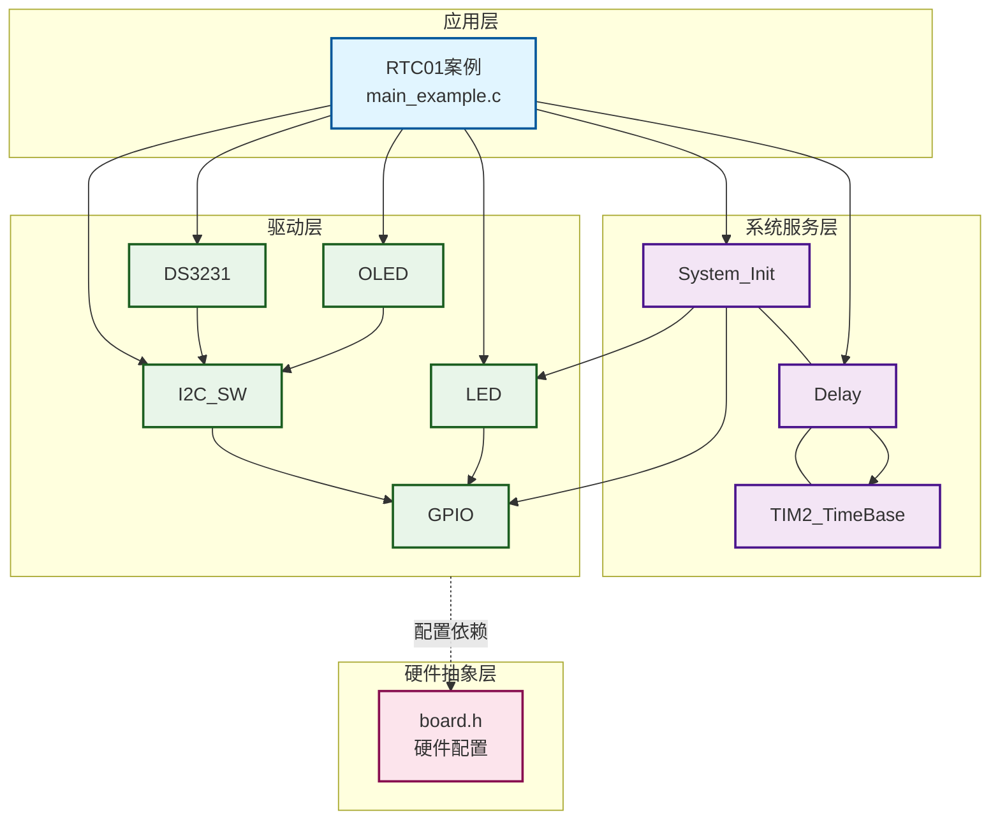
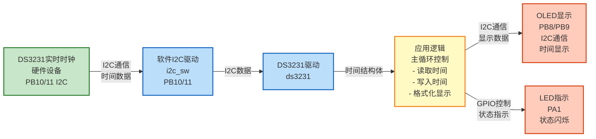

# RTC01 - DS3231读写时间示例

## 📋 案例目的

本案例的主要目的是：

- **核心目标**：演示如何使用DS3231实时时钟模块进行时间读写操作
- **学习重点**：
  - 理解DS3231初始化和配置流程
  - 掌握DS3231时间读取方法（`DS3231_ReadTime()`）
  - 掌握DS3231时间写入方法（`DS3231_SetTime()`）
  - 学习OSF（振荡器停止标志）的检查和清除
  - 理解DS3231时间格式和星期编码规则
- **应用场景**：适用于需要实时时钟功能的应用，如数据记录、定时任务、时钟显示等

## 🔧 硬件要求

### 必需外设

- **LED1**：`PA1`（系统状态指示）

### 传感器/模块

- **DS3231实时时钟模块**（I2C接口）
  - SCL：`PB10`（软件I2C）
  - SDA：`PB11`（软件I2C）
  - VCC：3.3V
  - GND：GND
  - **上拉电阻**：SCL和SDA需要4.7kΩ-10kΩ上拉到3.3V（I2C总线必需）

- **OLED显示屏**（SSD1306，软件I2C接口）
  - SCL：`PB8`（软件I2C）
  - SDA：`PB9`（软件I2C）
  - VCC：3.3V
  - GND：GND

**⚠️ 重要提示**：

1. **I2C上拉电阻必须添加**：DS3231的SCL和SDA线必须添加上拉电阻（4.7kΩ-10kΩ）到3.3V，否则I2C通信会失败
2. **引脚不冲突**：DS3231（PB10/11）和OLED（PB8/9）使用不同的I2C实例，不会冲突

## 📦 模块依赖

### 模块依赖关系图

展示本案例使用的模块及其依赖关系：

### 模块列表

本案例使用以下模块：

- `soft_i2c`：软件I2C驱动模块（DS3231使用软件I2C）
- `ds3231`：DS3231实时时钟驱动模块（核心）
- `gpio`：GPIO驱动模块（软件I2C依赖）
- `led`：LED驱动模块（状态指示）
- `oled`：OLED显示模块（默认显示器）
- `delay`：延时模块
- `TIM2_TimeBase`：TIM2时间基准模块（延时模块依赖）
- `system_init`：系统初始化模块

## 🔄 实现流程

### 整体逻辑

本案例演示DS3231的基本读写操作，整体流程如下：

1. **初始化阶段**
   - 系统初始化（时钟、GPIO等）
   - LED和OLED初始化
   - 软件I2C2初始化（用于DS3231）
   - DS3231初始化
   - 检查并清除OSF标志（如果存在）
   - 启动DS3231振荡器

2. **读取当前时间**
   - 调用 `DS3231_ReadTime()` 读取DS3231当前时间
   - 在OLED上显示读取到的当前时间
   - 停留2秒让用户查看

3. **写入新时间**
   - 设置时间结构体（2024-01-01 12:00:00 Monday）
   - 调用 `DS3231_SetTime()` 写入时间到DS3231
   - 显示写入成功提示

4. **循环显示时间**
   - 主循环中每秒调用 `DS3231_ReadTime()` 读取时间
   - 在OLED上实时显示日期和时间
   - LED闪烁指示系统运行

### 关键方法

- **先读后写策略**：先读取当前时间显示，再写入新时间，最后循环显示，符合实际应用流程
- **OSF标志处理**：初始化后检查OSF标志，如果存在则清除，确保时间准确性
- **错误处理**：每个关键操作都检查返回值，失败时显示错误信息并停止运行
- **实时显示**：使用延时模块的tick功能实现每秒更新，避免阻塞主循环

### 数据流向图

展示本案例的数据流向：DS3231设备 → I2C通信 → 应用逻辑 → 输出显示

**数据流说明**：

1. **输入设备**：
   - **DS3231实时时钟**：通过I2C接口（PB10/11）提供时间数据

2. **I2C通信**：
   - **软件I2C驱动**：实现I2C通信协议，与DS3231进行数据交换
   - **DS3231驱动**：封装DS3231的读写操作，提供时间读取和设置接口

3. **应用逻辑**：
   - 主循环中读取DS3231时间
   - 格式化时间数据用于显示
   - 控制OLED和LED的更新

4. **输出设备**：
   - **OLED**：显示日期和时间（实时更新）
   - **LED**：闪烁指示系统运行状态

### 工作流程示意

```mermaid
flowchart TD
    %% 初始化阶段
    subgraph INIT[初始化阶段]
        direction TB
        START[系统初始化<br/>System_Init]
        START --> LED_INIT[LED初始化<br/>LED_Init]
        LED_INIT --> OLED_INIT[OLED初始化<br/>OLED_Init]
        OLED_INIT --> I2C_INIT[软件I2C2初始化<br/>I2C_SW_Init<br/>PB10/11]
        I2C_INIT --> DS3231_INIT[DS3231初始化<br/>DS3231_Init]
        DS3231_INIT --> CHECK_OSF[检查OSF标志<br/>DS3231_CheckOSF]
        CHECK_OSF --> CLEAR_OSF[清除OSF标志<br/>DS3231_ClearOSF]
        CLEAR_OSF --> START_OSC[启动振荡器<br/>DS3231_Start]
    end
    
    %% 读取阶段
    subgraph READ[读取当前时间]
        direction TB
        READ_TIME[读取时间<br/>DS3231_ReadTime]
        READ_TIME --> DISPLAY_TIME[OLED显示时间<br/>停留2秒]
    end
    
    %% 写入阶段
    subgraph WRITE[写入新时间]
        direction TB
        SET_TIME[设置时间结构体<br/>2024-01-01 12:00:00]
        SET_TIME --> WRITE_TIME[写入时间<br/>DS3231_SetTime]
        WRITE_TIME --> SHOW_SUCCESS[显示写入成功]
    end
    
    %% 主循环阶段
    subgraph LOOP[主循环阶段]
        direction TB
        MAIN_LOOP[主循环开始]
        MAIN_LOOP --> READ_LOOP[读取时间<br/>DS3231_ReadTime]
        READ_LOOP --> UPDATE_OLED[更新OLED显示<br/>日期和时间]
        UPDATE_OLED --> LED_BLINK[LED闪烁<br/>状态指示]
        LED_BLINK --> DELAY[延时1秒<br/>Delay_GetElapsed]
        DELAY --> MAIN_LOOP
    end
    
    %% 连接
    START_OSC --> READ_TIME
    DISPLAY_TIME --> SET_TIME
    SHOW_SUCCESS --> MAIN_LOOP
    
    %% 样式
    style START fill:#e1f5ff,stroke:#01579b,stroke-width:2px
    style START_OSC fill:#e1f5ff,stroke:#01579b,stroke-width:2px
    style MAIN_LOOP fill:#fff3e0,stroke:#e65100,stroke-width:3px
    style READ_TIME fill:#bbdefb,stroke:#1565c0,stroke-width:2px
    style WRITE_TIME fill:#bbdefb,stroke:#1565c0,stroke-width:2px
    style UPDATE_OLED fill:#ffccbc,stroke:#d84315,stroke-width:2px
    style LED_BLINK fill:#ffccbc,stroke:#d84315,stroke-width:2px
    style DELAY fill:#f5f5f5,stroke:#757575,stroke-width:1px
```

## 📚 关键函数说明

### DS3231相关函数

- **`DS3231_Init()`**：初始化DS3231模块
  - 在本案例中用于配置DS3231接口类型和I2C实例
  - 必须在使用其他DS3231函数前调用
  - 需要配置接口类型（软件I2C或硬件I2C）和对应的I2C实例

- **`DS3231_CheckOSF()`**：检查OSF（振荡器停止标志）
  - 在本案例中用于检测DS3231是否曾经断电或振荡器停止
  - OSF标志被设置时，时间可能不准确，需要重新设置时间

- **`DS3231_ClearOSF()`**：清除OSF标志
  - 在本案例中用于清除OSF标志，确保时间状态正常
  - 写入新时间后会自动清除OSF标志

- **`DS3231_Start()`**：启动DS3231振荡器
  - 在本案例中用于确保DS3231振荡器运行
  - 必须在设置时间前启动振荡器

- **`DS3231_ReadTime()`**：读取DS3231当前时间
  - 在本案例中用于读取DS3231的当前时间
  - 返回的时间结构体包含年、月、日、时、分、秒、星期
  - 星期编码：1=Sunday, 2=Monday, ..., 7=Saturday

- **`DS3231_SetTime()`**：设置DS3231时间
  - 在本案例中用于写入新时间到DS3231
  - 会自动进行参数校验（日期有效性、闰年检查等）
  - 写入成功后会自动清除OSF标志

### OLED相关函数

- **`OLED_Init()`**：初始化OLED显示模块
  - 在本案例中用于初始化OLED显示屏
  - 必须在使用其他OLED函数前调用

- **`OLED_ShowString()`**：显示字符串
  - 在本案例中用于显示提示信息和时间字符串

- **`OLED_ShowChar()`**：显示单个字符
  - 在本案例中用于清除行尾残留字符

### 软件I2C相关函数

- **`I2C_SW_Init()`**：初始化软件I2C实例
  - 在本案例中用于初始化SoftI2C2实例（PB10/11）
  - 必须在DS3231初始化前调用

**详细函数实现和调用示例请参考**：`main_example.c` 中的代码

## ⚠️ 注意事项与重点

### ⚠️ 重要提示

1. **I2C上拉电阻必须添加**
   - DS3231的SCL和SDA线必须添加上拉电阻（4.7kΩ-10kΩ）到3.3V
   - 否则I2C通信会失败，无法读取或写入时间

2. **OSF标志处理**
   - 如果DS3231曾经断电，OSF标志会被设置
   - 必须清除OSF标志后再使用，否则时间可能不准确
   - 写入新时间后会自动清除OSF标志

3. **时间格式必须正确**
   - 年：1900-2099
   - 月：1-12
   - 日：1-31（需要考虑月份天数和闰年）
   - 时：0-23（24小时制）
   - 分：0-59
   - 秒：0-59
   - 星期：1-7（1=Sunday, 2=Monday, ..., 7=Saturday）

### 🔑 关键点

1. **先读后写流程**
   - 本案例采用先读取当前时间、再写入新时间、最后循环显示的流程
   - 这样可以先了解DS3231的当前状态，再设置新时间

2. **星期编码规则**
   - DS3231使用1-7表示星期，1表示Sunday
   - 2024-01-01是Monday，所以weekday=2
   - 必须确保日期和星期匹配，否则显示会错误

3. **时间验证**
   - `DS3231_SetTime()` 函数会自动进行参数校验
   - 包括日期有效性检查（考虑闰年和月份天数）
   - 无效的时间会被拒绝，返回错误码

4. **实时显示实现**
   - 使用 `Delay_GetTick()` 和 `Delay_GetElapsed()` 实现非阻塞的定时更新
   - 每秒更新一次显示，避免频繁读取DS3231

5. **错误处理**
   - 所有关键操作都检查返回值
   - 失败时显示错误信息并停止运行
   - 便于快速定位问题

## 💡 扩展练习

### 循序渐进理解本案例

1. **修改写入时间**：修改代码中的时间设置，尝试写入不同的日期和时间，理解DS3231时间写入的方法
2. **添加温度显示**：使用 `DS3231_ReadTemperature()` 函数读取并显示温度，理解DS3231温度读取功能
3. **格式化显示优化**：优化OLED显示格式，添加更多信息（如温度、星期全称等），理解时间数据的格式化显示

### 实际场景中的常见坑点

4. **I2C通信失败处理**：当I2C通信失败时（如设备未连接、通信干扰等），如何检测和处理？如何实现通信重试机制？如何避免程序因通信失败而卡死？
5. **时间同步问题**：如果系统断电后重新上电，DS3231的时间可能已经更新，但系统时间可能不同步。如何检测和处理时间不同步的情况？如何实现时间同步机制？
6. **时间写入原子性**：当写入时间时，如果写入过程中断电，可能导致时间数据不完整。如何保证时间写入的原子性？如何处理时间数据损坏的情况？

## 📖 相关文档

- **模块文档**：
  - **DS3231驱动**：`Drivers/sensors/ds3231.c/h`
  - **软件I2C驱动**：`Drivers/i2c/i2c_sw.c/h`
  - **OLED驱动**：`Drivers/display/oled_ssd1306.c/h`
  - **LED驱动**：`Drivers/basic/led.c/h`
  - **延时功能**：`system/delay.c/h`
  - **系统初始化**：`system/system_init.c/h`

- **业务文档**：
  - **主程序代码**：`main_example.c`
  - **硬件配置**：`board.h`
  - **模块配置**：`config.h`
  - **项目规范文档**：`../../AI/README.md`（AI规则体系）
  - **案例参考**：`Examples/README.md`
- **硬件配置**：案例目录下的 `board.h`

---

**最后更新**：2024-01-01
