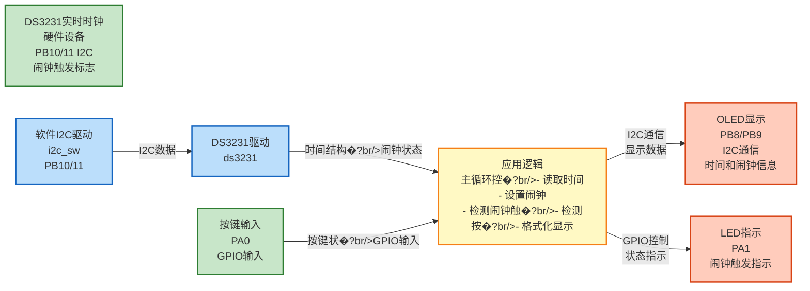

# RTC02 - DS3231闹钟功能示例

## 📋 案例目的

本案例的主要目的是：

- **核心目标**：演示如何使用DS3231实时时钟模块的双闹钟功能（Alarm1和Alarm2�?- **学习重点**�?  - 理解DS3231双闹钟配置流�?  - 掌握DS3231闹钟设置方法（`DS3231_SetAlarm1()`和`DS3231_SetAlarm2()`�?  - 掌握DS3231闹钟读取方法（`DS3231_ReadAlarm1()`和`DS3231_ReadAlarm2()`�?  - 掌握DS3231闹钟标志检测方法（`DS3231_CheckAlarm1Flag()`和`DS3231_CheckAlarm2Flag()`�?  - 学习闹钟触发后的处理流程
  - 学习GPIO按键检测方�?  - 学习闹钟显示格式处理（不同匹配模式的日期计算�?- **应用场景**：适用于需要定时提醒、闹钟功能的应用，如定时器、提醒器、闹钟等

## 🔧 硬件要求

### 必需外设

- **LED1**：`PA1`（闹钟触发指示）

### 传感�?模块

- **DS3231实时时钟模块**（I2C接口�?  - SCL：`PB10`（软件I2C�?  - SDA：`PB11`（软件I2C�?  - VCC�?.3V
  - GND：GND
  - **上拉电阻**：SCL和SDA需�?.7kΩ-10kΩ上拉�?.3V（I2C总线必需�?  - **注意**：本案例不使用INT/SQW引脚，通过轮询状态寄存器检测闹钟触�?
- **OLED显示�?*（SSD1306，软件I2C接口�?  - SCL：`PB8`（软件I2C�?  - SDA：`PB9`（软件I2C�?  - VCC�?.3V
  - GND：GND

- **按键**（用于清除闹钟标志）
  - 信号线：`PA0`（GPIO输入，下拉）
  - 另一端：连接�?.3V（按下时高电平）

**⚠️ 重要提示**�?
1. **I2C上拉电阻必须添加**：DS3231的SCL和SDA线必须添加上拉电阻（4.7kΩ-10kΩ）到3.3V，否则I2C通信会失�?2. **引脚不冲�?*：DS3231（PB10/11）和OLED（PB8/9）使用不同的I2C实例，不会冲�?3. **按键连接**：按键一端接PA0，另一端接3.3V，按下时PA0为高电平
4. **INT/SQW引脚**：本案例不使用INT/SQW引脚，通过软件轮询检测闹钟触�?
## 📦 模块依赖

### 模块依赖关系�?
展示本案例使用的模块及其依赖关系�?
```mermaid
%%{init: {'flowchart': {'curve': 'basis'}}}%%
flowchart TB
    %% 应用�?    subgraph APP_LAYER[应用层]
        APP[RTC02案例<br/>main_example.c]
    end
    
    %% 系统服务�?    subgraph SYS_LAYER[系统服务层]
        direction LR
        SYS_INIT[System_Init]
        DELAY[Delay]
        BASE_TIMER[TIM2_TimeBase]
        SYS_INIT --- DELAY
        DELAY --- BASE_TIMER
    end
    
    %% 驱动�?    subgraph DRV_LAYER[驱动层]
        direction LR
        GPIO[GPIO]
        I2C_SW[I2C_SW]
        DS3231[DS3231]
        OLED[OLED]
        LED[LED]
    end
    
    %% 硬件抽象�?    subgraph BSP_LAYER[硬件抽象层]
        BSP[board.h<br/>硬件配置]
    end
    
    %% 应用层依�?    APP --> SYS_INIT
    APP --> I2C_SW
    APP --> DS3231
    APP --> OLED
    APP --> LED
    APP --> DELAY
    
    %% 系统服务层依�?    SYS_INIT --> GPIO
    SYS_INIT --> LED
    DELAY --> BASE_TIMER
    
    %% 驱动层内部依�?    DS3231 --> I2C_SW
    I2C_SW --> GPIO
    OLED --> I2C_SW
    LED --> GPIO
    
    %% BSP配置依赖（统一表示�?    DRV_LAYER -.->|配置依赖| BSP
    
    %% 样式
    classDef appLayer fill:#e1f5ff,stroke:#01579b,stroke-width:2px
    classDef sysLayer fill:#f3e5f5,stroke:#4a148c,stroke-width:2px
    classDef driverLayer fill:#e8f5e9,stroke:#1b5e20,stroke-width:2px
    classDef bspLayer fill:#fce4ec,stroke:#880e4f,stroke-width:2px
    
    class APP appLayer
    class SYS_INIT,DELAY,BASE_TIMER sysLayer
    class GPIO,I2C_SW,DS3231,OLED,LED driverLayer
    class BSP bspLayer
```

### 模块列表

本案例使用以下模块：

- `soft_i2c`：软件I2C驱动模块（DS3231和OLED使用软件I2C�?- `ds3231`：DS3231实时时钟驱动模块（核心）
- `gpio`：GPIO驱动模块（软件I2C依赖、按键输入）
- `led`：LED驱动模块（闹钟触发指示）
- `oled`：OLED显示模块（显示时间和闹钟信息�?- `delay`：延时模�?- `TIM2_TimeBase`：TIM2时间基准模块（延时模块依赖）
- `system_init`：系统初始化模块

## 🔄 实现流程

### 整体逻辑

本案例演示DS3231双闹钟功能的完整流程，整体流程如下：

1. **初始化阶�?*
   - 系统初始化（时钟、GPIO等）
   - LED和OLED初始�?   - 软件I2C2初始化（用于DS3231�?   - DS3231初始�?   - 检查并清除OSF标志（如果存在）
   - 启动DS3231振荡�?   - 清除闹钟标志（防止启动时误触发）
   - GPIO按键初始化（PA0，下拉输入）

2. **第一次读取闹钟�?*
   - 读取DS3231中已设置的Alarm1和Alarm2值（旧的�?   - 显示第一次读取的闹钟�?
3. **设置新闹�?*
   - 读取当前时间
   - 计算Alarm1时间：当前时�?5分钟（日期时分秒匹配模式�?   - 计算Alarm2时间：当前时�?10分钟（星期时分秒匹配模式�?   - 写入Alarm1和Alarm2到DS3231

4. **第二次读取闹钟�?*
   - 读取刚写入的Alarm1和Alarm2值（新的�?   - 显示第二次读取的闹钟�?
5. **使能闹钟**
   - 清除闹钟标志（确保干净状态）
   - 使能Alarm1和Alarm2
   - 设置DS3231中断模式为闹钟中�?   - LED1开机闪�?�?
6. **主循�?*
   - 每秒读取并显示当前时�?   - 显示两个闹钟的设置�?   - **检测DS3231硬件闹钟标志（Alarm1或Alarm2�?*
   - 闹钟触发时：LED1常亮，显�?Alarm Triggered!"
   - 检测按键按下，清除闹钟标志并关闭LED1

### 关键方法

- **双闹钟配�?*：同时使用Alarm1和Alarm2，可以设置不同的触发时间
- **闹钟匹配模式**�?  - Alarm1使用日期时分秒匹配模式（`DS3231_ALARM_MODE_DAY_HOUR_MIN_SEC_MATCH`�?  - Alarm2使用星期时分秒匹配模式（`DS3231_ALARM_MODE_WEEKDAY_HOUR_MIN_SEC_MATCH`�?- **时间计算**：基于当前时间计算闹钟时间（+5分钟�?10分钟），自动处理时间溢出
- **硬件触发**：由DS3231硬件闹钟标志控制触发，通过轮询状态寄存器检�?- **LED指示**：LED1开机闪�?次，之后只有闹钟触发时才常亮
- **按键清除**：检测到按键按下后，清除两个闹钟标志并关闭LED1

### 数据流向�?
展示本案例的数据流向：DS3231设备 �?I2C通信 �?应用逻辑 �?输出显示



**数据流说�?*�?
1. **输入设备**�?   - **DS3231实时时钟**：通过I2C接口（PB10/11）提供时间数据和闹钟触发标志
   - **按键**：通过GPIO输入（PA0）提供按键状�?
2. **I2C通信**�?   - **软件I2C驱动**：实现I2C通信协议，与DS3231进行数据交换
   - **DS3231驱动**：封装DS3231的读写操作，提供时间读取、闹钟设置和状态检测接�?
3. **应用逻辑**�?   - 主循环中读取DS3231时间和闹钟状�?   - 检测按键按下事�?   - 格式化数据用于显�?   - 控制OLED和LED的更�?
4. **输出设备**�?   - **OLED**：显示时间、闹钟设置值和触发状态（实时更新�?   - **LED**：闹钟触发时常亮，按键清除后关闭

### 工作流程示意

```mermaid
系统初始�?    �?LED和OLED初始�?    �?软件I2C2初始化（PB10/11�?    �?DS3231初始�?    �?检查并清除OSF标志
    �?启动DS3231振荡�?    �?清除闹钟标志（防止误触发�?    �?GPIO按键初始化（PA0�?    �?第一次读取闹钟值（旧的�?    �?显示第一次读取的闹钟�?    �?读取当前时间
    �?计算并设置新闹钟（当前时�?5分钟�?10分钟�?    �?第二次读取闹钟值（新的�?    �?显示第二次读取的闹钟�?    �?清除闹钟标志并使能闹�?    �?LED1开机闪�?�?    �?主循环：
    - 每秒读取并显示时�?    - 显示两个闹钟�?    - 检测DS3231硬件闹钟标志
    - 闹钟触发 �?LED1常亮，显示提�?    - 按键按下 �?清除标志，关闭LED1
```

## 📚 关键函数说明

### DS3231相关函数

- **`DS3231_Init()`**：初始化DS3231模块
  - 在本案例中用于配置DS3231接口类型和I2C实例
  - 必须在使用其他DS3231函数前调�?
- **`DS3231_CheckOSF()`**：检查OSF（振荡器停止标志�?  - 在本案例中用于检测DS3231是否曾经断电或振荡器停止
  - OSF标志被设置时，时间可能不准确，需要重新设置时�?
- **`DS3231_ClearOSF()`**：清除OSF标志
  - 在本案例中用于清除OSF标志，确保时间状态正�?
- **`DS3231_Start()`**：启动DS3231振荡�?  - 在本案例中用于确保DS3231振荡器运�?  - 必须在设置时间前启动振荡�?
- **`DS3231_ReadAlarm1()`**：读取闹�?设置
  - 在本案例中用于读取DS3231中已设置的Alarm1�?  - 第一次读取：读取旧的闹钟�?  - 第二次读取：读取新设置的闹钟�?
- **`DS3231_ReadAlarm2()`**：读取闹�?设置
  - 在本案例中用于读取DS3231中已设置的Alarm2�?  - 第一次读取：读取旧的闹钟�?  - 第二次读取：读取新设置的闹钟�?
- **`DS3231_SetAlarm1()`**：设置闹�?
  - 在本案例中用于配置闹�?（日期时分秒匹配模式，当前时�?5分钟�?  - 需要设置闹钟结构体（模式、秒、分、时、日/星期�?  - 本案例使用日期时分秒匹配模式，匹配日期、时、分、秒字段

- **`DS3231_SetAlarm2()`**：设置闹�?
  - 在本案例中用于配置闹�?（星期时分秒匹配模式，当前时�?10分钟�?  - 需要设置闹钟结构体（模式、秒、分、时、星期）
  - 本案例使用星期时分秒匹配模式，匹配星期、时、分、秒字段
  - Alarm2没有秒字段，秒固定为0

- **`DS3231_EnableAlarm1()`**：使能闹�?中断
  - 在本案例中用于使能闹�?中断
  - 使能后，闹钟触发时DS3231会设置闹钟标�?
- **`DS3231_EnableAlarm2()`**：使能闹�?中断
  - 在本案例中用于使能闹�?中断
  - 使能后，闹钟触发时DS3231会设置闹钟标�?
- **`DS3231_SetInterruptMode()`**：设置DS3231中断模式
  - 在本案例中用于设置DS3231为闹钟中断模式（`DS3231_INT_MODE_ALARM`�?  - 必须设置为闹钟中断模式，否则闹钟触发时不会设置标�?
- **`DS3231_CheckAlarm1Flag()`**：检查闹�?标志
  - 在本案例中用于检测Alarm1是否触发
  - 返回1表示闹钟已触发，0表示未触�?
- **`DS3231_CheckAlarm2Flag()`**：检查闹�?标志
  - 在本案例中用于检测Alarm2是否触发
  - 返回1表示闹钟已触发，0表示未触�?
- **`DS3231_ClearAlarm1Flag()`**：清除闹�?标志
  - 在本案例中用于清除Alarm1标志
  - 在启动时清除，防止误触发
  - 在按键按下时清除，关闭闹�?
- **`DS3231_ClearAlarm2Flag()`**：清除闹�?标志
  - 在本案例中用于清除Alarm2标志
  - 在启动时清除，防止误触发
  - 在按键按下时清除，关闭闹�?
- **`DS3231_ReadTime()`**：读取DS3231当前时间
  - 在本案例中用于读取并显示当前时间
  - 用于计算新闹钟时间（当前时间+5分钟�?10分钟�?  - 用于显示闹钟的完整日期（不同匹配模式的日期计算）

### GPIO相关函数

- **`GPIO_Config()`**：配置GPIO引脚
  - 在本案例中用于配置PA0为下拉输入模�?  - 按键按下时，PA0读取为高电平

- **`GPIO_ReadPin()`**：读取GPIO引脚电平
  - 在本案例中用于检测按键是否按�?  - 返回`Bit_SET`表示按键按下（高电平�?
### LED相关函数

- **`LED_Init()`**：初始化LED模块
  - 在本案例中用于初始化LED1（PA1�?
- **`LED_On()`**：打开LED
  - 在本案例中用于闹钟触发时打开LED1

- **`LED_Off()`**：关闭LED
  - 在本案例中用于关闭LED1（开机闪烁后和按键清除后�?
### OLED相关函数

- **`OLED_Init()`**：初始化OLED显示模块
  - 在本案例中用于初始化OLED显示�?  - 必须在使用其他OLED函数前调�?
- **`OLED_Clear()`**：清空OLED显示
  - 在本案例中用于清空屏幕，准备显示新内�?
- **`OLED_ShowString()`**：显示字符串
  - 在本案例中用于显示提示信息、时间和闹钟�?
- **`OLED_ShowChar()`**：显示单个字�?  - 在本案例中用于清除行尾残留字�?
**详细函数实现和调用示例请参�?*：`main_example.c` 中的代码

## ⚠️ 注意事项与重�?
### ⚠️ 重要提示

1. **I2C上拉电阻必须添加**
   - DS3231的SCL和SDA线必须添加上拉电阻（4.7kΩ-10kΩ）到3.3V
   - 否则I2C通信会失败，无法读取或写入时�?
2. **OSF标志处理**
   - 如果DS3231曾经断电，OSF标志会被设置
   - 必须清除OSF标志后再使用，否则时间可能不准确
   - 写入新时间后会自动清除OSF标志

3. **闹钟匹配模式选择**
   - Alarm1使用日期时分秒匹配模式（`DS3231_ALARM_MODE_DAY_HOUR_MIN_SEC_MATCH`�?   - Alarm2使用星期时分秒匹配模式（`DS3231_ALARM_MODE_WEEKDAY_HOUR_MIN_SEC_MATCH`�?   - 可以根据需要选择其他匹配模式（秒匹配、分秒匹配、时分秒匹配等）

4. **闹钟标志清除**
   - 闹钟触发后，标志会被设置
   - 必须清除标志后，闹钟才能再次触发
   - 本案例在启动时清除标志（防止误触发），在按键按下时清除标志（关闭闹钟�?
5. **时间计算和溢出处�?*
   - 基于当前时间计算闹钟时间�?5分钟�?10分钟�?   - 自动处理分钟溢出（超�?9分钟�?   - 自动处理小时溢出（超�?3小时�?   - 日期溢出处理简化（假设每月最�?1天）

### 🔑 关键�?
1. **双闹钟配置流�?*
   - 先读取旧的闹钟值（第一次读取）
   - 设置新的闹钟时间和匹配模式（Alarm1和Alarm2�?   - 读取新设置的闹钟值（第二次读取）
   - 清除闹钟标志（防止误触发�?   - 使能两个闹钟中断
   - 最后设置DS3231中断模式为闹钟中�?   - 必须按顺序执行，否则闹钟无法正常工作

2. **闹钟匹配模式理解**
   - 秒匹配模式：只匹配秒字段，其他字段不匹配
   - 分秒匹配模式：匹配分和秒字段
   - 时分秒匹配模式：匹配时、分、秒字段
   - 日期时分秒匹配模式：匹配日期、时、分、秒字段（Alarm1使用�?   - 星期时分秒匹配模式：匹配星期、时、分、秒字段（Alarm2使用�?
3. **闹钟显示格式**
   - 根据闹钟匹配模式计算完整的日期时�?   - 日期匹配模式：直接使用闹钟中的日期�?   - 星期匹配模式：计算下一个目标星期几的日�?   - 显示格式：`YY/M/D HH:MM:SS`（紧凑格式）

4. **LED指示逻辑**
   - LED1开机闪�?次（表示系统启动�?   - 之后LED1保持关闭
   - 只有闹钟触发时LED1才常�?   - 按键清除闹钟后LED1关闭

5. **按键检�?*
   - 使用下拉输入模式，按键按下时为高电平
   - 检测到按键按下后，清除两个闹钟标志并关闭LED1
   - 需要添加消抖处理（本案例使用简单检测）
   - 实际应用中建议使用中断或硬件消抖

## 💡 扩展练习

### 循序渐进理解本案�?
1. **修改闹钟触发时间**：修改代码中的闹钟设置，尝试不同的触发时间（如每小时的第0�?秒），理解闹钟时间的设置方法
2. **改变匹配模式**：尝试使用秒匹配、分秒匹配、时分秒匹配等不同的匹配模式，理解不同匹配模式的应用场景
3. **添加蜂鸣器功�?*：添加PWM驱动蜂鸣器，闹钟触发时发出声音提示，理解闹钟触发后的响应处理

### 实际场景中的常见坑点

4. **闹钟触发检测延�?*：如果主循环执行时间较长，可能延迟检测到闹钟触发。如何确保及时检测闹钟触发？使用硬件中断（INT/SQW引脚）是否一定能解决这个问题�?5. **闹钟状态同�?*：如果系统断电后重新上电，闹钟状态可能丢失。如何保存和恢复闹钟状态？如何实现闹钟状态的持久化存储？
6. **多闹钟管�?*：如果同时使用Alarm1和Alarm2，如何协调管理？如何处理闹钟触发冲突？如何实现闹钟优先级管理�?
## 📖 相关文档

- **模块文档**�?  - **DS3231驱动**：`Drivers/sensors/ds3231.c/h`
  - **软件I2C驱动**：`Drivers/i2c/i2c_sw.c/h`
  - **OLED驱动**：`Drivers/display/oled_ssd1306.c/h`
  - **GPIO驱动**：`Drivers/basic/gpio.c/h`
  - **LED驱动**：`Drivers/basic/led.c/h`
  - **延时功能**：`system/delay.c/h`

- **业务文档**�?  - **主程序代�?*：`main_example.c`
  - **硬件配置**：`board.h`
  - **模块配置**：`config.h`
  - **项目规范文档**：`PROJECT_KEYWORDS.md`
  - **案例参�?*：`Examples/README.md`
- **系统初始�?*：`system/system_init.c/h`
- **硬件配置**：案例目录下�?`board.h`


### DS3231两个闹钟同时工作的技术要点：

1. **独立寄存�?*：Alarm 1和Alarm 2有完全独立的时、分、秒/日期寄存器（0x07-0x0D），可同时设置不同触发时间�?2. **共享中断**：两个闹钟共享同一个INT/SQW引脚输出，但�?   - 状态寄存器(0x0F)的A1F和A2F位分别指示哪个闹钟触�?   - 控制寄存�?0x0E)的A1IE和A2IE位分别控制各自使�?3. **触发逻辑**�?   - 若同时触发，中断引脚会拉低，读取状态寄存器可判断是A1、A2或两者同时触�?   - 需手动�?清除状态位以撤销中断
4. **工作模式**：支持多种组合，如Alarm 1每天响一�?Alarm 2每周一响一次，互不干扰�?
**简单说**：两个闹钟完全独立，可以一起用，但要注意中断共享和状态清除�?
---

**最后更�?*�?024-01-01
