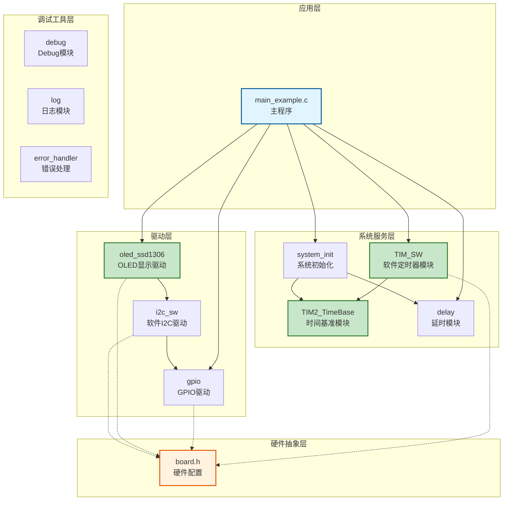
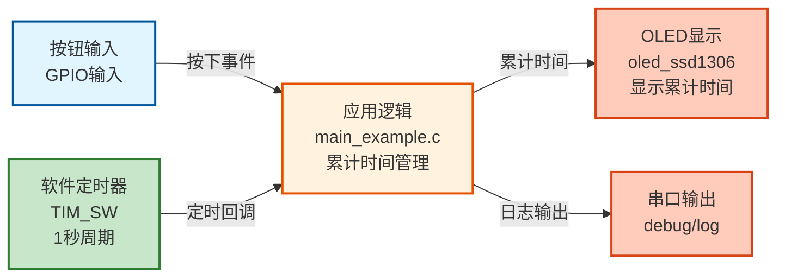
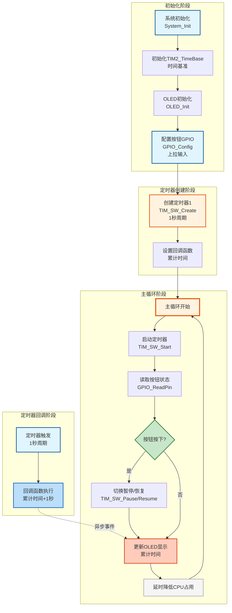

# Timer01 - 软件定时器示例

软件定时器功能演示案例，展示软件定时器的创建、启动、暂停/恢复功能，以及累计跑秒功能。

---

## 📋 案例目的

- **核心目标**：演示软件定时器模块（TIM_SW）的基本功能和使用方法
- **学习重点**：
  - 软件定时器的创建和配置（周期模式）
  - 定时器的启动、暂停和恢复操作
  - 定时器回调函数的使用
  - 使用软件定时器实现累计跑秒功能
  - OLED实时显示累计运行时间（时分秒格式）
  - 按钮控制定时器暂停/恢复
- **应用场景**：适用于需要定时任务和累计计时的场景，如秒表、运行时间统计等

---

## 🔧 硬件要求

### 必需外设

- **按钮**：连接到PA4
  - 按钮一端连接到PA4
  - 按钮另一端连接到GND
  - 使用上拉输入模式，按下时为低电平

- **OLED显示屏**（SSD1306，I2C接口）：
  - SCL连接到PB8
  - SDA连接到PB9
  - VCC连接到3.3V
  - GND连接到GND
  - **⚠️ 重要提示**：OLED需要外部上拉电阻（通常4.7kΩ-10kΩ）连接到SCL和SDA

### 可选外设

- **LED1**：连接到PA1（可选，用于视觉反馈）
- **LED2**：连接到PA2（可选，用于视觉反馈）

### 硬件连接

**按钮连接**：
- 按钮一端 → PA4
- 按钮另一端 → GND

**OLED连接**：
- OLED SCL → PB8
- OLED SDA → PB9
- OLED VCC → 3.3V
- OLED GND → GND
- **⚠️ 重要**：SCL和SDA需要上拉电阻（4.7kΩ-10kΩ）到3.3V

### 硬件配置

**⚠️ 重要说明**：案例是独立工程，硬件配置在案例目录下的 `board.h` 中。
如果硬件引脚不同，直接修改 `Examples/Timer/Timer01_SoftwareTimer/board.h` 中的配置即可。

**按钮配置**：
```c
#define BUTTON_PORT  GPIOA   /* 按钮GPIO端口 */
#define BUTTON_PIN   GPIO_Pin_4  /* 按钮GPIO引脚（PA4） */
```

**OLED配置**：
```c
#define OLED_I2C_CONFIG { \
    GPIOB, GPIO_Pin_8, /* SCL: PB8 */ \
    GPIOB, GPIO_Pin_9, /* SDA: PB9 */ \
}
```

---

## 📦 模块依赖

### 模块依赖关系图



### 模块列表

- **TIM_SW模块**：软件定时器核心功能
- **TIM2_TimeBase模块**：时间基准（TIM_SW依赖）
- **GPIO模块**：用于配置按钮输入引脚
- **OLED模块**：用于显示累计运行时间
- **软件I2C模块**：OLED使用软件I2C接口
- **延时模块**：用于降低CPU占用率
- **系统初始化模块**：用于初始化系统基础功能

---

## 🔄 实现流程

### 整体逻辑

1. **系统初始化阶段**：
   - 调用 `System_Init()` 初始化系统基础功能（TIM2_TimeBase、TIM_SW、SysTick、延时模块）
   - 初始化OLED显示屏

2. **GPIO配置阶段**：
   - 配置按钮引脚为输入上拉模式
   - 上拉输入模式下，按钮未按下时引脚为高电平，按下时为低电平

3. **定时器创建阶段**：
   - 创建定时器1：1秒周期，周期模式，用于累计跑秒
   - 定时器回调函数每1秒触发一次，累加1秒（1000ms）

4. **定时器启动阶段**：
   - 启动定时器1
   - 定时器开始计时，每1秒触发一次回调函数

5. **主循环阶段**：
   - 循环读取按钮状态，检测按下事件
   - 按钮按下时切换暂停/恢复定时器
   - 更新OLED显示累计运行时间（时分秒格式：00:00:00）
   - 延时降低CPU占用率

### 关键方法

1. **定时器创建**：使用 `TIM_SW_Create()` 创建定时器，指定周期（1000ms）、模式（周期模式）、回调函数
2. **定时器控制**：使用 `TIM_SW_Start()` 启动定时器
3. **暂停/恢复机制**：使用 `TIM_SW_Pause()` 和 `TIM_SW_Resume()` 暂停和恢复定时器
4. **累计时间**：在定时器回调函数中累加时间，每1秒累加1秒（1000ms）
5. **按钮边沿检测**：通过比较当前状态和上次状态，检测按钮按下事件
6. **OLED实时显示**：在主循环中定期更新OLED显示，展示累计运行时间（时分秒格式）

### 数据流向图



### 工作流程示意图



---

## 📚 关键函数说明

### 软件定时器相关函数

- **`TIM_SW_Create()`**：创建软件定时器
  - 在本案例中用于创建1秒周期的定时器（1000ms）
  - 使用周期模式（TIM_SW_MODE_PERIODIC）
  - 指定回调函数timer1_callback，每1秒触发一次

- **`TIM_SW_Start()`**：启动软件定时器
  - 在本案例中用于启动定时器1
  - 启动后定时器开始计时，每1秒触发一次回调函数

- **`TIM_SW_Pause()`**：暂停定时器（保持剩余时间）
  - 在本案例中用于暂停定时器（按钮按下时）
  - 暂停后定时器停止计时，回调函数不会触发
  - 累计时间停止累加

- **`TIM_SW_Resume()`**：恢复定时器（从暂停点继续）
  - 在本案例中用于恢复定时器（按钮再次按下时）
  - 恢复后定时器继续计时，回调函数继续触发
  - 累计时间继续累加

**详细函数实现和调用示例请参考**：`main_example.c` 中的代码

### GPIO相关函数

- **`GPIO_Config()`**：配置GPIO引脚的模式和速度
  - 在本案例中用于配置按钮引脚为上拉输入模式（`GPIO_MODE_INPUT_PULLUP`）
  - 上拉输入模式：按钮未按下时引脚为高电平，按下时为低电平

- **`GPIO_ReadPin()`**：读取GPIO引脚当前电平
  - 在本案例中用于读取按钮引脚的电平状态
  - 返回值：`Bit_SET`（高电平）或`Bit_RESET`（低电平）

### OLED相关函数

- **`OLED_Init()`**：初始化OLED显示屏
  - 在本案例中用于初始化OLED，准备显示累计运行时间

- **`OLED_ShowString()`**：在OLED上显示字符串
  - 在本案例中用于显示状态文本（"Timer [RUN]"、"Timer [PAUSE]"等）

- **`OLED_ShowNum()`**：在OLED上显示数字
  - 在本案例中用于显示累计运行时间（时分秒格式）

**详细函数实现和调用示例请参考**：`main_example.c` 中的代码

---

## ⚠️ 注意事项与重点

### ⚠️ 重要提示

1. **定时器初始化顺序**：
   - TIM_SW模块依赖TIM2_TimeBase模块
   - System_Init()会自动初始化TIM2_TimeBase和TIM_SW
   - 如果手动初始化，必须先初始化TIM2_TimeBase，再初始化TIM_SW

2. **定时器回调函数**：
   - 回调函数在TIM2中断中调用，执行时间应尽量短
   - 不要在回调函数中执行耗时操作，避免影响其他定时器
   - 回调函数中可以访问全局变量，但要注意线程安全
   - **本案例中，累计时间由软件定时器的回调函数产生**，每1秒触发一次，累加1秒

3. **暂停/恢复机制**：
   - 暂停后定时器停止计时，回调函数不会触发
   - 恢复后定时器继续计时，回调函数继续触发
   - **累计时间在回调函数中累加，暂停时不会累加，恢复时继续累加**

4. **累计时间计算**：
   - 累计时间由软件定时器的回调函数产生
   - 每1秒触发一次回调函数，在回调中累加1秒（1000ms）
   - 暂停时回调函数不触发，累计时间停止累加
   - 恢复时回调函数继续触发，累计时间继续累加

5. **定时器句柄管理**：
   - 定时器句柄在创建时分配，删除后失效
   - 使用前应检查句柄是否有效（不等于TIM_SW_HANDLE_INVALID）
   - 定时器最大数量为16个（TIM_SW_MAX_COUNT）

### 🔑 关键点

1. **软件定时器产生累计时间**：累计时间由软件定时器的回调函数产生，每1秒触发一次，累加1秒
2. **按钮边沿检测**：通过比较当前状态和上次状态，检测按钮按下事件
3. **OLED实时更新**：在主循环中定期更新OLED显示，展示累计运行时间（时分秒格式）
4. **时分秒格式显示**：将累计秒数转换为时分秒格式（00:00:00），更直观

### 💡 调试技巧

1. **定时器不工作**：
   - 检查TIM2_TimeBase是否已初始化
   - 检查TIM_SW是否已初始化
   - 检查定时器是否已启动（调用TIM_SW_Start()）
   - 检查定时器句柄是否有效

2. **按钮不响应**：
   - 检查按钮连接是否正确（一端接PA4，另一端接GND）
   - 检查GPIO配置是否正确（上拉输入模式）
   - 使用万用表测量按钮按下时PA4引脚是否为低电平

3. **累计时间不累加**：
   - 检查定时器是否正在运行（调用TIM_SW_IsRunning()）
   - 检查定时器是否被暂停
   - 检查回调函数是否被正确调用
   - 检查g_timers_paused标志是否正确

4. **OLED不显示**：
   - 检查OLED连接是否正确（SCL接PB8，SDA接PB9）
   - 检查I2C上拉电阻是否正确连接（4.7kΩ-10kΩ）
   - 检查软件I2C配置是否正确
   - 使用示波器检查I2C信号

---

## 💡 扩展练习

### 循序渐进理解本案例

1. **添加重置功能**：通过按钮长按重置累计时间，理解定时器的生命周期管理
2. **添加多个定时器**：创建多个定时器，实现不同的功能，理解多定时器的协调管理
3. **添加定时器统计**：记录定时器触发次数、平均周期等，理解定时器性能监控

### 实际场景中的常见坑点

4. **定时器精度问题**：软件定时器依赖系统tick，如果系统tick精度不够或主循环阻塞，定时器精度会下降。如何提高定时器精度？如何处理主循环阻塞对定时器的影响？
5. **定时器溢出处理**：当定时器周期很长时，累计时间可能溢出。如何检测和处理定时器溢出？如何实现长时间定时（如数小时、数天）？
6. **多定时器资源竞争**：当有多个定时器同时运行时，如何避免资源竞争？如何实现定时器的优先级管理？如何处理定时器回调函数的执行时间过长的问题？

---

## 📖 相关文档

- **模块文档**：
  - **软件定时器模块**：`system/TIM_sw.c/h`
  - **时间基准模块**：`Drivers/timer/TIM2_TimeBase.c/h`
  - **GPIO驱动**：`Drivers/basic/gpio.c/h`
  - **OLED驱动**：`Drivers/display/oled_ssd1306.c/h`
  - **软件I2C驱动**：`Drivers/i2c/i2c_sw.c/h`
  - **延时功能**：`system/delay.c/h`
  - **系统初始化**：`system/system_init.c/h`

- **业务文档**：
  - **主程序代码**：案例目录下的 `main_example.c`
  - **硬件配置**：案例目录下的 `board.h`
  - **模块配置**：案例目录下的 `config.h`
  - **项目规范文档**：`../../AI/README.md`（AI规则体系）
  - **案例参考**：`Examples/README.md`

---

**最后更新**：2024-01-01
