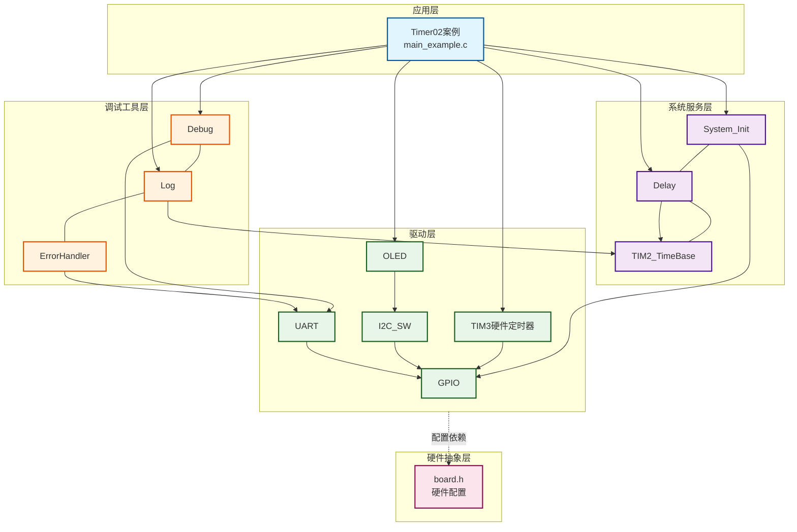
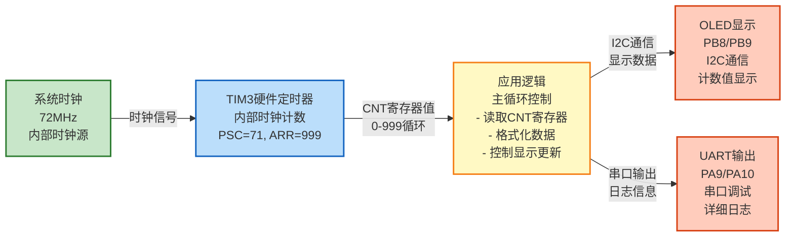

# Timer02 - 内部时钟计数示例

硬件定时器内部时钟计数功能演示案例，展示如何使用TIM3硬件定时器进行内部时钟计数，通过读取CNT寄存器获取计数值。

---

## 📋 案例目的

- **核心目标**：演示硬件定时器TIM3的内部时钟计数功能和使用方法
- **学习重点**：
  - 硬件定时器的初始化配置（内部时钟源）
  - 定时器预分频器（PSC）和自动重装载值（ARR）的设置
  - 读取定时器CNT寄存器获取当前计数值
  - 定时器自动计数的工作原理
  - OLED实时显示计数值
  - UART输出详细日志信息
- **应用场景**：适用于需要硬件定时器计数、频率测量、时间基准等场景

---

## 🔧 硬件要求

### 必需外设

- **TIM3硬件定时器**：内部时钟源，无需外部输入
  - TIM3是STM32F103C8T6的通用定时器
  - 挂载在APB1总线上
  - 使用内部系统时钟作为时钟源

- **OLED显示屏**（SSD1306，I2C接口）：
  - SCL连接到PB8
  - SDA连接到PB9
  - VCC连接到3.3V
  - GND连接到GND
  - **⚠️ 重要提示**：OLED需要外部上拉电阻（通常4.7kΩ-10kΩ）连接到SCL和SDA

- **USART1串口**（用于UART日志输出）：
  - TX连接到PA9
  - RX连接到PA10
  - 波特率：115200，8N1格式
  - **⚠️ 重要提示**：串口助手需要配置为GB2312编码以正确显示中文

### 硬件连接

**OLED连接**：
- OLED SCL → PB8
- OLED SDA → PB9
- OLED VCC → 3.3V
- OLED GND → GND
- **⚠️ 重要**：SCL和SDA需要上拉电阻（4.7kΩ-10kΩ）到3.3V

**UART连接**：
- USART1 TX (PA9) → USB转串口模块RX
- USART1 RX (PA10) → USB转串口模块TX
- GND → GND

### 硬件配置

**⚠️ 重要说明**：案例是独立工程，硬件配置在案例目录下的 `board.h` 中。
如果硬件引脚不同，直接修改 `Examples/Timer/Timer02_InternalClockCounting/board.h` 中的配置即可。

**UART配置**：
```c
#define UART_CONFIGS { \
    {USART1, GPIOA, GPIO_Pin_9, GPIOA, GPIO_Pin_10, 115200, USART_WordLength_8b, USART_StopBits_1, USART_Parity_No, 1}, \
}
```

**OLED配置**：
```c
#define OLED_I2C_CONFIG { \
    GPIOB, GPIO_Pin_8, /* SCL: PB8 */ \
    GPIOB, GPIO_Pin_9, /* SDA: PB9 */ \
}
```

---

## 📦 模块依赖

### 模块依赖关系图

展示本案例使用的模块及其依赖关系：



### 模块列表

本案例使用以下模块：

- **TIM2_TimeBase模块**：时间基准（用于获取系统tick，控制显示更新频率）
- **TIM3硬件定时器**：内部时钟计数（核心功能）
- **GPIO模块**：用于配置UART和OLED的GPIO引脚
- **UART模块**：用于串口日志输出
- **Debug模块**：用于UART输出功能（printf重定向）
- **Log模块**：用于分级日志输出
- **ErrorHandler模块**：用于错误处理
- **OLED模块**：用于显示计数值
- **软件I2C模块**：OLED使用软件I2C接口
- **延时模块**：用于降低CPU占用率
- **系统初始化模块**：用于初始化系统基础功能

---

## 🔄 实现流程

### 整体逻辑

1. **系统初始化阶段**：
   - 调用 `System_Init()` 初始化系统基础功能（TIM2_TimeBase、SysTick、延时模块）
   - 初始化UART（USART1）
   - 初始化Debug模块（UART模式）
   - 初始化Log模块
   - 初始化ErrorHandler模块
   - 初始化OLED显示屏

2. **TIM3初始化阶段**：
   - 使能TIM3时钟（RCC_APB1Periph_TIM3）
   - 配置TIM3为内部时钟源（TIM_InternalClockConfig）
   - 设置预分频器（PSC=71）和自动重装载值（ARR=999）
   - 配置为向上计数模式（TIM_CounterMode_Up）
   - 启动TIM3定时器（TIM_Cmd）

3. **主循环阶段**：
   - 循环读取TIM3->CNT寄存器值
   - OLED显示计数值（每100ms更新一次）
   - UART输出详细日志（每1秒输出一次）
   - 延时降低CPU占用率

### 关键方法

1. **TIM3初始化**：使用STM32标准外设库（SPL）配置TIM3为内部时钟源，自动计数
2. **读取计数值**：直接读取 `TIM3->CNT` 寄存器获取当前计数值
3. **定时器自动计数**：TIM3启动后，CNT寄存器自动递增，从0到ARR循环计数
4. **显示更新控制**：使用TIM2_TimeBase_GetTick()控制OLED和UART的更新频率
5. **OLED实时显示**：在主循环中定期更新OLED显示，展示当前计数值
6. **UART日志输出**：使用Log模块输出详细日志信息（中文，GB2312编码）

### 数据流向图

展示本案例的数据流向：内部时钟源 → TIM3计数 → 应用逻辑 → 输出显示



**数据流说明**：

1. **时钟源**：
   - **系统时钟**（72MHz）：STM32内部系统时钟，作为TIM3的时钟源

2. **硬件定时器**：
   - **TIM3**：配置为内部时钟源，PSC=71，ARR=999，实现约1ms计数周期
   - CNT寄存器自动从0递增到999，然后循环

3. **应用逻辑**：
   - 主循环中读取TIM3->CNT寄存器值
   - 格式化数据用于显示
   - 控制OLED和UART的更新频率

4. **输出设备**：
   - **OLED**：显示TIM3计数值（实时更新）
   - **UART**：输出详细日志信息（支持中文）

---

## 📚 关键函数说明

### TIM3硬件定时器相关函数

- **`TIM3_InternalClock_Init()`**：初始化TIM3硬件定时器（内部时钟计数）
  - 在本案例中用于配置TIM3为内部时钟源，自动计数
  - 配置PSC=71，ARR=999，实现约1ms计数周期（72MHz系统时钟）
  - 配置为向上计数模式，启动后CNT寄存器自动递增

- **`TIM3_GetCount()`**：读取TIM3当前计数值
  - 在本案例中用于读取TIM3->CNT寄存器值
  - 返回值：0-999（循环计数）
  - TIM3是16位定时器，计数值会从0到ARR自动循环

**详细函数实现和调用示例请参考**：`main_example.c` 中的代码

### STM32标准外设库函数

- **`RCC_APB1PeriphClockCmd()`**：使能APB1外设时钟
  - 在本案例中用于使能TIM3时钟（RCC_APB1Periph_TIM3）

- **`TIM_InternalClockConfig()`**：配置定时器为内部时钟源
  - 在本案例中用于配置TIM3使用内部系统时钟作为时钟源

- **`TIM_TimeBaseInit()`**：初始化定时器时间基准
  - 在本案例中用于配置TIM3的PSC、ARR、计数模式等参数

- **`TIM_Cmd()`**：启动/停止定时器
  - 在本案例中用于启动TIM3定时器

- **`TIM3->CNT`**：读取定时器计数值寄存器
  - 在本案例中用于读取TIM3的当前计数值

### OLED相关函数

- **`OLED_Init()`**：初始化OLED显示屏
  - 在本案例中用于初始化OLED，准备显示计数值

- **`OLED_ShowString()`**：在OLED上显示字符串
  - 在本案例中用于显示标题和状态文本（"Timer02 Demo"、"Status: Running"等）

- **`OLED_ShowNum()`**：在OLED上显示数字
  - 在本案例中用于显示TIM3计数值

### UART和日志相关函数

- **`UART_Init()`**：初始化UART模块
  - 在本案例中用于初始化USART1，准备串口输出

- **`Debug_Init()`**：初始化Debug模块（UART模式）
  - 在本案例中用于实现printf重定向到UART

- **`Log_Init()`**：初始化Log模块
  - 在本案例中用于初始化分级日志系统

- **`LOG_INFO()`**：输出INFO级别日志
  - 在本案例中用于输出详细日志信息（中文，GB2312编码）

**详细函数实现和调用示例请参考**：`main_example.c` 中的代码

---

## ⚠️ 注意事项与重点

### ⚠️ 重要提示

1. **TIM2已被占用**：
   - TIM2被TIM2_TimeBase模块占用，用于系统时间基准（1ms中断）
   - 本案例使用TIM3进行内部时钟计数
   - TIM3是通用定时器，挂载在APB1总线上

2. **内部时钟源**：
   - TIM3使用内部系统时钟作为时钟源，不需要外部输入
   - 通过 `TIM_InternalClockConfig(TIM3)` 配置为内部时钟源
   - 定时器启动后，CNT寄存器自动递增

3. **计数值循环**：
   - TIM3是16位定时器，计数值范围：0-65535
   - 本案例配置ARR=999，计数值从0到999循环
   - 当CNT达到ARR+1时，自动清零并重新开始计数

4. **PSC和ARR配置**：
   - PSC=71：预分频器，72MHz / 72 = 1MHz
   - ARR=999：自动重装载值，1MHz / 1000 = 1kHz（1ms周期）
   - 实际计数周期 = (PSC + 1) * (ARR + 1) / 系统时钟频率

5. **显示更新频率**：
   - OLED显示：每100ms更新一次（避免刷新过快）
   - UART日志：每1秒输出一次（避免输出过快）
   - 使用TIM2_TimeBase_GetTick()控制更新频率

### 🔑 关键点

1. **硬件定时器自动计数**：TIM3启动后，CNT寄存器自动递增，无需软件干预
2. **直接读取寄存器**：通过 `TIM3->CNT` 直接读取计数值，实时获取
3. **内部时钟源配置**：使用 `TIM_InternalClockConfig()` 配置为内部时钟源
4. **计数模式**：向上计数模式（TIM_CounterMode_Up），从0到ARR循环

### 💡 调试技巧

1. **TIM3不计数**：
   - 检查TIM3时钟是否已使能（RCC_APB1PeriphClockCmd）
   - 检查TIM3是否已启动（TIM_Cmd）
   - 检查PSC和ARR配置是否正确
   - 使用调试器查看TIM3->CNT寄存器值

2. **计数值不变化**：
   - 检查TIM3是否已启动
   - 检查时钟源配置是否正确（TIM_InternalClockConfig）
   - 检查系统时钟频率是否正确（72MHz）

3. **OLED不显示**：
   - 检查OLED连接是否正确（SCL接PB8，SDA接PB9）
   - 检查I2C上拉电阻是否正确连接（4.7kΩ-10kΩ）
   - 检查软件I2C配置是否正确
   - 使用示波器检查I2C信号

4. **UART无输出**：
   - 检查UART连接是否正确（TX接PA9，RX接PA10）
   - 检查串口助手配置是否正确（115200，8N1，GB2312编码）
   - 检查Debug模块是否已初始化
   - 检查Log模块是否已初始化

---

## 💡 扩展练习

### 循序渐进理解本案例

1. **修改计数周期**：修改PSC和ARR值，实现不同的计数周期（如10ms、100ms等），理解预分频器和自动重装载值的作用
2. **添加定时器中断**：配置TIM3更新中断，在中断中处理计数溢出事件，理解定时器中断的使用
3. **多定时器计数**：使用TIM3和TIM4同时计数，比较两个定时器的计数值，理解多定时器的协调使用

### 实际场景中的常见坑点

4. **计数溢出处理**：当计数周期很长时，如果中断处理不及时，可能丢失溢出事件。如何确保不丢失溢出事件？如何处理中断嵌套和优先级问题？
5. **频率精度问题**：内部时钟频率受系统时钟影响，如果系统时钟不稳定，计数精度会下降。如何提高计数精度？如何处理系统时钟漂移？
6. **定时器资源冲突**：STM32的定时器资源有限，如果多个功能都需要使用定时器，如何分配和管理定时器资源？如何实现定时器的动态分配和释放？

---

## 📖 相关文档

- **模块文档**：
  - **TIM2_TimeBase模块**：`Drivers/timer/TIM2_TimeBase.c/h`
  - **GPIO驱动**：`Drivers/basic/gpio.c/h`
  - **UART驱动**：`Drivers/uart/uart.c/h`
  - **Debug模块**：`Debug/debug.c/h`
  - **Log模块**：`Debug/log.c/h`
  - **ErrorHandler模块**：`Common/error_handler.c/h`
  - **OLED驱动**：`Drivers/display/oled_ssd1306.c/h`
  - **软件I2C驱动**：`Drivers/i2c/i2c_sw.c/h`
  - **延时功能**：`System/delay.c/h`
  - **系统初始化**：`System/system_init.c/h`

- **业务文档**：
  - **主程序代码**：案例目录下的 `main_example.c`
  - **硬件配置**：案例目录下的 `board.h`
  - **模块配置**：案例目录下的 `config.h`
  - **项目规范文档**：`../../AI/README.md`（AI规则体系）
  - **案例参考**：`Examples/README.md`
- **主程序**：案例目录下的 `main_example.c`

---

**最后更新**：2024-01-01
