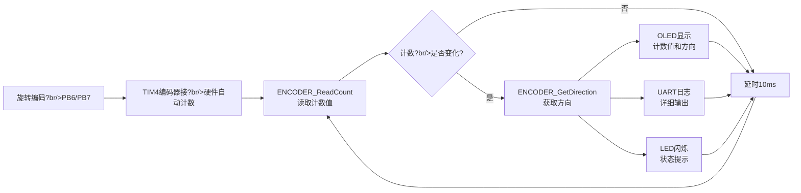
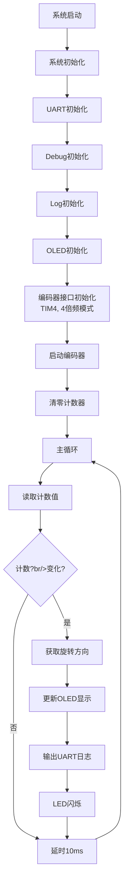

# Timer05 - 编码器接口示?
使用定时器编码器接口模式实现旋转编码器的计数功能，替代EXTI方式，提供更高的精度和更简单的实现?
---

## 📋 案例目的

- **核心目标**
  - 演示如何使用定时器编码器接口模式实现旋转编码器的计数功能
  - 对比EXTI方式和编码器接口方式的优缺点
  - 展示编码器接口模式的4倍频功能，提高计数精?
- **学习重点**?  - 定时器编码器接口模式的配置和使用方法
  - 编码器接口模式的硬件要求（只能使用CH1和CH2?  - 编码器接口模式的4倍频功能（ENCODER_MODE_TI12?  - 编码器接口模式自动判断旋转方?  - 编码器接口模式与EXTI方式的对?
- **应用场景**：适用于需要高精度旋转编码器计数的场景，如位置控制、速度测量、角度检测等

---

## 🔧 硬件要求

### 必需外设

- **LED1**：`PA1`（状态指示，计数时闪烁）

### 传感?模块

- **旋转编码器模?*
  - 通道A：`PB6`（TIM4 CH1，编码器接口输入?  - 通道B：`PB7`（TIM4 CH2，编码器接口输入?  - VCC：独立供电（不依赖STM32?  - GND：GND
  - **⚠️ 重要提示**?    - **编码器接口模式只能使用定时器的CH1和CH2**
    - **PB0/PB1是TIM3的CH3/CH4，无法用于编码器接口模式**
    - 本案例使用TIM4（PB6/PB7），最接近PB0/PB1的引?    - 编码器接口模式支?倍频（ENCODER_MODE_TI12），精度更高
    - 编码器接口模式自动判断旋转方向，无需软件状态机
    - **4倍频硬件特?*：一个物理步?= 4个计数（TI1上升、TI1下降、TI2上升、TI2下降?
- **OLED显示?*（SSD1306，软件I2C接口，可选）
  - SCL：`PB8`
  - SDA：`PB9`
  - VCC?.3V
  - GND：GND

### 硬件连接

| STM32F103C8T6 | 旋转编码?| 说明 |
|--------------|-----------|------|
| PB6 | 通道A（输出信号） | TIM4 CH1，编码器接口输入 |
| PB7 | 通道B（输出信号） | TIM4 CH2，编码器接口输入 |
| 3.3V | VCC | 电源（编码器独立供电，此引脚可选） |
| GND | GND | 地线 |

**⚠️ 重要提示**?- **硬件连接变化**：与EXTI02案例不同，本案例使用PB6/PB7而不是PB0/PB1
- 原因：编码器接口模式只能使用定时器的CH1和CH2，PB0/PB1是TIM3的CH3/CH4，无法使?- TIM4的CH1/CH2对应PB6/PB7，是最接近PB0/PB1的引脚选项
- PB6和PB7配置?*上拉输入**（GPIO_Mode_IPU），适用于开漏输出的编码?- 如果编码器是推挽输出，可以改为浮空输入（GPIO_Mode_IN_FLOATING?
**⚠️ 编码器接口模式引脚选项**?- **TIM4**：PB6/PB7（CH1/CH2? 本案例使?- **TIM3默认**：PA6/PA7（CH1/CH2?- **TIM3部分重映?*：PB4/PB5（CH1/CH2?- **TIM3完全重映?*：PC6/PC7（CH1/CH2?- **TIM1**：PA8/PA9（CH1/CH2?- **TIM2**：PA0/PA1（CH1/CH2? 注意：TIM2被TIM2_TimeBase占用，不可用

**⚠️ 4倍频硬件特性说?*?- STM32编码器接口模式会在TI1和TI2的所有边沿（上升?下降沿）都计?- 一个物理步?= 4个边沿（TI1上升、TI1下降、TI2上升、TI2下降? CNT变化4
- **这是正常的硬件特性，不是bug**?倍频提高了分辨率
- 解决方案：在读取时直接除?，得到真实的物理步进数（代码中已实现?
---

## 📦 模块依赖

### 模块依赖关系?
```mermaid
graph TB
    %% 应用?    subgraph APP[应用层]
        MAIN[main_example.c<br/>主程序]
    end
    
    %% 系统服务?    subgraph SYS[系统服务层]
        DELAY[delay<br/>延时模块]
        SYS_INIT[system_init<br/>系统初始化]
    end
    
    %% 驱动?    subgraph DRV[驱动层]
        ENCODER[timer_encoder<br/>编码器接口模块]
        GPIO[gpio<br/>GPIO驱动]
        LED[led<br/>LED驱动]
        OLED[oled_ssd1306<br/>OLED显示驱动]
        I2C_SW[i2c_sw<br/>软件I2C驱动]
        UART[uart<br/>UART驱动]
    end
    
    %% 调试工具?    subgraph DEBUG[调试工具层]
        DEBUG_MOD[debug<br/>Debug模块]
        LOG[log<br/>日志模块]
        ERROR[error_handler<br/>错误处理模块]
    end
    
    %% 硬件抽象?    subgraph BSP[硬件抽象层]
        BOARD[board.h<br/>硬件配置]
    end
    
    %% 依赖关系
    MAIN --> ENCODER
    MAIN --> LED
    MAIN --> OLED
    MAIN --> UART
    MAIN --> DELAY
    MAIN --> SYS_INIT
    MAIN --> DEBUG_MOD
    MAIN --> LOG
    MAIN --> ERROR
    
    ENCODER --> GPIO
    ENCODER --> BOARD
    OLED --> I2C_SW
    I2C_SW --> GPIO
    UART --> GPIO
    LED --> GPIO
    DEBUG_MOD --> UART
    LOG --> UART
    DELAY --> SYS_INIT
    SYS_INIT --> GPIO
    SYS_INIT --> LED
    SYS_INIT --> DELAY
```

### 模块列表

- **timer_encoder**：编码器接口模块，提供编码器接口模式的配置和计数功能
- **gpio**：GPIO驱动模块，编码器接口模式需要GPIO配置
- **led**：LED驱动模块，用于状态指?- **oled_ssd1306**：OLED显示驱动模块，用于显示计数值和方向
- **i2c_sw**：软件I2C驱动模块，OLED使用
- **uart**：UART驱动模块，用于串口调?- **delay**：延时模块，用于主循环延?- **system_init**：系统初始化模块，自动初始化GPIO、LED、delay?- **debug**：Debug模块，printf重定向到UART
- **log**：日志模块，分级日志输出
- **error_handler**：错误处理模块，统一错误处理

---

## 🔄 实现流程

### 整体逻辑

1. **系统初始化阶?*?   - 初始化系统（GPIO、LED、delay、TIM2_TimeBase?   - 初始化UART、Debug、Log模块
   - 初始化OLED显示
   - 初始化编码器接口（TIM4?倍频模式，PB6/PB7?
2. **主循环阶?*?   - 读取编码器计数值（4倍频值）
   - 计算实际物理步数（计数值除??   - 检查计数值是否变?   - 获取旋转方向
   - 更新OLED显示（显示原始计数和实际步数?   - 输出UART日志
   - LED闪烁提示

### 数据流向?


### 关键方法

1. **编码器接口初始化**?   - 使用`ENCODER_Init()`初始化编码器接口（TIM4，PB6/PB7?   - 选择4倍频模式（`ENCODER_MODE_TI12`）提高精?   - 编码器接口模式自动配置GPIO和定时器
   - 配置输入捕获滤波器（TIM_ICFilter = 0xF）减少抖?
2. **读取计数?*?   - 使用`ENCODER_ReadCount()`读取有符号计数值（4倍频值）
   - 计数值自动递增（正转）或递减（反转）
   - 支持负数，可以判断旋转方?   - **重要**：将计数值除?得到实际物理步数?:1计数?
3. **获取旋转方向**?   - 使用`ENCODER_GetDirection()`获取当前旋转方向
   - 编码器接口模式硬件自动判断方向，无需软件状态机

4. **显示更新**?   - OLED显示原始计数值（4倍频）和实际步数?:1?   - UART输出详细日志（包含原始计数和实际步数?   - LED闪烁提示计数变化

### 工作流程示意?


---

## 📚 关键函数说明

### 编码器接口相关函?
- **`ENCODER_Init()`**：初始化编码器接?  - 在本案例中用于初始化TIM4编码器接口，选择4倍频模式
  - 编码器接口模式自动配置GPIO和定时器，无需手动配置
  - 配置了输入捕获滤波器（TIM_ICFilter = 0xF）减少抖?  - 必须在使用前初始?
- **`ENCODER_Start()`**：启动编码器
  - 在本案例中用于启动TIM4编码器接?  - 启动后编码器接口开始自动计?  - 必须在初始化后调?
- **`ENCODER_ReadCount()`**：读取编码器计数值（有符号）
  - 在本案例中用于读取TIM4编码器接口的计数?  - 计数值自动递增（正转）或递减（反转），支持负?  - 在主循环中定期调用，检查计数值变?  - **注意**：读取的计数值是4倍频值，需要除?得到实际物理步数

- **`ENCODER_GetDirection()`**：获取编码器旋转方向
  - 在本案例中用于获取TIM4编码器接口的当前旋转方向
  - 编码器接口模式硬件自动判断方向，无需软件状态机
  - 返回ENCODER_DIR_FORWARD（正转）或ENCODER_DIR_BACKWARD（反转）

- **`ENCODER_ClearCount()`**：清零编码器计数?  - 在本案例中用于初始化时清零计数器
  - 清零后计数值从0开始计?
- **`ENCODER_SetTIM3Remap()`**：设置TIM3重映射配置（可选）
  - 用于配置TIM3的重映射，支持PB4/PB5或PC6/PC7
  - 必须在ENCODER_Init之前调用
  - 本案例使用TIM4，无需此函?
**详细函数实现和调用示例请参?*：`main_example.c` 中的代码

---

## ⚠️ 注意事项与重?
### ⚠️ 重要提示

1. **硬件连接变化**?   - 与EXTI02案例不同，本案例使用PB6/PB7而不是PB0/PB1
   - 原因：编码器接口模式只能使用定时器的CH1和CH2
   - PB0/PB1是TIM3的CH3/CH4，无法用于编码器接口模式
   - 本案例使用TIM4（PB6/PB7），是最接近PB0/PB1的引脚选项

2. **编码器接口模式限?*?   - 编码器接口模式只能使用定时器的CH1和CH2
   - 如果硬件已连接PB0/PB1，需要改为PB6/PB7（TIM4）或其他支持CH1/CH2的引?   - 可用定时器：TIM1（PA8/PA9）、TIM3（PA6/PA7或重映射）、TIM4（PB6/PB7?   - 注意：TIM2被TIM2_TimeBase占用，不可用

3. **编码器接口模式优?*?   - 支持4倍频（ENCODER_MODE_TI12），精度更高
   - 硬件自动判断旋转方向，无需软件状态机
   - 硬件自动计数，CPU占用率低
   - 支持有符号计数，可以判断旋转方向
   - 输入捕获滤波器减少抖?
4. **4倍频硬件特性说?*?   - **核心要点**：STM32编码器接口模式会在TI1和TI2的所有边沿（上升?下降沿）都计?   - 一个物理步?= 4个边?= CNT变化4，这?*正常的硬件特性，不是bug**
   - 4倍频提高了分辨率，在电机控制等应用中是有利的
   - **解决方案**：在应用层统一使用物理单位，底层读取时进行转换（除??   - 代码中已实现：`actual_steps = encoder_count / 4;`

5. **编码器接口模式与EXTI方式对比**?   - **编码器接口模?*：硬件自动计数，精度高，CPU占用率低，但只能使用CH1/CH2
   - **EXTI方式**：可以使用任意GPIO，但需要软件状态机，精度较低，CPU占用率高

### 🔑 关键?
1. **4倍频硬件特性（重要?*?   - 使用`ENCODER_MODE_TI12`模式，编码器接口会在TI1和TI2的所有边沿计?   - 一个物理步?= 4个边沿（TI1上升、TI1下降、TI2上升、TI2下降? CNT变化4
   - **这是STM32编码器接口模式的硬件特性，不是bug**
   - 4倍频提高了分辨率，适合高精度位置控?   - **解决方案**：在读取时直接除?，得到真实的物理步进?   - 代码示例：`actual_steps = encoder_count / 4;`

2. **自动方向判断**?   - 编码器接口模式硬件自动判断旋转方?   - 正转时计数值递增，反转时计数值递减
   - 无需软件状态机，简化代?
3. **有符号计?*?   - 编码器接口模式支持有符号计数
   - 计数值可以是负数，可以判断旋转方?   - 适合需要判断旋转方向的场景

4. **输入捕获滤波?*?   - 代码中配置了`TIM_ICFilter = 0xF`（最大滤波）
   - 减少编码器信号抖动，提高计数稳定?
---

## 🔍 常见问题排查

### 问题1：编码器接口初始化失?
**可能原因**?- 编码器接口模块未实现（当前是占位空函数）
- 定时器已被其他模块占用（如TIM2被TIM2_TimeBase占用?- GPIO配置错误

**解决方法**?1. 检查编码器接口模块是否已实现（`Drivers/timer/timer_encoder.c`?2. 确认使用的定时器未被其他模块占用
3. 检查GPIO配置是否正确（编码器接口模式自动配置GPIO?
### 问题2：计数值不变化

**可能原因**?- 编码器接口未启动
- 硬件连接错误（PB6/PB7连接错误?- 编码器接口模式配置错?- GPIO模式配置错误（应使用上拉输入?
**解决方法**?1. 确认已调用`ENCODER_Start()`启动编码?2. 检查硬件连接（PB6/PB7是否正确连接?3. 检查编码器接口模式配置（是否使用ENCODER_MODE_TI12?4. 检查GPIO状态（使用串口日志查看PB6/PB7的状态）

### 问题3：硬件连接与EXTI02案例不同

**可能原因**?- 编码器接口模式只能使用CH1和CH2
- PB0/PB1是TIM3的CH3/CH4，无法用于编码器接口模式

**解决方法**?1. 将编码器通道A连接到PB6（TIM4 CH1?2. 将编码器通道B连接到PB7（TIM4 CH2?3. 或者使用其他支持编码器接口模式的定时器（TIM1、TIM3?
### 问题4：计数值是4倍频，如何实?:1计数?
**说明**?- 这是STM32编码器接口模式的硬件特性，不是bug
- 编码器接口模式会在所有边沿计数，一个物理步?= 4个计?
**解决方法**?1. 在读取时直接除以4：`actual_steps = encoder_count / 4;`
2. 代码中已实现此转换，OLED和UART都会显示实际步数
3. 如果需要更高精度，可以保留4倍频值，在应用层进行转换

---

## 💡 扩展练习

### 循序渐进部分

1. **简化功?*?   - 移除OLED显示，只使用UART输出
   - 简化主循环逻辑，只读取和输出计数?
2. **修改编码器模?*?   - 尝试使用`ENCODER_MODE_TI1`或`ENCODER_MODE_TI2`模式
   - 对比不同模式的计数精?
3. **添加速度测量**?   - 在主循环中计算计数值的变化?   - 使用延时计算编码器旋转速度

### 实际场景坑点部分

4. **边界条件处理**?   - 处理计数值溢出（16位计数器溢出?   - 处理计数值回绕（从最大值到最小值）

5. **性能优化**?   - 优化主循环延时，提高响应速度
   - 使用中断模式替代轮询模式

6. **多编码器支持**?   - 同时使用多个编码器接口（TIM1、TIM3、TIM4?   - 处理多个编码器的计数和方?
---

## 📖 相关文档

### 模块文档

- **编码器接口模?*：`Drivers/timer/timer_encoder.c/h`
- **GPIO模块**：`Drivers/basic/gpio.c/h`
- **LED模块**：`Drivers/basic/led.c/h`
- **OLED模块**：`Drivers/display/oled_ssd1306.c/h`
- **UART模块**：`Drivers/uart/uart.c/h`

### 业务文档

- **主程序代?*：`Examples/Timer/Timer05_EncoderInterface/main_example.c`
- **硬件配置**：`Examples/Timer/Timer05_EncoderInterface/board.h`
- **模块配置**：`Examples/Timer/Timer05_EncoderInterface/config.h`
- **参考案?*：`Examples/EXTI/EXTI02_RotaryEncoder_Counter/` - EXTI方式实现编码器计?- **项目规范**：`PROJECT_KEYWORDS.md` - AI规则与项目约?
---

## 📝 更新日志

### v0.3.0 (2024-01-XX)
- 案例?`Examples/PWM/PWM06_EncoderInterface` 移动?`Examples/Timer/Timer05_EncoderInterface`
- 更新案例编号：从 PWM06 改为 Timer05
- 更新所有文档和代码注释中的路径引用
- 更新状态：?待调?改为"已调试完?

### v0.2.0 (2024-01-XX)
- 完成编码器接口模块核心功能实?- 使用TIM4（PB6/PB7）替代TIM3（PA6/PA7?- 添加输入捕获滤波器配置（TIM_ICFilter = 0xF?- 添加TIM3重映射支持（PB4/PB5、PC6/PC7?- 实现4倍频?:1计数的转换（除以4?- 更新硬件连接说明?倍频特性说?
### v0.1.0 (2024-01-01)
- 初始化案例结?- 创建编码器接口模式示?- 说明硬件连接变化（PB6/PB7替代PB0/PB1?- **注意**：编码器接口模块当前是占位空函数，需要实?
---
