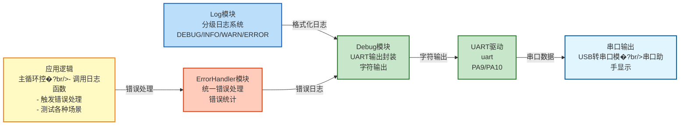

# UART01 - 错误日志输出示例

## 📋 案例目的

- **核心目标**：演示如何通过UART输出错误日志，展示UART模块、Debug模块、Log模块和ErrorHandler模块的完整集成使�?- **学习重点**�?  - 理解UART模块的基本使用方法（初始化、发送）
  - 掌握Debug模块与UART的集成（实现UART输出功能�?  - 学习Log模块的分级日志输出（DEBUG/INFO/WARN/ERROR�?  - 了解ErrorHandler模块的错误处理机�?  - 学习各种错误场景的处理方法（UART错误、参数错误、自定义错误等）
  - 理解错误统计功能的使�?- **应用场景**：适用于需要通过串口输出调试信息、错误日志的应用，如开发调试、系统监控、故障诊断等

## 🔧 硬件要求

### 必需外设

- **USART1**�?  - TX：`PA9`
  - RX：`PA10`
  - 波特率：`115200`
  - 数据格式：`8N1`�?位数据位，无校验�?位停止位�?
### 硬件连接

| STM32F103C8T6 | 外设/模块 | 说明 |
|--------------|----------|------|
| PA9 | USB转串口模�?TX | UART发送引�?|
| PA10 | USB转串口模�?RX | UART接收引脚 |
| 3.3V | USB转串口模�?VCC | 电源（如果模块需要） |
| GND | USB转串口模�?GND | 地线 |

**⚠️ 重要提示**�?- 案例是独立工程，硬件配置在案例目录下�?`board.h` �?- 如果硬件引脚不同，直接修�?`Examples/UART/UART01_Error_Log_Output/board.h` 中的配置即可
- 需要USB转串口模块（如CH340、CP2102等）连接到电脑，通过串口助手查看日志输出

## 📦 模块依赖

### 模块依赖关系�?
展示本案例使用的模块及其依赖关系�?
```mermaid
%%{init: {'flowchart': {'curve': 'basis'}}}%%
flowchart TB
    %% 应用�?    subgraph APP_LAYER[应用层]
        APP[UART01案例<br/>main_example.c]
    end
    
    %% 系统服务�?    subgraph SYS_LAYER[系统服务层]
        direction LR
        SYS_INIT[System_Init]
        DELAY[Delay]
        BASE_TIMER[TIM2_TimeBase]
        SYS_INIT --- DELAY
        DELAY --- BASE_TIMER
    end
    
    %% 驱动�?    subgraph DRV_LAYER[驱动层]
        direction LR
        GPIO[GPIO]
        UART[UART]
    end
    
    %% 调试工具�?    subgraph DEBUG_LAYER[调试工具层]
        direction LR
        DEBUG[Debug]
        LOG[Log]
        ERROR[ErrorHandler]
        ERROR_CODE[ErrorCode]
        DEBUG --- LOG
        LOG --- ERROR
        ERROR --- ERROR_CODE
    end
    
    %% 硬件抽象�?    subgraph BSP_LAYER[硬件抽象层]
        BSP[board.h<br/>硬件配置]
    end
    
    %% 应用层依�?    APP --> SYS_INIT
    APP --> DEBUG
    APP --> LOG
    APP --> ERROR
    APP --> DELAY
    
    %% 系统服务层依�?    SYS_INIT --> GPIO
    DELAY --> BASE_TIMER
    
    %% 驱动层内部依�?    UART --> GPIO
    
    %% 调试工具层依�?    DEBUG --> UART
    LOG --> BASE_TIMER
    ERROR --> UART
    
    %% BSP配置依赖（统一表示�?    DRV_LAYER -.->|配置依赖| BSP
    
    %% 样式
    classDef appLayer fill:#e1f5ff,stroke:#01579b,stroke-width:2px
    classDef sysLayer fill:#f3e5f5,stroke:#4a148c,stroke-width:2px
    classDef driverLayer fill:#e8f5e9,stroke:#1b5e20,stroke-width:2px
    classDef debugLayer fill:#fff3e0,stroke:#e65100,stroke-width:2px
    classDef bspLayer fill:#fce4ec,stroke:#880e4f,stroke-width:2px
    
    class APP appLayer
    class SYS_INIT,DELAY,BASE_TIMER sysLayer
    class GPIO,UART driverLayer
    class DEBUG,LOG,ERROR,ERROR_CODE debugLayer
    class BSP bspLayer
```

### 模块列表

本案例使用以下模块：

- `uart`：UART驱动模块（核心功能）
- `debug`：Debug模块（UART输出功能已集成到Debug模块�?- `log`：日志模块（分级日志输出�?- `error_handler`：错误处理模块（统一错误处理�?- `error_code`：错误码定义模块
- `delay`：延时模�?- `TIM2_TimeBase`：TIM2时间基准模块（delay依赖�?- `gpio`：GPIO驱动模块（UART依赖�?- `system_init`：系统初始化模块

## 🔄 实现流程

### 整体逻辑

本案例通过7个测试阶段，全面演示UART错误日志输出功能。每个测试阶段展示不同的功能点：

1. **测试阶段1：系统初始化**
   - 系统初始化信息输�?   - 各模块初始化状态确�?   - 基本日志输出演示

2. **测试阶段2：各种级别的日志输出**
   - DEBUG级别日志（调试信息）
   - INFO级别日志（一般信息）
   - WARN级别日志（警告信息）
   - ERROR级别日志（错误信息）

3. **测试阶段3：UART模块错误处理**
   - 无效实例错误
   - 未初始化错误
   - 空指针参数错�?   - 零长度参数错�?
4. **测试阶段4：参数错误处�?*
   - Log模块空指针参�?   - ErrorHandler空指针参�?
5. **测试阶段5：自定义错误�?*
   - UART错误码演�?   - 通用错误码演�?   - 错误码字符串转换

6. **测试阶段6：错误统计功�?*
   - 错误总数统计
   - 模块错误统计
   - 错误码字符串显示

7. **测试阶段7：实时日志输出循�?*
   - 连续输出不同级别的日�?   - 演示实时日志输出功能

### 关键方法

- **Debug模块UART实现**：在案例中实现Debug模块的UART输出功能，不修改主工程的Debug模块
- **分级日志输出**：通过Log模块实现不同级别的日志输出，便于调试和监�?- **错误处理集成**：通过ErrorHandler模块统一处理错误，并输出错误日志

### 数据流向�?
展示本案例的数据流向：应用逻辑 �?日志/错误处理 �?UART输出



**数据流说�?*�?
1. **应用逻辑**�?   - 主循环中调用日志函数（LOG_DEBUG、LOG_INFO等）
   - 触发错误处理（ErrorHandler_Handle�?   - 测试各种错误场景

2. **日志处理**�?   - **Log模块**：分级日志系统，格式化日志字符串
   - **ErrorHandler模块**：统一错误处理，生成错误日�?
3. **输出处理**�?   - **Debug模块**：封装UART输出，逐字符发�?   - **UART驱动**：底层UART通信，发送数据到串口

4. **输出设备**�?   - **串口输出**：通过USB转串口模块输出到串口助手，显示日志和错误信息

### 工作流程示意

```mermaid
flowchart TD
    %% 初始化阶�?    subgraph INIT[初始化阶段]
        direction TB
        START[系统初始�?br/>System_Init]
        START --> UART_INIT[UART1初始�?br/>UART_Init]
        UART_INIT --> DEBUG_INIT[Debug模块初始�?br/>Debug_Init<br/>UART模式]
        DEBUG_INIT --> LOG_INIT[Log模块初始�?br/>Log_Init]
        LOG_INIT --> ERROR_INIT[ErrorHandler模块初始�?br/>自动初始化]
    end
    
    %% 测试阶段
    subgraph TEST[测试阶段循环]
        direction TB
        TEST1[测试阶段1<br/>系统初始化信息]
        TEST1 --> TEST2[测试阶段2<br/>各种级别日志输出]
        TEST2 --> TEST3[测试阶段3<br/>UART模块错误处理]
        TEST3 --> TEST4[测试阶段4<br/>参数错误处理]
        TEST4 --> TEST5[测试阶段5<br/>自定义错误码]
        TEST5 --> TEST6[测试阶段6<br/>错误统计功能]
        TEST6 --> TEST7[测试阶段7<br/>实时日志输出循环]
        TEST7 --> DELAY[延时2�?br/>Delay_ms]
        DELAY --> TEST1
    end
    
    %% 连接
    ERROR_INIT --> TEST1
    
    %% 样式
    style START fill:#e1f5ff,stroke:#01579b,stroke-width:2px
    style ERROR_INIT fill:#e1f5ff,stroke:#01579b,stroke-width:2px
    style TEST1 fill:#fff3e0,stroke:#e65100,stroke-width:3px
    style TEST7 fill:#fff3e0,stroke:#e65100,stroke-width:3px
    style DELAY fill:#f5f5f5,stroke:#757575,stroke-width:1px
```

## 📚 关键函数说明

### UART相关函数

- **`UART_Init()`**：初始化UART外设
  - 在本案例中用于初始化USART1，配置为115200波特率�?N1格式
  - 参数：UART实例索引（UART_INSTANCE_1�?
- **`UART_Transmit()`**：发送数据（阻塞式）
  - 在本案例中用于发送数据到UART
  - 参数：实例索引、数据缓冲区、长度、超时时�?
- **`UART_TransmitByte()`**：发送单个字节（阻塞式）
  - 在本案例中由Debug模块调用，用于发送单个字�?  - 参数：实例索引、字节、超时时�?
### Debug模块相关函数（案例专用）

- **`Debug_Init()`**：初始化Debug模块（UART模式�?  - 在本案例中用于初始化Debug模块，配置为UART输出模式
  - 参数：输出模式（DEBUG_MODE_UART）、波特率

- **`Debug_PutChar()`**：发送单个字�?  - 在本案例中由Log模块调用，用于通过UART发送字�?  - 参数：字�?  - 返回值：发送的字符

### Log模块相关函数

- **`Log_Init()`**：初始化日志系统
  - 在本案例中用于初始化日志系统，配置日志级别和功能开�?  - 参数：日志配置结构体指针

- **`LOG_DEBUG()`** / **`LOG_INFO()`** / **`LOG_WARN()`** / **`LOG_ERROR()`**：分级日志宏
  - 在本案例中用于输出不同级别的日志
  - 参数：模块名称、格式字符串、参数列�?
### 错误处理相关函数

- **`ErrorHandler_Init()`**：初始化错误处理模块
  - 在本案例中用于初始化错误处理模块

- **`ErrorHandler_Handle()`**：处理错�?  - 在本案例中用于处理各种错误，并输出错误日�?  - 参数：错误码、模块名�?
- **`ErrorHandler_GetString()`**：获取错误码字符�?  - 在本案例中用于将错误码转换为可读的字符串
  - 参数：错误码
  - 返回值：错误码字符串

- **`ErrorHandler_GetTotalCount()`**：获取错误总数
  - 在本案例中用于获取错误统计信息（需要启用统计功能）
  - 返回值：错误总数

- **`ErrorHandler_GetModuleCount()`**：获取模块错误数
  - 在本案例中用于获取特定模块的错误统计信息
  - 参数：模块名�?  - 返回值：模块错误�?
**详细函数实现和调用示例请参�?*：`main_example.c` 中的代码

## ⚠️ 注意事项与重�?
### ⚠️ 重要提示

1. **Debug模块**�?   - Debug模块的UART输出功能已集成到`Debug/debug.c`�?   - 当启用UART模块（`CONFIG_MODULE_UART_ENABLED = 1`）时，Debug模块自动支持UART输出
   - Debug模块通过UART模块的阻塞式接口发送字�?
2. **日志级别配置**�?   - 案例中配置为DEBUG级别（`CONFIG_LOG_LEVEL = 0`），显示所有级别的日志
   - 可以通过修改`config.h`中的`CONFIG_LOG_LEVEL`来调整日志级�?   - 日志级别�?=DEBUG, 1=INFO, 2=WARN, 3=ERROR, 4=NONE

3. **串口助手配置**�?   - 波特率：115200
   - 数据位：8
   - 停止位：1
   - 校验位：�?   - 流控：无

4. **错误统计功能**�?   - 需要启用`CONFIG_ERROR_HANDLER_STATS_EN = 1`才能使用错误统计功能
   - 错误统计功能会增加内存开销，根据需求选择是否启用

5. **测试循环**�?   - 7个测试阶段循环执�?   - 可以通过复位重新开始测�?
### 🔑 关键�?
1. **UART输出流程**�?   - Log模块调用`Log_Print()`构建日志字符�?   - `Log_Print()`调用`Debug_PutChar()`逐字符输�?   - `Debug_PutChar()`调用`UART_TransmitByte()`发送到UART
   - 通过串口助手查看日志输出

2. **错误处理集成**�?   - 所有模块函数返回统一的错误码类型（error_code_t�?   - 通过ErrorHandler统一处理错误，并输出错误日志
   - 错误日志通过UART输出，便于调试和监控

3. **分级日志系统**�?   - DEBUG：调试信息（最详细�?   - INFO：一般信�?   - WARN：警告信�?   - ERROR：错误信息（最重要�?   - 可以通过日志级别过滤，只显示重要信息

### 💡 调试技�?
1. **没有日志输出**�?   - 检查UART是否正确初始�?   - 检查Debug模块是否正确初始�?   - 检查串口助手配置是否正确（115200, 8N1�?   - 检查硬件连接是否正确（PA9/PA10�?
2. **日志级别不正�?*�?   - 检查`config.h`中的`CONFIG_LOG_LEVEL`配置
   - 检查`Log_Init()`中的日志级别配置

3. **错误处理不生�?*�?   - 检查错误处理模块是否已启用（`CONFIG_MODULE_ERROR_HANDLER_ENABLED = 1`�?   - 检查是否正确调用`ErrorHandler_Handle()`

4. **错误统计不显�?*�?   - 检查是否启用了错误统计功能（`CONFIG_ERROR_HANDLER_STATS_EN = 1`�?   - 检查是否有错误发生（错误统计需要先有错误才能显示）

5. **字符乱码**�?   - 检查串口助手波特率配置是否正确�?15200�?   - 检查数据格式配置是否正确（8N1�?
## 💡 扩展练习

### 循序渐进理解本案�?
1. **添加更多错误测试**：测试UART接收错误（如帧错误、溢出错误等）、超时错误、其他模块的错误处理，理解错误处理机制的完整�?2. **优化日志输出**：启用时间戳功能（`CONFIG_LOG_TIMESTAMP_EN = 1`）、启用颜色输出功能（`CONFIG_LOG_COLOR_EN = 1`）、自定义日志格式，理解日志系统的配置和优�?3. **实现日志过滤**：根据模块名称过滤日志，根据日志级别动态调整过滤规则，理解日志过滤的实现和应用

### 实际场景中的常见坑点

4. **日志输出阻塞问题**：当日志输出量很大时，UART发送可能阻塞主循环，影响程序实时性。如何实现非阻塞日志输出？如何实现日志缓冲和队列机制�?5. **日志存储空间管理**：如果日志保存到Flash或SD卡，存储空间有限，如何实现日志循环覆盖？如何实现日志压缩和归档？如何处理存储空间不足的情况？
6. **多模块日志冲�?*：当多个模块同时输出日志时，可能导致日志混乱或丢失。如何实现日志的线程安全？如何实现日志的优先级管理？如何处理日志输出的竞争条件？

5. **实现远程日志**�?   - 通过网络模块发送日志到远程服务�?   - 实现日志实时监控

6. **优化错误处理**�?   - 添加错误恢复机制
   - 实现错误重试功能
   - 添加错误报警功能

## 📖 相关文档

- **模块文档**�?  - **UART驱动模块**：`../../Drivers/uart/uart.c/h`
  - **Debug模块**：`../../Debug/debug.c/h`
  - **日志模块**：`../../Debug/log.c/h`
  - **错误处理模块**：`../../Common/error_handler.c/h`
  - **错误码定�?*：`../../Common/error_code.h`
  - **GPIO驱动**：`../../Drivers/basic/gpio.c/h`

- **业务文档**�?  - **主程序代�?*：`main_example.c`
  - **硬件配置**：`board.h`
  - **模块配置**：`config.h`
  - **项目规范文档**：`PROJECT_KEYWORDS.md`
  - **案例参�?*：`Examples/README.md`
- **延时功能**：`../../System/delay.c/h`
- **基时定时�?*：`../../Drivers/timer/TIM2_TimeBase.c/h`
- **系统初始�?*：`../../System/system_init.c/h`
- **硬件配置**：案例目录下�?`board.h`
- **模块配置**：案例目录下�?`config.h`
